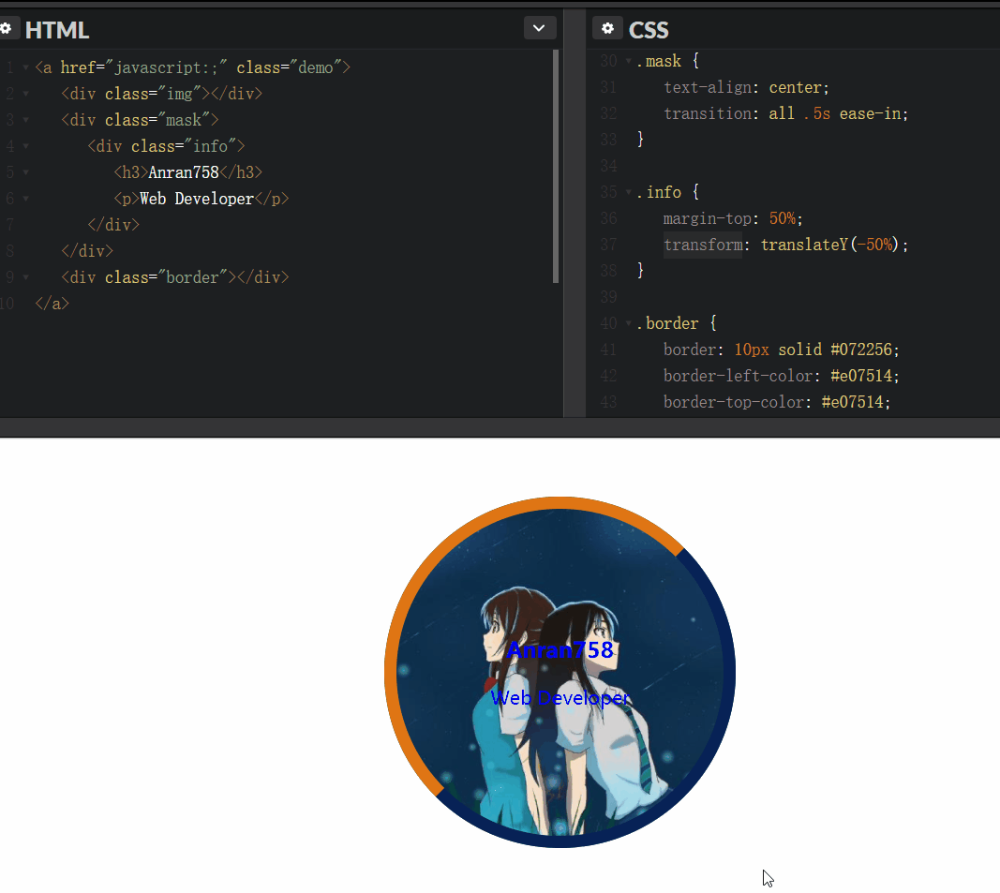

# CSS / CSS3 的踩坑与应用


> CSS世界中的各类属性相互间有着紧密联系，而非独立的个体。 --by 张鑫旭

css看似简单，但我们在编写css时，时常能看到动了一个属性，然后牵扯出其他属性或者布局的变化。有些对css不够熟悉的同学就容易踩到坑。因此将一些常用的css方法抽出来，可以现拿现用~

我会尽量将案例都配合图片来展示效果. `codepen`是一个在线分享代码的工具, 点击进去可以能看到代码的实际效果.

---

### 目录

* CSS 及常见的应用
  1. [[common] reset 与 Normalize](#common-base)
  1. [[common] 响应式设计 - 针对不同分辨率设置(@media)](#common-responsive)
  1. [[display] 隐藏元素](#display-content)
  1. [[image] 图片居中处理](#imgage-center)
  1. [[layout] 关于居中](#layout-center)
  1. [[layout] 查看更多 - 白色半透明遮罩](#layout-background-more)
  1. [[nav] 导航渐变色分割线 - after](#nav-split)
  1. [[nav] 导航列表下标 - 悬浮动画显示](#nav-anima)
  1. [[text] 文字超出显示省略号 - text-overflow](#text-overflow)
* CSS3
  1. [绘制图形](#form-1)
  1. [[animation]loading](#animation-loading)

---

### CSS 及常见的应用

<a name="common-base"></a>

tips:

1. css 选择符是从右至左进行匹配的，因此需要尽可能的减少匹配的层级.
1. 了解哪些属性是可以通过继承而来，避免重复指定规则
1. 滚动容器不要使用`padding-bottom`进行留白，IOS低版本会直接忽略点。除此之外IE, firefox据说也有这种情况，然而在最新版的火狐浏览器上并没有测出来..

#### [common] CSS中常见的问题

**reset 与 Normalize:**

关于这两者有什么区别, 该如何取舍. 我曾经写过一篇博客, 感兴趣的同学可以过去看一下 - [浅谈 Normalize 与 reset](https://anran758.github.io/blog/2017/10/15/%E6%B5%85%E8%B0%88Normalize%E4%B8%8Ereset/)

优化后的`reset.css`: https://github.com/anran758/Front-End-Lab/tree/master/CSS/reset.css

**继承性与通配符:**

使用通配符(*), 意味着页面中的所有的标签都会加上通配符里的属性. 然而很多人在使用的时候, 尤其在不了解属性特性的情况下, 容易造成很大性能浪费.

就比如说有些属性是具有**继承性**的, 在下例中`<em>`标签在没有制定`color`属性时, 就逐级向上找到`.container`的`color`继承.

``` html
<style>.container {color: green}</style>

<div class="container">
  这里是div容器内
  <p>这是一个<em>演示</em>的例子</p>
</div>
```

这意味着如果我们用通配符设置这些属性时, 会徒劳给页面的增加没必要的性能负担. 

再来看一个典型的例子. iOS系统下, 点击一个链接或者通过Javascript定义的可点击元素的时候, 会出现一个半透明的灰色背景(就是所谓会闪一下), 这时`可以设置-webkit-tap-highlight-color`为透明来重置这个"BUG", 这里属性没用错, 但问题就出现在错误的使用了通配符. 如下图:


还有一种就是使用`* {margin: 0; padding: 0}`则就过分了, `H1 ~ 6`标签本身就没有默认`padding`, 你特么非要给人家重置一下. `<li>`就更无辜了, 没有默认的`padding`和`margin`也要被批斗. 因此我们应该避免使用通配符.

---

<a name="common-responsive"></a>

#### [common] 响应式设计 - 针对不同分辨率设置(@media)

如今比较通用的媒体查询. 其中`max-width`是媒体查询的一个特性，其意思是指媒体类型小于或等于指定的宽度时, `min-width`相反

```css
/* 1024px显屏 */
@media screen and (max-width: 1024px) {
  /* 样式代码 */
}

/* 800px显屏 */
@media screen and (max-width: 800px) {
}

/* 640px显屏 */
@media screen and (max-width: 640px) {
}

/* iPad横板显屏 */
@media screen and (max-device-width: 1024px) and (orientation: landscape) {
}

/* iPad竖板显屏 */
@media screen and (max-device-width: 768px) and (orientation: portrait) {
}

/* iPhone 和 Smartphones */
@media screen and (min-device-width: 320px) and (min-device-width: 480px) {
}
```

现在有关于这方面的运用也是相当的成熟，twitter 的 Bootstrap 第二版本中就加上了这方面的运用。大家可以对比一下：

```css
@media (max-width: 480px) {
  /* ... */
}
@media (max-width: 768px) {
  /* ... */
}
@media (min-width: 768px) and (max-width: 980px) {
  /* ... */
}
@media (min-width: 1200px) {
  /* ... */
}
```

---

<a name="display-content"></a>

#### [display] 隐藏元素

优化无障碍的体验, 避免使用`display: none`. 因为辅助屏幕设备实际上是读不了设置了这个属性里的内容, 搜索引擎的爬虫蜘蛛也会过滤掉设置了`display: none`里的内容.

```css
.hidden {
  position: absolute;
  top: -9999em;
}

.hidden {
  position: absolute;
  clip: rect(1px 1px 1px 1px); /* IE6, IE7 */
  clip: rect(1px, 1px, 1px, 1px);
}
```

如果不用顾忌无障碍的话, 也可以这个方法来避免页面回流

```css
.hidden {
  position: absolute;
  visibility: hidden;
}
```

---

<a name="imgage-center"></a>

#### [image] 图片居中裁剪

我们经常能遇到这种情景, 做一个用户头像. 拿到的图片是一个长方形的长图, 但是我们并不需要这么长的图, 因此我们需要"裁剪". 这时我们只需设置图片中心为原点, 设置相应的宽高再加上圆角即可, 代码如下:

```css
.user-info-box .avatar {
  width: 86px;
  height: 86px;
  border-radius: 50%;
  background: 50%/cover;
  background-color: #f1f1f1;
  background-image: url(https://avatars.githubusercontent.com/u/23024075?v=3);
}
```


其中`background: 50%/cover`是关键, 这一个方法同时也可以适用于其他有图片的场景.  
[codepen / test](https://codepen.io/anran758/pen/WdOvRY/)

---

<a name="layout-center"></a>

#### [layout] 关于居中

> 常用的居中方法

* `absolute` + `margin`分配剩余空间, 这个方法需要设置宽高.

```css
.element {
  width: 600px;
  height: 400px;
  position: absolute;
  left: 0;
  top: 0;
  right: 0;
  bottom: 0;
  margin: auto;
}
```

* `absolute` + `transform`自身宽高的一半, 副作用是`transform`会占据原来的文档流位置. 部分场景不适用.

```css
.element {
  position:  absolute;
  top:  50%;
  left:  50%;
  transform:  translate(-50%, -50%);
}
```

* 基于`vertical-align`的水平垂直居中 --by 张鑫旭

``` html
<div class="container">
  <div class="dialog">
    <div class="content">内容占位</div>
  </div>
</div>
```

``` css
.container {
  position: fixed;
  top: 0; right: 0; bottom: 0; left: 0;
  /* for IE8 */
  /* background: url(data:image/png;base64,iVB...g==); */
  /* for IE9+ */
  background: rgba(0,0,0,.5);
  text-align: center;
  white-space: nowrap;
  z-index: 99;
}
.container:after {
  content: "";
  display: inline-block;
  height: 100%;
  vertical-align: middle;
}
.dialog {
  display: inline-block;
  vertical-align: middle;
  border-radius: 6px;
  background-color: #fff;
  text-align: left;
  white-space: normal;
}
```

---

<a name="layout-background-more"></a>

#### [layout] 查看更多 - 白色半透明遮罩

写了个简易的 Demo, 使用`linear-gradient`颜色渐变, 再使用`pointer-events: none`清除默认事件.  
[codepen / test](https://codepen.io/anran758/pen/ppwwKN)


---

<a name="nav-split"></a>

#### [nav]导航渐变色分割线 - after

使用`after`对导航进行分割, 对`background`使用`linear-gradient`渐变.

[codepen / test](https://codepen.io/anran758/pen/ypXYba)


---

<a name="nav-anima"></a>

#### [nav]导航列表下标 - 悬浮动画显示

利用`:before`和`transition`实现悬浮后, 下标从底部中间向两边展开.

[codepen / test](https://codepen.io/anran758/pen/BJZdLL)


---

<a name="text-overflow"></a>

#### [text] 文本溢出点点点(text-overflow)

**单行溢出:**
text-overflow 只是用来说明文字溢出时用什么方式显示，要实现溢出时产生省略号的效果，还须配合其他属性.

```css
/* 强制不断行, 单行超出范围出现省略号 */
.overflow {
  overflow: hidden;
  white-space: nowrap;
  text-overflow: ellipsis;
}
```

**多行溢出:**

``` css
.intwoline {
  display: -webkit-box !important;
  overflow: hidden;
  text-overflow: ellipsis;
  word-break: break-all;
  -webkit-box-orient: vertical;
  -webkit-line-clamp: 2;
}
```

不过这种纯CSS的方法受兼容性限制, ~~非`webkit`内核的浏览器都没有实现.~~ 不过这个方法在移动端可以适用. 在caniuse上我们可以得知, ios.Safari 5.1+, Android 2.3+ 均支持`-webkit-`的前缀.

除此之外的方法就只能使用js计算了.

---

#### [base] 绘制图形

<a name="form-1"></a>

可以利用`css`属性来绘制常见的图形, 来完成一些设计所需，同时还可以节省图片的HTTP请求.

[codepen / test](https://codepen.io/anran758/pen/jxjGyo)


---

### CSS3

css3已经在主流的浏览器上普及了, 只剩一些老式的浏览器没有实现. 以下的代码均不会加那些丑陋的浏览器前缀, 不过出于兼容性的考虑, 如果你有这方面兼容的需求, 你可以在[autoprefix](http://autoprefixer.github.io/)上复制相应的代码, 选择兼容的版本, 让工具自动帮你去添加前缀~


<a name="animation-loading"></a>

#### [animation] loading动画

我们可以利用css3属性来做一些动画loading, 相对于图片既能节省HTTP请求, 仅需几行代码即可实现我们想要的功能功能. github上也有很多这种动画库, 有兴趣的同学可以搜一搜.


---

[codepen / test](https://codepen.io/anran758/pen/dmOPdO)

<a name="image-hover"></a>

#### [image] 悬浮头像

我们利用 css3 属性的`transform`对悬浮后的`border`进行旋转, 通过`transition`进行过度, 从而实现悬浮后的炫酷效果.



[codepen / test](https://codepen.io/anran758/pen/YapWKd)