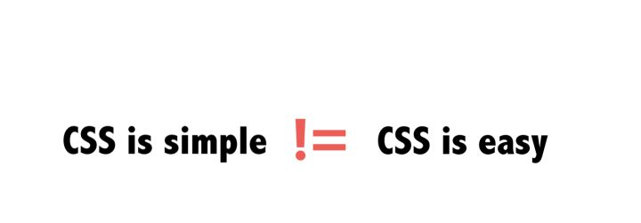
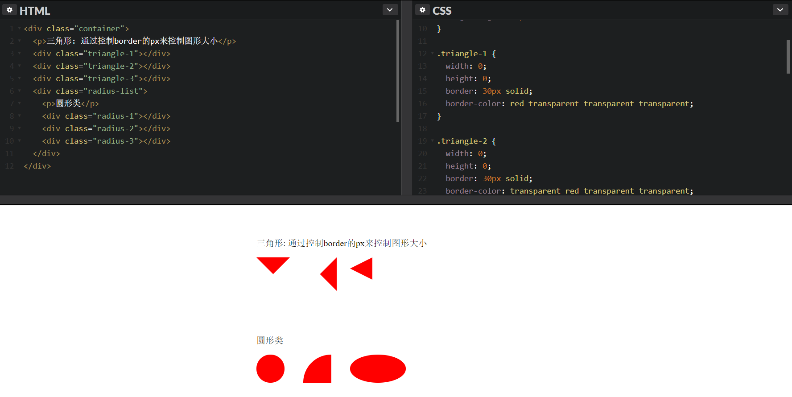

# CSS / CSS3 的踩坑与应用



CSS 相关的资料在网上也很多, 但都比较零散, 也有很多坑 dalao 们踩过的都知道, 如`inline-block`就自带有 3px 左右的间隙, 新手就会摸不透头脑, 因此将自己的一些经验整合分享下。

> 我会尽量将案例都配合图片来展示效果. `codepen`是一个在线分享代码的工具, 点击进去可以看到代码的实际效果.

---

### 目录

* CSS 及常见的应用
  1. [[common] reset 与 Normalize](#common-reset)
  2. [[common] 响应式设计 - 针对不同分辨率设置(@media)](#common-responsive)
  3. [[display] 隐藏元素](#dispaly)
  4. [[image] 图片居中处理](#imgage-center)
  5. [[layout] 关于居中](#layout-center)
  6. [[layout] 查看更多 - 白色半透明遮罩](#layout-background-more)
  7. [[nav] 导航渐变色分割线 - after](#nav-split)
  8. [[nav] 导航列表下标 - 悬浮动画显示](#nav-anima)
  9. [[text] 文字超出显示省略号 - text-overflow](#text-overflow)
* CSS / CSS3 绘制图形
  1. [基础图形](#form-1)

---

### CSS 及常见的应用

<a name="common-reset"></a>

#### [common] reset 与 Normalize

可能有同学会困惑, 这两者有什么区别, 该如何取舍. 我曾经写过一篇博客, . 有兴趣的同学可以过去看一下 - [浅谈 Normalize 与 reset](https://anran758.github.io/blog/2017/10/15/%E6%B5%85%E8%B0%88Normalize%E4%B8%8Ereset/)

**优化后的`reset.css`**: https://github.com/anran758/Front-End-Lab/tree/master/CSS/reset.css

---

<a name="common-responsive"></a>

#### [common] 响应式设计 - 针对不同分辨率设置(@media)

如今比较通用的媒体查询. 其中`max-width`是媒体查询的一个特性，其意思是指媒体类型小于或等于指定的宽度时, `min-width`相反

```css
/* 1024px显屏 */
@media screen and (max-width: 1024px) {
  /* 样式代码 */
}

/* 800px显屏 */
@media screen and (max-width: 800px) {
}

/* 640px显屏 */
@media screen and (max-width: 640px) {
}

/* iPad横板显屏 */
@media screen and (max-device-width: 1024px) and (orientation: landscape) {
}

/* iPad竖板显屏 */
@media screen and (max-device-width: 768px) and (orientation: portrait) {
}

/* iPhone 和 Smartphones */
@media screen and (min-device-width: 320px) and (min-device-width: 480px) {
}
```

现在有关于这方面的运用也是相当的成熟，twitter 的 Bootstrap 第二版本中就加上了这方面的运用。大家可以对比一下：

```css
@media (max-width: 480px) {
  /* ... */
}
@media (max-width: 768px) {
  /* ... */
}
@media (min-width: 768px) and (max-width: 980px) {
  /* ... */
}
@media (min-width: 1200px) {
  /* ... */
}
```

---

<a name="display"></a>

#### [display] 隐藏元素

优化无障碍的体验, 避免使用`display: none`. 因为辅助屏幕设备实际上是读不了设置了这个属性里的内容, 搜索引擎的爬虫蜘蛛也会过滤掉设置了`display: none`里的内容.

```css
.hidden {
  position: absolute;
  top: -9999em;
}

.hidden {
  position: absolute;
  clip: rect(1px 1px 1px 1px); /* IE6, IE7 */
  clip: rect(1px, 1px, 1px, 1px);
}
```

如果不用顾忌无障碍的话, 也可以这个方法来避免页面回流

```css
.hidden {
  position: absolute;
  visibility: hidden;
}
```

---

<a name="imgage-center"></a>

#### [image] 图片居中裁剪

我们经常能遇到这种情景, 做一个用户头像. 拿到的图片是一个长方形的长图, 但是我们并不需要这么长的图, 因此我们需要"裁剪". 这时我们只需设置图片中心为原点, 设置相应的宽高再加上圆角即可, 代码如下:

```css
.user-info-box .avatar {
  width: 86px;
  height: 86px;
  border-radius: 50%;
  background: 50%/cover;
  background-color: #f1f1f1;
  background-image: url(https://avatars.githubusercontent.com/u/23024075?v=3);
}
```


其中`background: 50%/cover`是关键, 这一个方法同时也可以适用于其他有图片的场景.  
[codepen / 测试一下](https://codepen.io/anran758/pen/WdOvRY/)

---

<a name="layout-center"></a>

#### [layout] 关于居中

> 常用的居中方法

1. `absolute` + `margin`分配剩余空间, 这个方法需要设置宽高.

```css
.element {
  width: 600px;
  height: 400px;
  position: absolute;
  left: 0;
  top: 0;
  right: 0;
  bottom: 0;
  margin: auto;
}
```

2. `absolute` + `transform`自身宽高的一半, 副作用是`transform`会占据原来的文档流位置. 部分场景不适用.

```css
.element {
  position:  absolute;
  top:  50%;
  left:  50%;
  transform:  translate(-50%, -50%);
}
```

---

<a name="layout-background-more"></a>

#### [layout] 查看更多 - 白色半透明遮罩

写了个简易的 Demo, 使用`linear-gradient`颜色渐变, 再使用`pointer-events: none`清除默认事件.  
[codepen / 测试一下](https://codepen.io/anran758/pen/ppwwKN)


---

<a name="nav-split"></a>

#### [nav]导航渐变色分割线 - after

使用`after`对导航进行分割, 对`background`使用`linear-gradient`渐变.

[codepen / 测试一下](https://codepen.io/anran758/pen/ypXYba)


---

<a name="nav-anima"></a>

#### [nav]导航列表下标 - 悬浮动画显示

利用`:before`和`transition`实现悬浮后, 下标从底部中间向两边展开.

[codepen / 测试一下](https://codepen.io/anran758/pen/BJZdLL)


---

<a name="text-overflow"></a>

#### [text] 文本溢出点点点(text-overflow)

**单行溢出**  
text-overflow 只是用来说明文字溢出时用什么方式显示，要实现溢出时产生省略号的效果，还须配合其他属性.

```css
/* 强制不断行, 单行超出范围出现省略号 */
.overflow {
  overflow: hidden;
  white-space: nowrap;
  text-overflow: ellipsis;
}
```

**多行溢出**  
``` css
.intwoline {
  display: -webkit-box !important;
  overflow: hidden;
  text-overflow: ellipsis;
  word-break: break-all;
  -webkit-box-orient: vertical;
  -webkit-line-clamp: 2;
}
```

这种纯CSS的方法受兼容性限制, 非`webkit`内核的浏览器都没有实现. 除此之外的方法就只能使用js计算了..

---

### CSS / CSS3 绘制图形

<a name="form-1"></a>

#### 基本图形

善用 css 属性绘制图形, 来完成一些设计所需.

[codepen / 测试一下](https://codepen.io/anran758/pen/NXgzGM)


