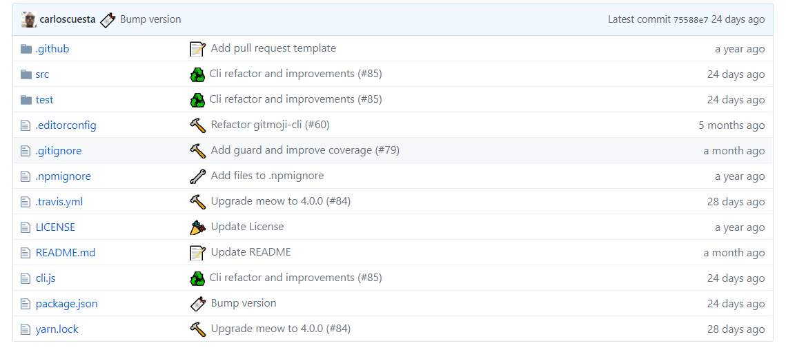

# 在git项目中使用emoji

emoji源于日语词汇“絵文字”, 想必大家对它都挺熟悉的吧, 其拟人化的生动形象，已经成为当下流行的表情之一. 现在Github已经支持使用 emoji 啦~ 那么这意味着我们可以随意卖萌了?(不

实际上在项目中, 这 emoji 的使用还真有讲究. 用的恰当能使项目中的每个`commit`内容都变得更可观, 接下来讲一下如何规范的在`git`中使用 emoji 提高可读性.


<!-- more -->

### 使用方式

在`git commit`上加入emoji的二进制符号, 格式为

``` bash
  :emoji1: :emoji2: 本次提交的主要内容
```

如初次提交:

``` bash
  git commit -m ":tada: Initialize Repo"
```

### 相关规范

emoji 表情在提交代码的时候也不能乱用，否则容易造成误解. 因此开源项目[gitmoji](https://gitmoji.carloscuesta.me/)专门规定了在 github 提交代码时应当遵循的 emoji 规范：

| emoji                                | emoji代码                     | 说明                       |
| :----------------------------------- | :---------------------------- | :------------------------- |
| :tada:(喝彩)                         | `:tada:`                      | 初始提交                   |
| :art:(调色板)                        | `:art:`                       | 改进代码的结构/格式        |
| :zap:(闪电)                          | `:zap:`                       | 提高性能                   |
| :fire:(火焰)                         | `:fire:`                      | 删除代码或文件             |
| :bug:(bug)                           | `:bug:`                       | 修复一个错误               |
| :ambulance:(紧急救护车)              | `:ambulance:`                 | 关键修补程序               |
| :sparkles:(闪亮)                     | `:sparkles:`                  | 引用新功能                 |
| :memo:(备忘录)                       | `:memo:`                      | 编写文档                   |
| :rocket:(火箭)                       | `:rocket:`                    | 部署新功能                 |
| :recycle:(重构)                      | `:recycle:`                   | 代码重构                   |
| :lipstick:(口红)                     | `:lipstick:`                  | 更新UI和样式文件           |
| :white_check_mark:(复选框)           | `:white_check_mark:`          | 添加测试                   |
| :apple:(苹果)                        | `:apple:`                     | 修复MacOS上的问题          |
| :penguin:(企鹅)                      | `:penguin:`                   | 修复Linux上的问题          |
| :checkered_flag:(旗子)               | `:checkered_flag:`            | 修复Windows上的问题        |
| :robot:(机器人)                      | `:robot:`                     | 解决Android上的问题        |
| :green_apple:(绿苹果)                | `:green_apple:`               | 解决iOS上的问题            |
| :bookmark:(书签)                     | `:bookmark:`                  | 发布/版本标签              |
| :rotating_light:(警告灯)             | `:rotating_light:`            | 移除 linter 警告           |
| :construction:(施工)                 | `:construction:`              | 工作正在进行中             |
| :green_heart:(绿心)                  | `:green_heart:`               | 修复CI构建                 |
| :arrow_down:(下降)                   | `:arrow_down:`                | 降级依赖关系               |
| :arrow_up:(上升)                     | `:arrow_up:`                  | 升级依赖关系               |
| :pushpin:(图钉)                      | `:pushpin:`                   | 将依赖关系固定到特定的版本 |
| :construction_worker:(工人)          | `:construction_worker:`       | 添加CI构建系统             |
| :chart_with_upwards_trend:(上升趋势) | `:chart_with_upwards_trend:`  | 添加分析或跟踪代码         |
| :heavy_minus_sign:(减号)             | `:heavy_minus_sign:`          | 删除依赖项                 |
| :whale:(鲸鱼)                        | `:whale:`                     | 关于Docker的工作           |
| :heavy_plus_sign:(加号)              | `:heavy_plus_sign:`           | 添加一个依赖项             |
| :wrench:(扳手)                       | `:wrench:`                    | 更改配置文件               |
| :pencil2:(铅笔)                      | `:pencil2:`                   | 修正错别字                 |
| :hankey:(hankey)                     | `:hankey:`                    | 编写需要改进的不好的代码   |
| :rewind:(回退)                       | `:rewind:`                    | 恢复更改                   |
| :globe_with_meridians:(国际化)       | `:globe_with_meridians:`      | 国际化和本地化             |
| :twisted_rightwards_arrows:(合并)    | `:twisted_rightwards_arrows:` | 合并分支                   |
| :package:(打包)                      | `:package:`                   | 更新编译的文件或包         |
| :alien:(外星人)                      | `:alien:`                     | 由于外部API更改而更新代码  |
| :truck:(移动搬家)                    | `:truck:`                     | 移动或重命名文件           |
| :page_facing_up:(页面)               | `:page_facing_up:`            | 添加或更新许可证           |
| :boom:(爆炸性)                       | `:boom:`                      | 介绍突破性变化             |
| :bento:(便当)                        | `:bento:`                     | 添加或更新资产             |
| :ok_hand:(好的手势)                  | `:ok_hand:`                   | 由于代码审阅更改而更新代码 |
| :wheelchair:(无障碍)                 | `:wheelchair:`                | 改善无障碍                 |
| :bulb:(灯泡)                         | `:bulb:`                      | 记录源代码                 |
| :speech_balloon:(文字框)             | `:speech_balloon:`            | 更新文字和文字             |
| :card_file_box:(存档箱)              | `:card_file_box:`             | 执行与数据库相关的更改     |
| :loud_sound:(声响)                   | `:loud_sound:`                | 添加日志                   |
| :mute:(静音)                         | `:mute:`                      | 删除日志                   |
| :children_crossing:(用户)            | `:children_crossing:`         | 改善用户体验/可用性        |
| :building_construction:(建筑)        | `:building_construction:`     | 进行架构更改               |

**参考资料:**

Git emoji: https://gitmoji.carloscuesta.me  
Github emoji列表: https://segmentfault.com/a/1190000009649780