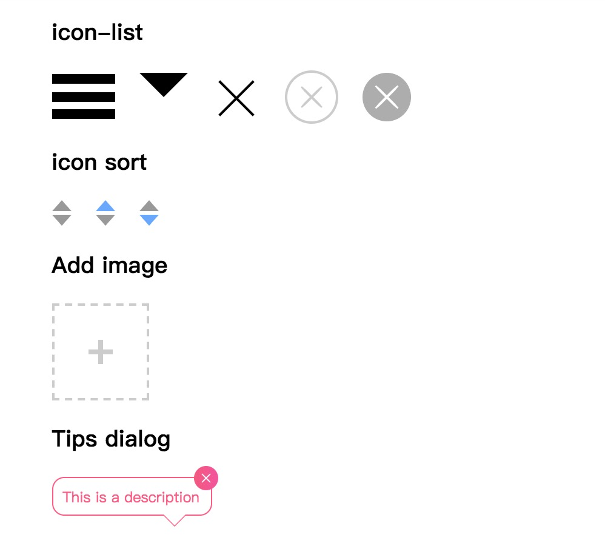
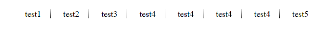

# CSS World


> CSS 世界中的各类属性相互间有着紧密联系，而非独立的个体。 --by 张鑫旭

css 看似简单，但我们在编写 css 时，时常能看到动了一个属性，然后牵扯出其他属性或者布局的变化。有些对 css 不够熟悉的同学就容易踩到坑。因此将一些常用的 css 方法抽出来，可以现拿现用~

我会尽量将案例都配合图片来展示效果. `codepen` 是一个在线分享代码的工具, 点击进去可以能看到代码的实际效果.

---

**目录:**

- [CSS World](#css-world)
  - [common](#common)
    - [值得注意的规则](#%e5%80%bc%e5%be%97%e6%b3%a8%e6%84%8f%e7%9a%84%e8%a7%84%e5%88%99)
    - [Reset、Normalize 的选择](#resetnormalize-%e7%9a%84%e9%80%89%e6%8b%a9)
    - [继承性与通配符](#%e7%bb%a7%e6%89%bf%e6%80%a7%e4%b8%8e%e9%80%9a%e9%85%8d%e7%ac%a6)
  - [常见工具类](#%e5%b8%b8%e8%a7%81%e5%b7%a5%e5%85%b7%e7%b1%bb)
    - [[display] 隐藏元素](#display-%e9%9a%90%e8%97%8f%e5%85%83%e7%b4%a0)
    - [[image] 居中裁剪图片](#image-%e5%b1%85%e4%b8%ad%e8%a3%81%e5%89%aa%e5%9b%be%e7%89%87)
    - [[layout] 居中元素](#layout-%e5%b1%85%e4%b8%ad%e5%85%83%e7%b4%a0)
    - [[text] 文本溢出溢出隐藏](#text-%e6%96%87%e6%9c%ac%e6%ba%a2%e5%87%ba%e6%ba%a2%e5%87%ba%e9%9a%90%e8%97%8f)
    - [图形绘制](#%e5%9b%be%e5%bd%a2%e7%bb%98%e5%88%b6)
  - [feature](#feature)
    - [[nav] 导航渐变色分割线](#nav-%e5%af%bc%e8%88%aa%e6%b8%90%e5%8f%98%e8%89%b2%e5%88%86%e5%89%b2%e7%ba%bf)
    - [[nav] 导航列表下标，悬浮动画显示](#nav-%e5%af%bc%e8%88%aa%e5%88%97%e8%a1%a8%e4%b8%8b%e6%a0%87%e6%82%ac%e6%b5%ae%e5%8a%a8%e7%94%bb%e6%98%be%e7%a4%ba)
    - [[overflow] 查看更多](#overflow-%e6%9f%a5%e7%9c%8b%e6%9b%b4%e5%a4%9a)
    - [[animation] loading](#animation-loading)
    - [[image] 悬浮头像动画](#image-%e6%82%ac%e6%b5%ae%e5%a4%b4%e5%83%8f%e5%8a%a8%e7%94%bb)
  - [layout](#layout)
    - [圣杯布局](#%e5%9c%a3%e6%9d%af%e5%b8%83%e5%b1%80)
    - [双飞翼布局](#%e5%8f%8c%e9%a3%9e%e7%bf%bc%e5%b8%83%e5%b1%80)
    - [Flexbox 布局](#flexbox-%e5%b8%83%e5%b1%80)
    - [响应式布局](#%e5%93%8d%e5%ba%94%e5%bc%8f%e5%b8%83%e5%b1%80)
    - [Grid](#grid)
  - [动画与特效](#%e5%8a%a8%e7%94%bb%e4%b8%8e%e7%89%b9%e6%95%88)

---

## common

### 值得注意的规则

1. css 选择符是从右至左进行匹配的，因此需要尽可能的减少匹配的层级.
2. 了解哪些属性是可以通过继承而来，避免重复指定规则
3. 滚动容器不要使用 `padding-bottom` 进行留白，IOS 低版本会直接忽略掉。除此之外`IE`, 低版本的`firefox`据说也有这种情况.

### Reset、Normalize 的选择

关于这两者有什么区别, 该如何取舍. 我曾经写过一篇博客, 感兴趣的同学可以过去看一下 - [浅谈 Normalize 与 reset](https://anran758.github.io/blog/2017/10/15/%E6%B5%85%E8%B0%88Normalize%E4%B8%8Ereset/)

优化后的[reset.css](./reset.css)

### 继承性与通配符

使用通配符(`*`), 意味着页面中的所有的标签都会加上通配符里的属性. 然而很多人在使用的时候, 尤其在不了解属性特性的情况下, 容易造成很大性能浪费.

就比如说有些属性是具有**继承性**的, 在下例中`<em>`标签在没有制定`color`属性时, 就逐级向上找到`.container`的`color`继承.

```html
<style>
  .container {
    color: green;
  }
</style>

<div class="container">
  这里是div容器内
  <p>这是一个<em>演示</em>的例子</p>
</div>
```

这意味着如果我们用通配符设置这些属性时, 会徒劳给页面的增加没必要的性能负担.

再来看一个典型的例子. iOS 系统下, 点击一个链接或者通过 Javascript 定义的可点击元素的时候, 会出现一个半透明的灰色背景(就是所谓会闪一下), 这时`可以设置-webkit-tap-highlight-color`为透明来重置这个"BUG", 这里属性没用错, 但问题就出现在错误的使用了通配符. 如下图:


还有一种就是使用`* {margin: 0; padding: 0}`则就过分了, `H1 ~ 6`标签本身就没有默认`padding`, 你特么非要给人家重置一下. `<li>`就更无辜了, 没有默认的`padding`和`margin`也要被批斗. 因此我们应该避免使用通配符.

---

## 常见工具类

### [display] 隐藏元素

如果项目用需要优化无障碍的体验，那应该避免使用`display: none`。因为辅助屏幕设备实际上是读不了设置了这个属性里的内容, 搜索引擎的爬虫蜘蛛也会过滤掉设置了`display: none` 里的内容.

```css
.hidden {
  position: absolute;
  top: -9999em;
}

.hidden {
  position: absolute;
  clip: rect(1px 1px 1px 1px); /* IE6, IE7 */
  clip: rect(1px, 1px, 1px, 1px);
}
```

如果不用顾忌无障碍的话, 也可以这个方法来避免页面回流

```css
.hidden {
  position: absolute;
  visibility: hidden;
}
```

### [image] 居中裁剪图片

我们经常能遇到这种情景, 做一个用户头像. 拿到的图片是一个长方形的长图, 但是我们并不需要这么长的图, 因此我们需要"裁剪". 这时我们只需设置图片中心为原点, 设置相应的宽高再加上圆角即可, 代码如下:

```css
.user-info-box .avatar {
  width: 86px;
  height: 86px;
  border-radius: 50%;
  background: 50%/cover;
  background-color: #f1f1f1;
  background-image: url(https://avatars.githubusercontent.com/u/23024075?v=3);
}
```


其中`background: 50%/cover`是关键, 这一个方法同时也可以适用于其他有图片的场景.

[codepen / try it](https://codepen.io/anran758/pen/WdOvRY/)

### [layout] 居中元素

常用的居中方法：

- `absolute` + `margin` 分配剩余空间。这个方法**需要设置宽高**.

  ```css
  .element {
    width: 600px;
    height: 400px;
    position: absolute;
    left: 0;
    top: 0;
    right: 0;
    bottom: 0;
    margin: auto;
  }
  ```

- `absolute` + `transform`自身宽高的一半, 副作用是`transform`会**占据原来的文档流位置**。

  ```css
  .element {
    position: absolute;
    top: 50%;
    left: 50%;
    transform: translate(-50%, -50%);
  }
  ```

- 基于 `vertical-align` 的水平垂直居中 --by 张鑫旭

  ```html
  <div class="container">
    <div class="dialog">
      <div class="content">内容占位</div>
    </div>
  </div>
  ```

  ```css
  .container {
    position: fixed;
    top: 0;
    right: 0;
    bottom: 0;
    left: 0;
    /* for IE8 */
    /* background: url(data:image/png;base64,iVB...g==); */
    /* for IE9+ */
    background: rgba(0, 0, 0, 0.5);
    text-align: center;
    white-space: nowrap;
    z-index: 99;
  }
  .container:after {
    content: '';
    display: inline-block;
    height: 100%;
    vertical-align: middle;
  }
  .dialog {
    display: inline-block;
    vertical-align: middle;
    border-radius: 6px;
    background-color: #fff;
    text-align: left;
    white-space: normal;
  }
  ```

- 使用 `Flex` 布局方式

  ```html
  <div class="parent">
    <div>children</div>
  </div>
  ```

  ```css
  .parent {
    display: flex;
    justify-content: center;
    align-items: center;
    width: 100px;
    height: 100px;
    border: 1px solid red;
  }
  ```

### [text] 文本溢出溢出隐藏

**单行溢出:**

`text-overflow` 只是用来说明文字溢出时用什么方式显示，要实现溢出时产生省略号的效果，还须配合其他属性.

```css
/* 强制不断行, 单行超出范围出现省略号 */
.overflow {
  overflow: hidden;
  white-space: nowrap;
  text-overflow: ellipsis;
}
```

**多行溢出:**

```css
.intwoline {
  display: -webkit-box !important;
  overflow: hidden;
  text-overflow: ellipsis;
  word-break: break-all;
  -webkit-box-orient: vertical;
  -webkit-line-clamp: 2;
}
```

不过这种纯 CSS 的方法受兼容性限制, ~~非`webkit`内核的浏览器都没有实现.~~ 不过这个方法在移动端可以适用. 在 caniuse 上我们可以得知, ios.Safari 5.1+, Android 2.3+ 均支持`-webkit-`的前缀.

除此之外的方法就只能使用 js 计算了.

### 图形绘制

可以利用`css`属性来绘制常见的图形, 来完成一些设计所需，同时还可以节省图片的 HTTP 请求.

[codepen / try it](https://codepen.io/anran758/pen/jxjGyo)



---

## feature

### [nav] 导航渐变色分割线

使用`after`对导航进行分割, 对`background`使用`linear-gradient`渐变.

[codepen / try it](https://codepen.io/anran758/pen/ypXYba)



### [nav] 导航列表下标，悬浮动画显示

利用`:before`和`transition`实现悬浮后, 下标从底部中间向两边展开.

[codepen / try it](https://codepen.io/anran758/pen/BJZdLL)


### [overflow] 查看更多

白色半透明遮罩的"查看更多"，使用 `linear-gradient` 颜色渐变，再使用 `pointer-events: none` 清除默认事件.  
[codepen / try it](https://codepen.io/anran758/pen/ppwwKN)


### [animation] loading

我们可以利用 css3 属性来做一些动画 loading, 相对于图片既能节省 HTTP 请求, 仅需几行代码即可实现我们想要的功能功能. github 上也有很多这种动画库, 有兴趣的同学可以搜一搜.


[codepen / try it](https://codepen.io/anran758/pen/dmOPdO)

### [image] 悬浮头像动画

我们利用 css3 属性的`transform`对悬浮后的`border`进行旋转, 通过`transition`进行过度, 从而实现悬浮后的炫酷效果.


[codepen / try it](https://codepen.io/anran758/pen/YapWKd)

---

## layout

### 圣杯布局

圣杯布局实际上是讨论「三栏液态布局」的实现, 主要思想是让中间主要的内容先渲染, 两边相对来说没那么重要的放在后面加载.

圣杯布局让`container`上构建三个模块， 分别为`left`、`main`、`right`，其中`main`独占一行.
实现的原理如下：

1. 三者都使用 `float` 进行浮动.
2. `container` 使用 `padding` 为两侧栏腾出空位.
3. 将主要内容 `main` 排在前头, 让**DOM 树**先加载.
4. 两侧栏添加 `relative` 定位，左列使用 `margin-left: -100%`，右例使用 `margin-left: -右列宽度`。

[源码](./design/layout/grail.html)


### 双飞翼布局

双飞翼布局和圣杯布局类似，也是左，中，右三列，中列里面会再套一个容器。

- 中列宽度设置为`100%`
- 使用负边距`margin-left`把左右两列拉到和中列同一行
- 在中列内的容器 div 设置`margin-left`和`margin-right`给左右两列留下对应的空间

实现代码也很简单：

```html
<!-- HTML -->
<div class="container">
  <!-- 中间的 div 必须写在最前面 -->
  <div class="middle">
    <div class="middle-inner">中间弹性区</div>
  </div>
  <div class="left">左边栏</div>
  <div class="right">右边栏</div>
</div>

<!-- CSS -->
<style>
  .container {
    width: 960px;
    margin: 20px auto;
    overflow: hidden;
  }
  .middle {
    float: left;
    width: 100%;
  }
  .middle-inner {
    margin: 0 240px; /*留出距离*/
    background-color: yellow;
  }
  .left {
    float: left;
    width: 220px;
    margin-left: -100%;
    background-color: red;
  }
  .right {
    float: left;
    width: 220px;
    margin-left: -220px;
    background-color: green;
  }
</style>
```

圣杯布局和双飞翼布局解决的问题是一样的，都是两边定宽，中间自适应的三栏布局，中间栏要在放在文档流前面以优先渲染。

这样做主要是因为早年的网络和设备没有现在这么优秀，为了让主要的内容先向用户呈现，所以很多时候都使用这两种布局方式。甚至可以说，现在很多人都还在使用这两种布局方式。

### Flexbox 布局

`Flexbox` 是 `CSS` 的一个新特性，这个新特性解决我们以前在 `CSS` 中很多麻烦问题，比如说内容的伸缩与扩展、垂直居中、等分列、等高列等等。

`Flexbox` 顾名思义就是弹性盒子, 它可以规定弹性元素如何分配空间或者布局的方式. 下面就是个例子. 利用`flex`的计算的特性, 配合 js 的`onclick`实现出来的效果.


当我们将 Flex 布局运用在移动端, 更能体现出它的价值——它能适配移动端各种复杂的屏幕. qq 音乐的导航就是使用了`flex`的属性, 我们来随机测试一下机型. 能发现不管是什么尺寸屏幕下, `flex`都能合理的分配空间.


关于 `Flexbox` 的使用这里也不多说了, 下面是一些学习资料, 感兴趣的朋友可以看一下:

- [Flexbox 简介](https://segmentfault.com/a/1190000002910324#articleHeader6)
- [Flex 布局教程：语法篇](http://www.ruanyifeng.com/blog/2015/07/flex-grammar.html)
- [Flex 入门](http://ife.baidu.com/note/detail/id/952)

### 响应式布局

响应式布局实际上是一个设计理念, 它是多项技术的综合体. 能适应于各种的屏幕. 其核心围绕着媒体查询(@media).

`max-width`是媒体查询的一个特性，其意思是指媒体类型小于或等于指定的宽度时, `min-width`则相反.

```css
/* 1024px显屏 */
@media screen and (max-width: 1024px) {
  /* 样式代码 */
}

/* 800px显屏 */
@media screen and (max-width: 800px) {
}

/* 640px显屏 */
@media screen and (max-width: 640px) {
}

/* iPad横板显屏 */
@media screen and (max-device-width: 1024px) and (orientation: landscape) {
}

/* iPad竖板显屏 */
@media screen and (max-device-width: 768px) and (orientation: portrait) {
}

/* iPhone 和 Smartphones */
@media screen and (min-device-width: 320px) and (min-device-width: 480px) {
}
```

现在有关于这方面的运用也是相当的成熟，twitter 的 Bootstrap 第二版本中就加上了这方面的运用。大家可以对比一下：

```css
@media (max-width: 480px) {
  /* ... */
}
@media (max-width: 768px) {
  /* ... */
}
@media (min-width: 768px) and (max-width: 980px) {
  /* ... */
}
@media (min-width: 1200px) {
  /* ... */
}
```

关于响应式布局设计的其他几个点可以看[这里](https://anran758.github.io/blog/2018/01/25/web-%E8%B5%B0%E8%BF%9Bweb%E7%A7%BB%E5%8A%A8%E5%BC%80%E5%8F%91/#%E5%93%8D%E5%BA%94%E5%BC%8F%E5%B8%83%E5%B1%80)

### Grid

[网格布局(Grid)](https://developer.mozilla.org/zh-CN/docs/Web/CSS/CSS_Grid_Layout) 是新一代布局方式。占个坑，未来抽空补充。

---

## 动画与特效

- [使用一个 div 做动画](https://a.singlediv.com/)
- [button 悬浮特效](https://codepen.io/anran758/pen/LejpaB/)
- [loading.io](https://loading.io/): 商用的 loading 特效
