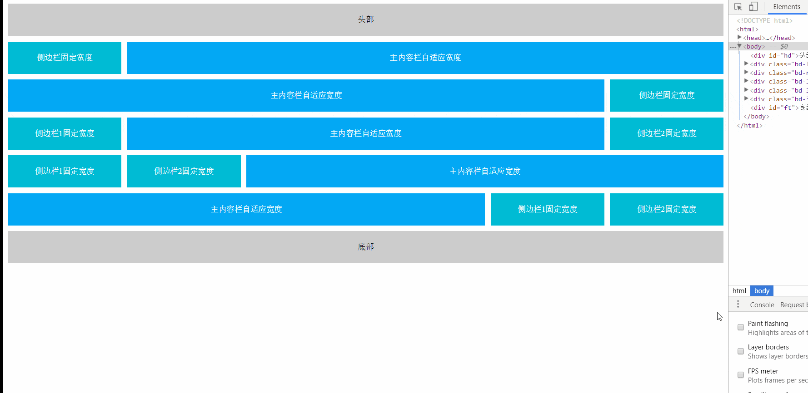
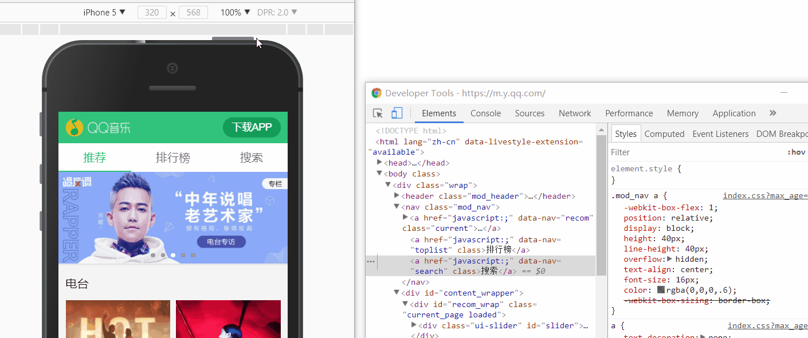
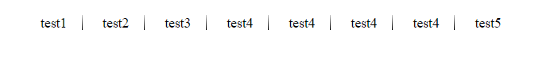
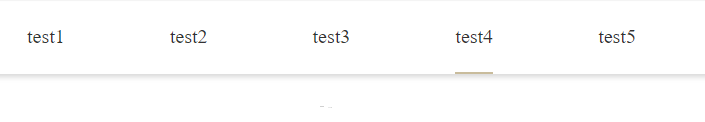
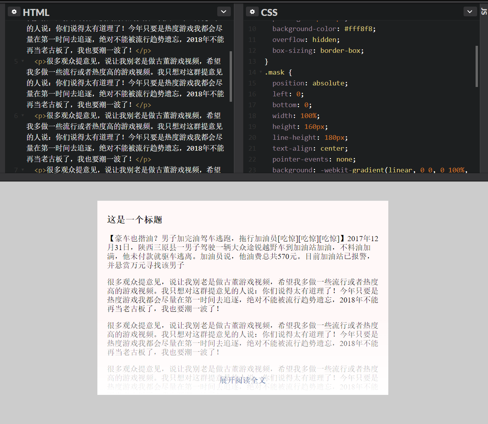
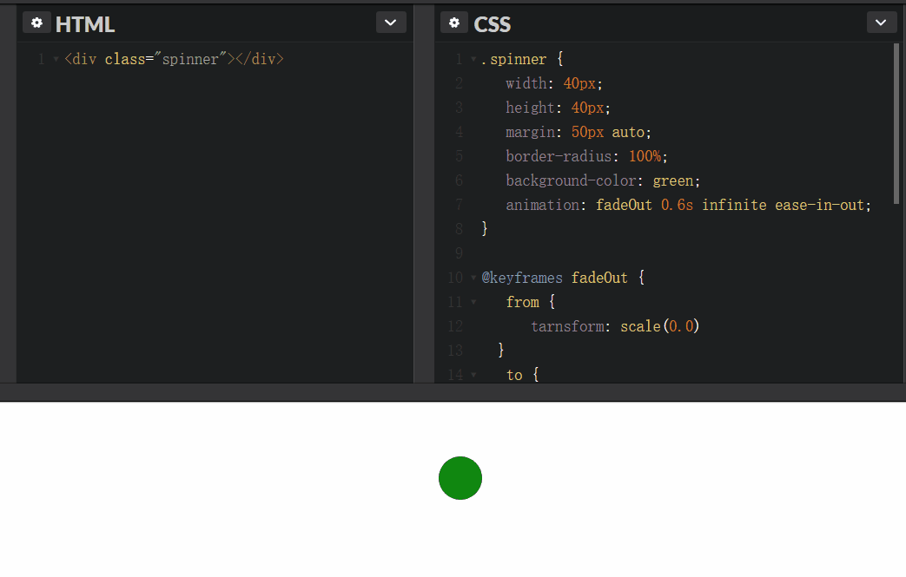
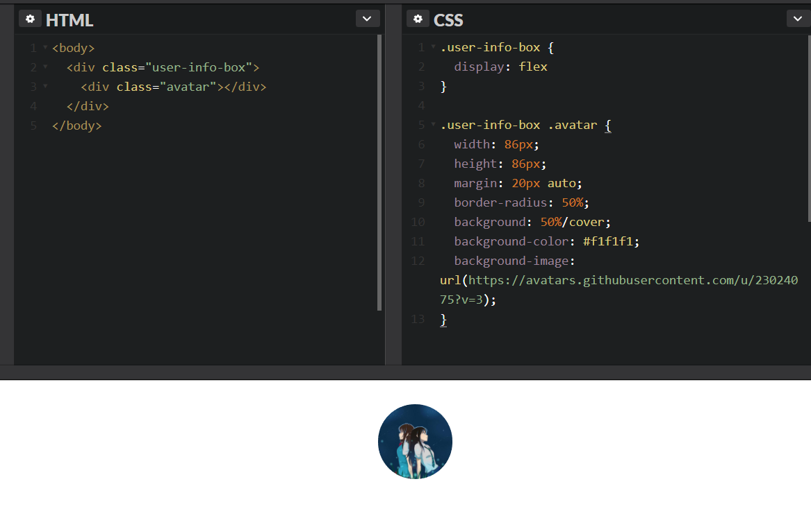
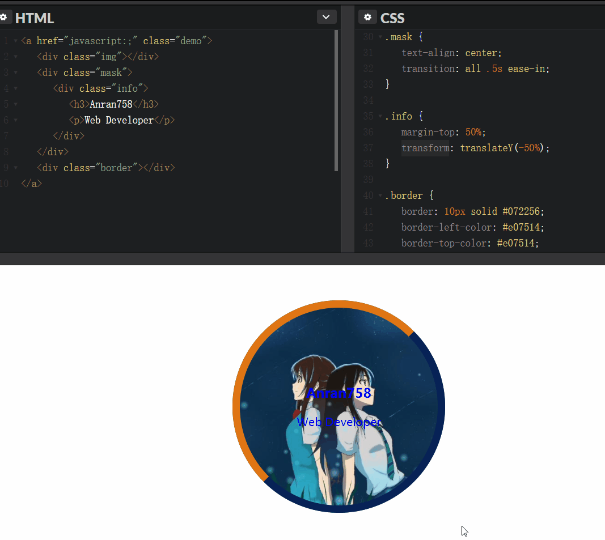
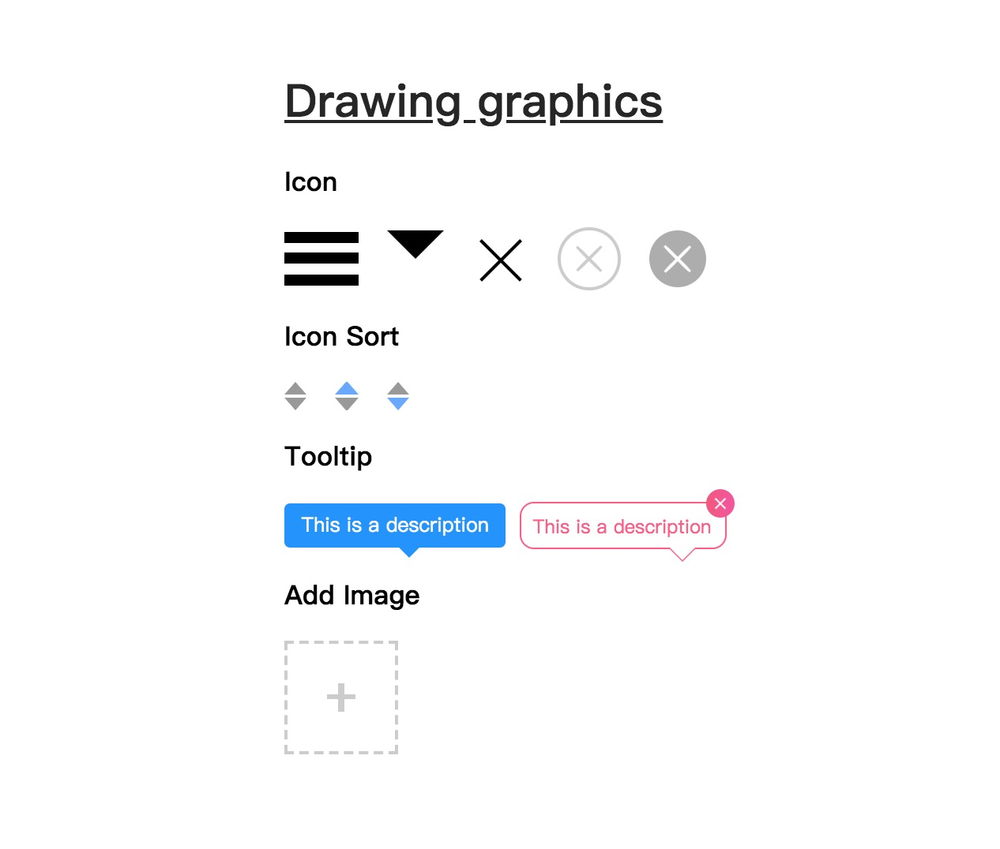
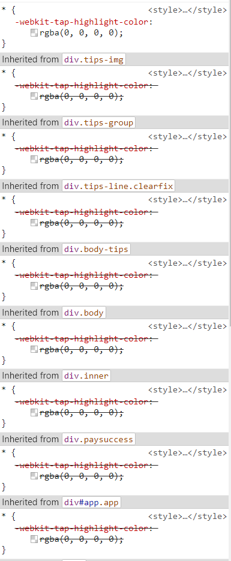

# CSS 应用

> css 实践搭配 codepen 预览效果会更佳噢~

**Table of Contents:**

[[toc]]

## Layout

### 圣杯布局

圣杯布局实际上是讨论「三栏液态布局」的实现, 主要思想是让中间主要的内容先渲染, 两边相对来说没那么重要的放在后面加载.

圣杯布局让`container`上构建三个模块， 分别为`left`、`main`、`right`，其中`main`独占一行.
实现的原理如下：

1. 三者都使用 `float` 进行浮动.
2. `container` 使用 `padding` 为两侧栏腾出空位.
3. 将主要内容 `main` 排在前头, 让**DOM 树**先加载.
4. 两侧栏添加 `relative` 定位，左列使用 `margin-left: -100%`，右例使用 `margin-left: -右列宽度`。

[示例](https://anran758.github.io/pages/demos/layout/grail)



### 双飞翼布局

双飞翼布局和圣杯布局类似，也是左，中，右三列，中列里面会再套一个容器。

- 中列宽度设置为`100%`
- 使用负边距`margin-left`把左右两列拉到和中列同一行
- 在中列内的容器 div 设置`margin-left`和`margin-right`给左右两列留下对应的空间

实现代码也很简单：

```html
<!-- HTML -->
<div class="container">
  <!-- 中间的 div 必须写在最前面 -->
  <div class="middle">
    <div class="middle-inner">中间弹性区</div>
  </div>
  <div class="left">左边栏</div>
  <div class="right">右边栏</div>
</div>

<!-- CSS -->
<style>
  .container {
    width: 960px;
    margin: 20px auto;
    overflow: hidden;
  }
  .middle {
    float: left;
    width: 100%;
  }
  .middle-inner {
    margin: 0 240px; /*留出距离*/
    background-color: yellow;
  }
  .left {
    float: left;
    width: 220px;
    margin-left: -100%;
    background-color: red;
  }
  .right {
    float: left;
    width: 220px;
    margin-left: -220px;
    background-color: green;
  }
</style>
```

圣杯布局和双飞翼布局解决的问题是一样的，都是两边定宽，中间自适应的三栏布局，中间栏要在放在文档流前面以优先渲染。

这样做主要是因为早年的网络和设备没有现在这么优秀，为了让主要的内容先向用户呈现，所以很多时候都使用这两种布局方式。甚至可以说，现在很多人都还在使用这两种布局方式。

### Flexbox 布局

`Flexbox` 是 `CSS` 的一个新特性，这个新特性解决我们以前在 `CSS` 中很多麻烦问题，比如说内容的伸缩与扩展、垂直居中、等分列、等高列等等。

`Flexbox` 顾名思义就是弹性盒子, 它可以规定弹性元素如何分配空间或者布局的方式. 下面就是个例子. 利用`flex`的计算的特性, 配合 js 的`onclick`实现出来的效果.


当我们将 Flex 布局运用在移动端, 更能体现出它的价值——它能适配移动端各种复杂的屏幕. qq 音乐的导航就是使用了`flex`的属性, 我们来随机测试一下机型. 能发现不管是什么尺寸屏幕下, `flex`都能合理的分配空间.



以下是 `Flex` 布局的参考资料:

- [Flexbox 布局入门](https://zhuanlan.zhihu.com/p/106311718)
- [Flexbox 布局实际用例](https://zhuanlan.zhihu.com/p/109144068)

### 响应式布局

响应式布局实际上是一个设计理念, 它是多项技术的综合体. 能适应于各种的屏幕. 其核心围绕着媒体查询(@media)。`max-width`是媒体查询的一个特性，其意思是指媒体类型小于或等于指定的宽度时, `min-width`则相反。在 [Bootstrap](https://getbootstrap.com/docs/4.1/layout/overview/) 中已经有相关文档的指导。

以下代码是当设备的宽度**大于等于**指定尺寸时，代码会被应用：

``` css
/* Small devices (landscape phones, devices width >= 576px) */
@media (min-width: 576px) { ... }

/* Medium devices (tablets, devices width >= 768px) */
@media (min-width: 768px) { ... }

/* Large devices (desktops, devices width >= 992px) */
@media (min-width: 992px) { ... }

/* Extra large devices (large desktops, devices width >= 1200px) */
@media (min-width: 1200px) { ... }
```

以下代码是当设备的宽度**小于**指定尺寸时，代码会被应用：

``` css
/* 超小型设备 (portrait phones, less than 576px) */
@media (max-width: 575.98px) { ... }

/* 小型设备 (landscape phones, less than 768px) */
@media (max-width: 767.98px) { ... }

/* 中型设备 (tablets, less than 992px) */
@media (max-width: 991.98px) { ... }

/* 大型设备 (desktops, less than 1200px) */
@media (max-width: 1199.98px) { ... }

/* 超大型设备 (large desktops, 1200px and up) */
@media (min-width: 1200px) { ... }
```

以上使用 `.98px` 的原因在于避免 `max-width` 与 `min-width` 同时出现时规则用冲突的情况。具体原因参见: [Why does Bootstrap use a 0.02px difference between screen size thresholds in its media queries?](https://stackoverflow.com/questions/51566916/why-does-bootstrap-use-a-0-02px-difference-between-screen-size-thresholds-in-its)

还可以针对指定大小的设备宽度做定制化样式:

``` css
/* 超小型设备 (portrait phones, less than 576px) */
@media (max-width: 575.98px) { ... }

/* 小型设备 (landscape phones, 576px and up) */
@media (min-width: 576px) and (max-width: 767.98px) { ... }

/* 中型设备 (tablets, 768px and up) */
@media (min-width: 768px) and (max-width: 991.98px) { ... }

/* 大型设备 (desktops, 992px and up) */
@media (min-width: 992px) and (max-width: 1199.98px) { ... }

/* 超大型设备 (large desktops, 1200px and up) */
@media (min-width: 1200px) { ... }
```

关于响应式布局设计的其他几个点可以看[这里](https://anran758.github.io/blog/2018/01/25/web-%E8%B5%B0%E8%BF%9Bweb%E7%A7%BB%E5%8A%A8%E5%BC%80%E5%8F%91/#%E5%93%8D%E5%BA%94%E5%BC%8F%E5%B8%83%E5%B1%80)

### Grid

`Grid` 是新一代布局方式，下面是相关的学习资料:

- [网格布局(Grid) | MDN](https://developer.mozilla.org/zh-CN/docs/Web/CSS/CSS_Grid_Layout)
- [CSS Grid | freeCodeCamp](https://learn.freecodecamp.one/responsive-web-design/css-grid)

## Utils

### [display] 隐藏元素

如果项目用需要优化无障碍的体验，那应该避免使用`display: none`。因为辅助屏幕设备实际上是读不了设置了这个属性里的内容, 搜索引擎的爬虫蜘蛛也会过滤掉设置了`display: none` 里的内容.

```css
.hidden {
  position: absolute;
  top: -9999em;
}

.hidden {
  position: absolute;
  clip: rect(1px 1px 1px 1px); /* IE6, IE7 */
  clip: rect(1px, 1px, 1px, 1px);
}
```

如果不用顾忌无障碍的话, 也可以这个方法来避免页面回流

```css
.hidden {
  position: absolute;
  visibility: hidden;
}
```

### [layout] 居中元素

**常用的居中方法**：

[单行垂直水平居中]: 容器 `height` 与 `line-height` 设为相同的值

``` css
.container {
  height: 30px;
  line-height: 30px;
  text-align: center;
}
```

`absolute` + `margin` 分配剩余空间。这个方法**需要设置宽高**.

``` css
.element {
width: 600px;
height: 400px;
position: absolute;
left: 0;
top: 0;
right: 0;
bottom: 0;
margin: auto;
}
```

`absolute` + `transform`自身宽高的一半, 副作用是`transform`会**占据原来的文档流位置**。

``` css
.element {
  position: absolute;
  top: 50%;
  left: 50%;
  transform: translate(-50%, -50%);
}
```

基于 `vertical-align` 的水平垂直居中 --by 张鑫旭

 ```html
 <div class="container">
  <div class="dialog">
    <div class="content">内容占位</div>
  </div>
 </div>
 ```

``` css
.container {
  position: fixed;
  top: 0;
  right: 0;
  bottom: 0;
  left: 0;
  /* for IE8 */
  /* background: url(data:image/png;base64,iVB...g==); */
  /* for IE9+ */
  background: rgba(0, 0, 0, 0.5);
  text-align: center;
  white-space: nowrap;
  z-index: 99;
}
.container:after {
  content: '';
  display: inline-block;
  height: 100%;
  vertical-align: middle;
}
.dialog {
  display: inline-block;
  vertical-align: middle;
  border-radius: 6px;
  background-color: #fff;
  text-align: left;
  white-space: normal;
}
```

`flex` 布局

``` html
<div class="parent">
  <div>children</div>
</div>
```

``` css
.parent {
  display: flex;
  justify-content: center;
  align-items: center;
  width: 100px;
  height: 100px;
  border: 1px solid red;
}
```

### [text] 文本溢出隐藏

**单行溢出:**

`text-overflow` 只是用来说明文字溢出时用什么方式显示，要实现溢出时产生省略号的效果，还须配合其他属性.

```css
/* 强制不断行, 单行超出范围出现省略号 */
.overflow {
  overflow: hidden;
  white-space: nowrap;
  text-overflow: ellipsis;
}
```

**多行溢出:**

```css
.in-two-line {
  display: -webkit-box !important;
  overflow: hidden;
  text-overflow: ellipsis;
  word-break: break-all;
  -webkit-box-orient: vertical;
  -webkit-line-clamp: 2;
}
```

不过这种纯 CSS 的方法受兼容性限制, ~~非`webkit`内核的浏览器都没有实现.~~ 不过这个方法在移动端可以适用. 在 caniuse 上我们可以得知, ios.Safari 5.1+, Android 2.3+ 均支持`-webkit-`的前缀.

除此之外的方法就只能使用 js 计算了.

### [text] 文本颜色渐变

``` css
.text-gradient {
  background: linear-gradient(90deg, #00aeff, #3369e7);
  /* IE9+ */
  -webkit-background-clip: text;
  -webkit-text-fill-color: transparent;
  -webkit-box-decoration-break: clone;
  box-decoration-break: clone;
  text-shadow: none;
}
```

[点击此链接跳转至 codepen demo](https://codepen.io/anran758/pen/ExVRLeX)

## Feature

### [nav] 导航渐变色分割线

使用`after`对导航进行分割, 对`background`使用`linear-gradient`渐变.

[点击此链接跳转至 codepen demo](https://codepen.io/anran758/pen/ypXYba)



### [nav] 导航列表下标，悬浮动画显示

利用`:before`和`transition`实现悬浮后, 下标从底部中间向两边展开.

[点击此链接跳转至 codepen demo](https://codepen.io/anran758/pen/BJZdLL)



### [overflow] 查看更多

白色半透明遮罩的"查看更多"，使用 `linear-gradient` 颜色渐变，再使用 `pointer-events: none` 清除默认事件.

[点击此链接跳转至 codepen demo](https://codepen.io/anran758/pen/ppwwKN)



### [animation] loading

我们可以利用 css3 属性来做一些动画 loading, 相对于图片既能节省 HTTP 请求, 仅需几行代码即可实现我们想要的功能功能. github 上也有很多这种动画库, 有兴趣的同学可以搜一搜.



[点击此链接跳转至 codepen demo](https://codepen.io/anran758/pen/dmOPdO)

### [image] 居中裁剪展示图片

我们经常能遇到这种情景, 做一个用户头像. 拿到的图片是一个长方形的长图, 但是我们并不需要这么长的图, 因此我们需要"裁剪". 这时我们只需设置图片中心为原点, 设置相应的宽高再加上圆角即可, 代码如下:

```css
.user-info-box .avatar {
  width: 86px;
  height: 86px;
  border-radius: 50%;
  background: 50%/cover;
  background-color: #f1f1f1;
  background-image: url(https://avatars.githubusercontent.com/u/23024075?v=3);
}
```



其中`background: 50%/cover`是关键, 这一个方法同时也可以适用于其他有图片的场景.

[点击此链接跳转至 codepen demo](https://codepen.io/anran758/pen/WdOvRY/)

### [image] 悬浮头像动画

我们利用 css3 属性的`transform`对悬浮后的`border`进行旋转, 通过`transition`进行过度, 从而实现悬浮后的炫酷效果.



[点击此链接跳转至 codepen demo](https://codepen.io/anran758/pen/YapWKd)

### [image] 图像置灰

css 中的 filter 可以将**模糊**或**颜色偏移**等图形效果应用于元素。其中 `grayscale` 函数可以设置图像的灰度:

``` css
.image {
  filter: grayscale(100%);
}
```


### 图形绘制

可以利用`css`属性来绘制常见的图形, 来完成一些设计所需，同时还可以节省图片的 HTTP 请求。

[点击此链接跳转至 codepen demo](https://codepen.io/anran758/pen/jxjGyo)



## 技术细节

### 继承性与通配符

使用通配符(`*`), 意味着页面中的所有的标签都会加上通配符里的属性. 然而很多人在使用的时候, 尤其在不了解属性特性的情况下, 容易造成很大性能浪费.

就比如说有些属性是具有**继承性**的, 在下例中`<em>`标签在没有制定`color`属性时, 就逐级向上找到`.container`的`color`继承.

```html
<style>
  .container {
    color: green;
  }
</style>

<div class="container">
  这里是div容器内
  <p>这是一个<em>演示</em>的例子</p>
</div>
```

这意味着如果我们用通配符设置这些属性时, 会徒劳给页面的增加没必要的性能负担.

再来看一个典型的例子. iOS 系统下, 点击一个链接或者通过 Javascript 定义的可点击元素的时候, 会出现一个半透明的灰色背景(就是所谓会闪一下), 这时`可以设置-webkit-tap-highlight-color`为透明来重置这个"BUG", 这里属性没用错, 但问题就出现在错误的使用了通配符. 如下图:



还有一种就是使用`* {margin: 0; padding: 0}`则就过分了, `H1 ~ 6`标签本身就没有默认`padding`, 你特么非要给人家重置一下. `<li>`就更无辜了, 没有默认的`padding`和`margin`也要被批斗. 因此我们应该避免使用通配符.

### 清除浮动

Nicholas C. Zakas( 尼古拉斯)提出了个更好清除浮动的一个方案, 即:

设置 `display: table;` 可以创建一个匿名的表格单元，同时这个匿名的表格单元会触发 `BFC(block formatting context)` 来清除浮动。

``` css
.clearfix:before,
.clearfix:after {
  content: '';
  display: block;
}

.clearfix:after {
  clear: both;
}
```

### z-index design

css 中的 z-index 可以控制元素的层级，在多人项目开发中很容易产生相互覆盖的情况，所以在事先需要对该部分做一个设计约束。

多数情况下，普通的元素若需要修改层级仅仅需要设置为低等级即可，如 `z-index: 1`。若设计全局组件为了避免业务代码的侵入，会设置一个大数值。以下变量可作为参考:

``` scss
$zindex-dropdown:          1000 !default;
$zindex-sticky:            1020 !default;
$zindex-fixed:             1030 !default;
$zindex-modal-backdrop:    1040 !default;
$zindex-modal:             1050 !default;
$zindex-popover:           1060 !default;
$zindex-tooltip:           1070 !default;
```

## 动画与特效

- [使用一个 div 做动画](https://a.singlediv.com/)
- [button 悬浮特效](https://codepen.io/anran758/pen/LejpaB/)
- [loading.io](https://loading.io/): 商用的 loading 特效
