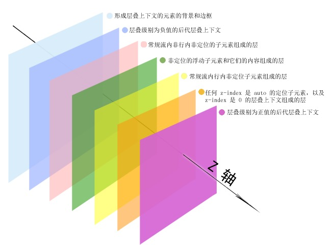

# CSS 原理

一些值得注意的 rule 或 defect:

1. css 选择符是从右至左进行匹配的，为了浏览器在匹配 rule 时消耗过的时间应避免嵌套太高层级，**建议最高不超过 3 层**。
2. 了解哪些属性可以通过继承而来，避免重复指定规则。
3. 滚动容器避免使用 `padding-bottom` 进行留白，IOS 低版本会直接忽略掉。除此之外 `IE`, 低版本的 `firefox` 据说也有这种情况。

在中文版 chrome 浏览器下, 最小的字号会有一个下限, 这个下限会强制改变小于该值的文字大小。使其成为默认浏览器最小的值。中文版最低是 `12px`，英文版则是 `10px`。

**相关资料:**

- [normalize 与 reset 的取舍](https://anran758.github.io/blog/2017/10/15/%E6%B5%85%E8%B0%88Normalize%E4%B8%8Ereset/)

## margin

### marin 百分比计算

普通元素的 `marin` 的百分比是根据父元素的宽度来计算的。例如:

```css
.parents {
  width: 600px;
}

img {
  margin: 10%;
}
```

那么子元素的 `margin` 计算后值为: `600px * 10% = 60px`。

绝对定位计算方式是相同的，只不过它不是相对父元素，而是相对于第一个定位元素 (`relative/absolute/fixed`) 的宽度计算的。

### margin 重叠通常特性

1. block 水平元素(不包括 `float` 和 `absolute` 元素)
2. 不考虑 `writing-mode`，只发生在垂直方向 (`margin-top` / `margin-bottom`)

### margin 重叠的场景

1. 相邻的兄弟元素
2. 父级和第一个 / 最后一个子元素
3. 空的 block 元素

### 父子 margin 重叠的其他条件

**margin-top 重叠**：

1. 父元素非块状格式化上下文元素
2. 父元素没有 `border-top` 设置
3. 父元素没有 `padding-top` 值
4. 父元素和第一个子元素之间没有 `inline` 元素分隔

**margin-bottom 重叠**:

1. 父元素非块状格式化上下文元素
2. 父元素没有 `border-bottom` 设置
3. 父元素没有 `padding-bottom` 值
4. 父元素和最后一个子元素之间没有 `inline` 元素分隔
5. 父元素没有 `height`、`min-height`、`max-height` 限制

### 空 block 元素重叠

1. 元素没有 `border`/`padding`/`inline` 元素;
2. 没有设置 `height`/`min-height`;

### margin 重叠计算规则

1. 正正取大值
2. 正负值相加
3. 正负最负值

### 清除 margin 重叠

1. -加入 css 属性 `overflow: hidden;`- 使父元素触发BFC,包括但不限于overflow:hidden;display:inline-block;等等
2. 加入边框 (`border`) 属性;
3. 加入 `padding-top`
4. 加入内联元素，如 `&nbsp;`
5. 限制高度 `height`

### 善用 margin 重叠

```css
.list {
  margin-top: 12px;
  margin-bottom: 12px;
}
```

写垂直布局的时候，利用 margin 重叠 (外边距塌陷) 的特性，在容器上下加上 margin 会更具有稳定性，哪怕移除元素或者元素没加载出来都不会破坏布局。

### margin 分配空间

`block` 元素可以使用 `margin` 分配剩余空间。

1. `margin:auto` 就是为了填充而设置的。
2. 如果一侧值是定值，另一侧是 auto，则 auto 为剩余值的空间大小
3. 如果两侧均是 `auto`，则平分剩余空间大小

元素上设置 `position: absolute;`、`width/height`，`left/right` 后可以通过 `margin: auto` 居中，兼容性: `IE8+`。

```css
.element {
  width: 400px;
  height: 400px;
  position: absolute;
  left: 0;
  top: 0;
  right: 0;
  bottom: 0;
  margin: auto;
}
```

### margin 实现等高布局

通过 `margin-bottom` 改变空间大小，`padding-bottom` 将内容填充回来，这时候元素占据的空间就是真实占高度据的空间。

副作用是必须要父元素 `overflow:hidden` 限制它，让 `margin-bottom` 不会影响外面的布局。

<iframe height="450" style="width: 100%;" scrolling="no" title="等高布局" src="https://codepen.io/anran758/embed/gOeyGeZ?default-tab=&editable=true" frameborder="no" loading="lazy" allowtransparency="true" allowfullscreen="true">
  See the Pen <a href="https://codepen.io/anran758/pen/gOeyGeZ">
  等高布局</a> by anran758 (<a href="https://codepen.io/anran758">@anran758</a>)
  on <a href="https://codepen.io">CodePen</a>.
</iframe>

### margin 失效的情况

1. `inline` 元素的垂直 `margin` 无效。
2. `margin` 重叠
3. 元素处于 `display:table-cell` 或 `display:table-row`
4. `position: absolute` 与 `margin`。

   绝对定位的 `margin` 值一直有效，只是表现形式不像普通元素那样。绝对定位元素是脱离文档流，它和相邻元素没有任何关系。可以理解为一个在地下，一个在天上，不在同一个维度)

5. 鞭长莫及导致的 margin 无效。
6. 内联特性导致的 margin 无效。(在有 `height` 限制下，`-margin` 小到一定程度时，会受制于内联默认对齐特性给限制住)

## float

**特性**：父元素没有设置固定高度，子元素设置了浮动，会使父元素高度坍塌。

### 关于标准文档流

**文档流**是相对于盒子模型，**文本流**是相对于文子段落。文本流是从上到下，从左到右的顺序进行文字排版。

元素浮动后，会让它脱离文档流。也就是说当它后面还有元素时，其他元素会无视它所占据的区域，直接在其身下布局。
但是文字还会认同浮动元素所占据的区域，围绕它布局，这意味着浮动元素脱离文档流但没有脱离文本流。

绝对定位元素脱离了文档流也脱离了文本流，文字都可以显示，这是**绝对定位和 float 的区别**。

总的来说，标准文档流=文档流+文本流。

## line-height

`line-height` 的定义：行高，表示两行文字基线的距离。

1. 行高由于其继承性，影响无处不在，即使单行文本也不例外。
2. 行高只是幕后黑手，高度的表现不是行高，而是内容区域和行间距。

```css
内容区域高度 + 行间距 = 行高
```

1. 内容区域高度只与字号以及字体有关，与 `line-height` 没有关系.
2. 在 `simsun(宋体)` 字体下，内容区域等于文字大小值。

```css
font-size + 行间距 = line-height

font-size: 240px;
line-height: 360px;
行间距 = 360px - 240px = 120px;
```

### 应用元素的差别

- `line-height: 1.5` 所有可继承元素根据 `font-size` 重计算行高
- `line-height: 150%/1.5em` 当前元素根据 `font-size` 计算行高，继承给下面的元素

### body 全局数值行高使用经验

面向用户: 匹配 `20px`的使用经验--方便心算

```css
body {
  font-size: 14px;
  line-height: 20px;
}
```

### 消除图片底部间隙的方法

1. 图片块状化 - 无基线对齐

   ```css
   img {
     display: block;
   }
   ```

2. 图片底线对齐

   ```css
   img {
     vertical-align: bottom;
   }
   ```

3. 行高足够小 - 基线位置上移

   ```css
   .box {
     line-height: 0;
   }
   ```

### middle

`vertical-align: middle` 其实就是基线往上1/2高度。

## position relative

### relative 限制作用

1. 限制 left/top/right/bottom 定位;
2. 限制 z-index 层级; (相同relative不同层级,层级高的显示在前)
3. 限制 overflow

### relative 和定位

1. 相对自身
2. 无侵入 (无侵入定位的应用)

top / bottom 和 left / right 对立属性同时存在会斗争,对立属性只有一个先来的会起作用

### relative 与 z-index 层级

1. 提高层叠上下文
2. 新建层叠上下文与层级控制
3. 设置 `position: relative` 的元素中 z-index 为 auto，不会限制内部 absolute 元素层叠问题.
   > :: IE6/IE7 auto 也会创建层叠上下文 (auto 不符合规范, 会出 bug)

### relative 的最小化影响原则

所谓 relative 的最小化影响原则，指的是尽量降低 relative 属性对其他元素或布局的潜在影响。

1. 尽量避免使用 relative
2. relative 最小化

## z-index

### z-index 的层级水平



1. 层叠上下文 background/border
2. 负 z-index
3. block 块状水平盒子
4. float 浮动盒子
5. inline/inline-block 水平盒子
6. z-index: auto 或 z-index: 0 不依赖 z-index 的层叠上下文
7. 正 z-index

### z-index 的相关实践

**最小化影响**

- 目的: z-index 嵌套层叠关系混乱
- 原因:
  1. 元素的层叠水平主要由所在的层叠上下文决定;
  2. IE7 z-index:auto 也会新建层叠上下文;
- 做法:
  1. 避免使用定位属性;
  2. 定位属性从大容器平级分离为私有小容器;

**避免滥用 z-index 层级**

- 目的: 避免 z-index 混乱，一山比一山高的样式问题
- 原因:

  1. 多人维护以及后期维护;

- 做法:

  1. 对于非浮层元素 (e.g. 弹框)，避免设置 z-index 值，z-index 值没有任何道理需要超过 2
     (避免弹框被非浮层元素覆盖)

**组件层级计数器**

- 目的: 避免浮层组件因 z-index 被覆盖的问题
- 原因:

  1. 总会遇到意想不到的高层级元素;
  2. 组件的覆盖规则具有动态性;

- 做法:

  1. 组件层级计数器方法: 通过 js 获取 body 下子元素最大的 z-index 值, 然后最大值 + 1

**可访问隐藏**

z-index 负值元素在层叠上下文的背景之上, 其他元素之下.
