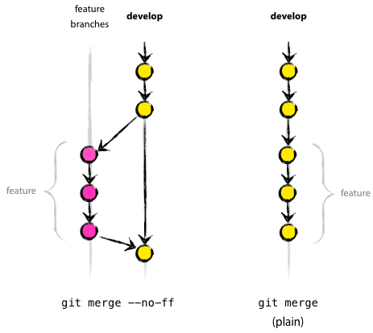

# Git

[[toc]]

| 术语      | 解释                                                                |
| --------- | ------------------------------------------------------------------- |
| origin    | 默认远端仓库                                                        |
| master    | 默认开发分支                                                        |
| HEAD      | 当前活跃分支的游标, 如果当前处于 master 分支，那么 HEAD 指向 master |
| HEAD^     | `HEAD` 父提交                                                       |
| tracked   | `git` 已经追踪文件                                                  |
| untracked | `git` 未跟踪的文件，也就是没有提交到 `git` 过的新文件               |
| revert    | 回退                                                                |
| stage     | 暂存的更改，此时文件还没有提交到远程                                |

## 日常提交流程

``` bash
# 跟踪改动过的文件
# `git add <file>` or
# `git add -A` or
git add .

# 添加 commit 信息
# 不同团队有不同的编写 commit 信息规范，有的项目依赖 commit 的格式来做自动化处理
# 常见格式如： `<action> <desc content>`
git commit -m "fix: message commit"

# 从远程仓库拉取代码，查看是否有冲突
# 直接 git pull 可能会有冲突，可采用 rebase 代替默认的 merge 策略减少多余的 commit 提交
git pull --rebase

# 提交改动至默认的远程仓库
git push

# or 同时提交改动至指定远程仓库(orgin)和分支(develop, master)
git push origin master develop

# 查看命令历史,
# 使用场景: 误操作 reset 错了 commit，现在期望恢复回来。
# 使用 git reflog 找到操作的历史，找到需要恢复的 commit_id 可以通过 git reset --hard <commit_id> 回退到原本的版本中
git reflog
```

## Add

``` shell
# 将 <change file> 将其添加到 “暂存的更改” 中
git add <change file>

# Example: 将当前路径下 ./docs/git/README.md 文件添加到 “暂存的更改” 中
git add docs/git/README.md

# 以下两者都是将修改的文件全部添加到缓存区中
git add .
git add --all
```

## Commit

``` shell
# 为已经进入 `stage(暂存的更改)` 添加`commit`信息
git commit -m <message>

# Example:
git commit -m "docs: uupdate README"

# 修改上次提交的 `commit` 信息, 之后会进入编辑器模式(一般是 vim 编辑器)
git commit --amend
```

## Branch

``` bash
# 查看分支
git branch

# git checkout <branch/tag> 切换指定的分支或标签
git checkout develop

# 切换名为 gh-pages 的分支, 如果不存在这个分支就基于当前分支创建它
# 比如当前分支为 develop, 那新分支的代码是基于 develop 的代码
git checkout -b "gh-pages"

# 使当前的分支和远程仓库 `origin2/game` 建立关联（前提是目标分支要存在）
# 建立关联后就可以直接使用 `git push` 命令而无需添加其他参数。
git branch --set-upstream-to orgin2/game

# 删除已合并的分支, 未合并过分支删除会失败
git branch -d feature/ticket-382

# 强制删除分支
git branch -D feature/ticket-382

# 删除远程的指定分支
git push origin --delete feature/ticket-382
```

### 批量删除分支

比如我现在 local 有很多不再需要使用的某个开发周期分支，因此可以通过管道批量删除分支：

``` shell
git branch | grep -v 13 | grep SPRINT | xargs git branch -D
```

上列代码中的 grep 用于查找文件里符合条件的字符串，用于过滤移除的结果，通过管道操作符可多次对结果进行筛选。xargs 是给命令行传递参数的工具。

### 修改远程分支名

``` bash
# 1. 重命名分支
git branch -m oldBranch newBranch

# 2. 删除远程分支
git push --delete origin oldBranch

# 3. 将修改后的新分支推送至远端并跟踪关联
git push -u origin newBranch
```

## Tag

``` bash
# 查看所有标签
git tag

# 基于当前 commit 创建标签
git tag <tagname>

# 删除指定标签
git tag -d <tagname>
```

## History

``` bash
# 查看提交历史
git log

# 使用更简洁的模式查看提交历史
git log --oneline

# 查看指定文件的提交历史
git log -p <file>

# 以列表的方式查看指定文件的提交历史
git blame <file>

# 查看指定用户 commit 记录
git log --author <authorName>

# 根据标签筛选出两个版本之间的 commit 信息:
git log master..develop
# 在 Git 中，..（两个连续的点）是一个范围操作符，用于表示两个参考点之间的范围。
# 以上表明筛选出 v0.0.1 和 v0.0.2 区间内的 commit 记录

# 查看上一次 commit 的修改内容
git show

# 查看指定 commit 的修改内容
git show <commitHash>

# 查看缓存区中文件的改动
git diff --cached
```

## Remote

添加新的 remote

``` bash
git remote add <originName> <remoteUrl>

# example, 添加一个 origin name 为 `newOrigin`
git remote add newOrigin https://github.com/anran758/front-end-lab.git
```

将本地分支推送到存在依赖关系的远端分支，如果 remote 没有推送的分支，那就新建一个:

``` bash
git push origin master
```

推送当前分支并与 remote 上游建立跟踪

``` bash
git push --set-upstream origin master
```

设置上游并推送至远程的 `master` 分支

``` bash
git push -u origin master

# 以下两条与上面一条功能相似
git push origin master
git branch --set-upstream-to orgin/master
```

## Guide

### 初始化远程仓库

假设你已经在远程储存库上创建了新的库(`test`)，此时需要将本地项目的代码关联并推送到远程仓库上去:

``` bash
cd test

# 初始化 git
git init

# 添加全部改动
git add .

# 添加 commit 信息
git commit -m "feat: init message"

# 添加远程地址
git remote add origin git@github.com:anran758/test.git

# 提交代码至 origin，并设置 master 分支为追踪分支
git push -u origin master
```

### 合并分支

分支合并时提供的 `--ff`, `--no-ff`, `--ff-only` 选项的不同会导致分支线可能会有不同：



其中 `ff` 为 `fast-forward` 的缩写，merge 代码时 git 默认会采用 `--ff` 的选项。
该选项的意思为：如果 master 没有分歧，git 不会创建新的提交，而是将 master 指向 feature 分支的最新提交，在 fast-forward 合并中不会有任何 “合并提交”。

一般我们合并 feature 分支时会倾向于将功能分支作为一条单独的线，合并后会保留这条分支线。此时就需要 merge 加上 `--no-ff`。即在所有情况下都创建 merge 提交。

> Tips: 我们可以通过 `git log --graph` 查看带分支线的 commit 日志。

### 撤销还没 push 到远程的 commit

``` bash
# 仅删除所有未追踪的文件，修改过已追踪的文件不会被回退
git clean -df

# 把已追踪的文件回退到前一个版本，不会删除未追踪的文件
git reset HEAD~1

# 把已追踪的文件回退到前一个版本，不会删除未追踪的文件。但会丢失已追踪的文件
git reset --hard
```

如果想撤销指定 commit 的话:

``` bash
# [保留文件的改动] 
#    如果当前只 commit 了一次，想给回退到 commit 前的上一个版本的话，
#    可以用 `HEAD` 指针来代替 `commit_hash`
# 
# HEAD    当前版本
# HEAD~1  当前版本向后移 1 个版本
# HEAD~5  当前版本向后移 5 个版本
git reset HEAD~1

# 如果想回退的版本过长，不好算 HEAD 偏移量时，可以根据 commit_hash 回退到指定版本
#
# Example: 我想将代码回退到第三个 commit(3333333) 的版本
git log --oneline
# 左侧=commit_hash, 右侧=commit_info
#
# 1111111 (HEAD -> master, origin/master, origin/HEAD) docs: modify README
# 2222222 build: update details styles
# 3333333 docs(topic): update topic note

# [保留文件的改动] 将代码恢复为 commit_hash=3333333 的版本
#   1111111 和 2222222 所做的改动会被保留，可以重新选择 commit
git reset 3333333

# [丢弃文件的改动] 将代码恢复为 commit_hash=3333333 的版本
#   1111111 和 2222222 所做的改动都会被丢弃
git reset --hard 3333333
```

### 撤销已经 push 到远端的 commit

在使用`git`时，有时候我们会无意间错推了我们不想推上去的文件或者希望能够回退以前版本的时候.
这时我们可以先在本地回退到相应的版本。

``` bash
# 注意使用 --hard 参数会抛弃当前工作区的修改
# 使用 --soft 参数的话会回退到之前的版本，但是保留当前工作区的修改，可以重新提交
git reset --hard <commit_hash>
```

为了覆盖掉远端的版本信息，使远端的仓库也回退到相应的版本，需要加上参数`--force`

``` bash
# branch: 分支
git push origin <branch> --force
```

### 合并两个不同仓库的 commit

首先我们有两个仓库: `repo1` 和 `repo2`。`repo1` 是我们想要保留的仓库：

``` bash
# 添加远程地址
git remote add repo2 git@github.com:anran758/repo2.git

# 拉取代码
git fetch repo2

# 切换至 master 分支
git checkout master

# 合并 repo2 的 master
# 由于两个 master 分支的 commit 会有所不同，此时需要添加：
# --allow-unrelated-histories, 允许 git 合并不相关的历史，其余有冲突让我们手动确认
git merge repo2/master --allow-unrelated-histories

# 合并冲突、后提交 commit
git commit -m "chore: 合并两个仓库的历史"
git push
```

### 清空项目的 commit 记录

当一个项目已经存在久远，或者说`commit`记录有很多历史遗留的问题，分支线跟地铁图似得。此时你想重置 `git` 线时，可以这样做:

``` bash
# 先从远端克隆一份仓库，不要在原先本地项目直接进行操作
git clone git@github.com:anran758/test.git
cd test

# 创建一个临时分支
git checkout --orphan tmp

# 在新的分支中添加全部文件进去，并提交 commit
git add .
git commit -m "commit message"

# 删除分支
git branch -D master

# 此时所处于的分支在 tmp 分支， 将 tmp 更名为 master
git branch -m master

# 强制推入远程仓库即可
git push -f origin master
```

### 解决.git目录过大的问题

<details block>
<summary>Click show details</summary>

> [如何解决 GitHub 提交次数过多 .git 文件过大的问题？ - 作者：郑宇](https://www.zhihu.com/question/29769130/answer/315745139)

项目中上传了一些很大的文件(文件过大在`git cached`中占用了很大空间，可能是几百M)，经过了一段时间后又将这些文件移除，并且确定不在使用后，可以使用下面命令在树中移除它:

1. 运行 gc ，生成 pack 文件（后面的 --prune=now 表示对之前的所有提交做修剪，有的时候仅仅 gc 一下.git 文件就会小很多）

   ``` bash
   git gc --prune=now
   ```

2. 找出最大的三个文件（看自己需要）

   ``` bash
   git verify-pack -v .git/objects/pack/*.idx | sort -k 3 -n | tail -3
   # 示例输出：
   #1debc758cf31a649c2fc5b0c59ea1b7f01416636 blob   4925660 3655422 14351
   #c43a8da9476f97e84b52e0b34034f8c2d93b4d90 blob   154188651 152549294 12546842
   #2272096493d061489349e0a312df00dcd0ec19a2 blob   155414465 153754005 1650961363
   ```

3. 查看那些大文件究竟是谁（c43a8da 是上面大文件的hash码）

   ``` bash
   $ git rev-list --objects --all | grep c43a8da
   # c43a8da9476f97e84b52e0b34034f8c2d93b4d90 data/bigfile
   ```

4. 使用`git filter-branch`移除对文件的引用重写分支。因为我想删除的是一个目录(`Books`)，因此需要加上递归(`-r`)来移除`Book`文件夹下的文件.

   ``` bash
   git filter-branch --index-filter  'git rm -r --cached --ignore-unmatch Books' --prune-empty --tag-name-filter cat --force -- --all
   ```

5. 进行 `repack`

   ``` bash
   git for-each-ref --format='delete %(refname)' refs/original | git update-ref --stdin
   git reflog expire --expire=now --all
   git gc --prune=now
   ```

6. 查看 pack 的空间使用情况

   ``` bash
   git count-objects -v
   ```

</details>

### 文件夹大小写切换

如果你提交了一个文件夹名为`FOO`，然后你现在想修改为小写的`foo`时，你会发现直接修改文件名`git`是不识别的。因为在默认情况下，`git`是不区分文件名大小写。

这时有两个解决方法：

**推荐**：通过 `git mv` 方法来改名。

``` bash
# 回避系统对大小写的判定，先修改为其他的名字, git 会将修改自动添加到工作区上
$ git mv FOO FOO1

# 再将名字修改回小写的状态，修改后的操作会自动添加到工作区上, 这样就完成了名字的修改
$ git mv FOO1 foo

# 提交修改
$ git commit -m "Modify dir name"
```

**不推荐**：直接设置 `git config` 区分大小写，但弊端在不同平台下可能会引起别的问题。

``` bash
# 配置仓库的大小写敏感
$ git config core.ignorecase false
```

### 保留空的文件夹

在默认情况下，`git` 会忽略掉空的文件夹。如果想要保留这个文件夹的话，可以在里面创建一个名为`.gitkeep`的空文件(名字是社区约定形成，也可以使用其他名字，原理上只是占个坑).

不过`windows`平台下不能直接右键创建`.`开头的文件，系统会认为文件名不合法。这时需要使用命令行或者编辑器来完成创建。

## 常见错误

### 在执行 git pull origin master 命令时，无法 pull 的情况

``` bash
$ git pull
$ fatal: refusing to merge unrelated histories
# 原因是说在 git 2.9版本后，需要加上这句 --allow-unrelated-histories。
git pull origin master --allow-unrelated-histories
```

使用 `git pull` 遇到合并 `commit` 时，此时并不想因为合并代码多产生一条 `commit` 记录，可以将 `commit` 信息注释掉，`shift + :wq`退出。

然后会因为自动合并失败后提示错误:

``` bash
Auto-merging pages/index/index.js
error: Empty commit message.
Not committing merge; use 'git commit' to complete the merge.
```

撤消合并并再次拉动，使用 `rebase` 解决冲突：

``` bash
$ git merge --abort
$ git pull --rebase
First, rewinding head to replay your work on top of it...
Applying: fix: fixed something

$ git push
```

### win10 修改 git 密码后无法 pull

**Error info**:

``` shell
remote: Invalid username or password
```

**解决方案**:

打开控制面板 -> 用户账号 -> 管理 windows 凭证 -> 选择 `git:https://github.com` -> 编辑 -> 输入修改后的密码

### Filename too long

执行 `git push` 时报 `Filename too long` 的错误。

原因: Git 的文件名限制为 4096 个字符，但在 Windows 上使用 msys 编译 git 时情况会有所不同。它会使用 Windows API 的较旧版本，文件名限制为 260 个字符。这是对 msys 的限制，而不是对 git 的限制。

我们可以通过使用 Windows 上的 git 的另一个客户端来绕过限制：

``` shell
# 在当前 project 下开启 longpaths
git config core.longpaths true

# 如果是 clone repository 时出现这个问题，可以使用如下命令来设置针对该 repository 的配置:
git clone -c core.longpaths=true <repo-url>

# 全局使用，但可能会引起一些脚本的失效，故 default=false
git config --system core.longpaths true
```

参考资料: [Filename too long in Git for Windows](https://stackoverflow.com/questions/22575662/filename-too-long-in-git-for-windows)

## 其他

### 查看仓库提交者的统计

``` git
# 查看选项
git shortlog --help

# 统计排除合并提交
git shortlog -sn --no-merges
```

### 更改项目中作者信息

[git 更改作者信息](https://help.github.com/en/articles/changing-author-info)

同样的方法还可以修改 commit 时间为作者时间:

``` bash
git filter-branch --env-filter 'GIT_COMMITTER_DATE=$GIT_AUTHOR_DATE; export GIT_COMMITTER_DATE'
```

### 扩展阅读

- [vim 常用命令](../operations/README.md#vim)
- [GitHub Protips: Tips, tricks, hacks, and secrets from Lee Reilly](https://github.blog/2020-04-09-github-protips-tips-tricks-hacks-and-secrets-from-lee-reilly)
