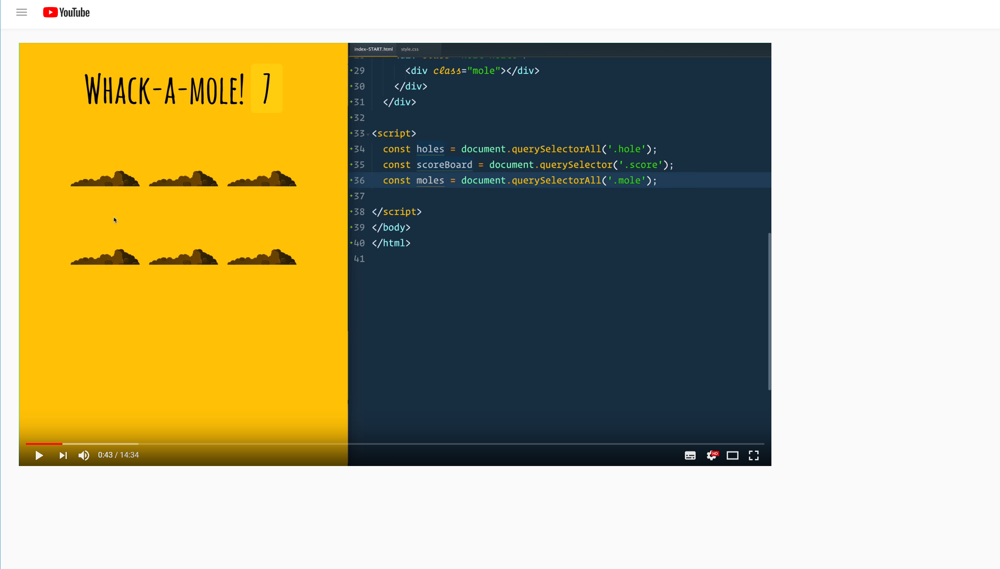

# HTML

想了想, 还是将HTML模块抽一个出来, 的确也有一些平时会遇到稀奇古怪的东西值得一说.

- [HTML](#html)
  - [common](#common)
  - [video](#video)
    - [视频首屏最先加载方法](#%e8%a7%86%e9%a2%91%e9%a6%96%e5%b1%8f%e6%9c%80%e5%85%88%e5%8a%a0%e8%bd%bd%e6%96%b9%e6%b3%95)
    - [引用视频播放失败](#%e5%bc%95%e7%94%a8%e8%a7%86%e9%a2%91%e6%92%ad%e6%94%be%e5%a4%b1%e8%b4%a5)
    - [video api](#video-api)
  - [pre and code](#pre-and-code)

## common

编写`HTML`的一些好习惯:

每个标签都有自己的语义，coding 时应该编写具有语义化的代码。这样方便小蜘蛛(搜索引擎)的抓取收录网站信息。

1. `h1 ~ h6`表示标题. 不准滥用`h1`标签
2. `ul` 标签多用于无序列表
3. `ol` 标签用于有序列表
4. `dl` 标签用于定义数据列表
5. `em`、`strong` 表示强调等

在模块化工程中，`<script>`标签加上了`type="ecmascript-6"`后, eslint 部分规则会失效。

## video

### 视频首屏最先加载方法

如爱奇艺、优酷等以视频为核心的网站, 用户点击进来无非就像看视频. 在进行性能优化的时候, 理所当然的先让用户看到想要看到的东西(视频). 因此我们需要把视频和相关依赖文件等最先加载.

但是浏览器会默认的将多媒体资源放在最后面加载, 无论你的标签在文档中放的多靠前. 这时的解决方案就是将`<script>`(初始化视频的js文件)改用为`<link>`标签引用.

### 引用视频播放失败

在一些业务中，会使用到第三方的视频链接。然后该链接的提供者或许会根据`referrer`来判断来源，进而拒绝请求，视频将无法播放。因此可以在页面首部加上`<meta name="referrer" content="no-referrer">`.

但引用该头部后可能会影响其他依赖`referrer`的功能。比如百度统计会追踪`referrer`，设置`no-referrer`后将无法再进行统计。

遇到 `403`, 通常是防盗链在作用。

### video api

playbackRate 控制播放速度

## pre and code

[Pre 和 Code 标签之间的区别](https://anran758.github.io/blog/2019/08/24/js-%E5%B0%86JSON%E6%95%B0%E6%8D%AE%E6%A0%BC%E5%BC%8F%E8%BE%93%E5%87%BA%E8%87%B3%E9%A1%B5%E9%9D%A2%E4%B8%8A/)
