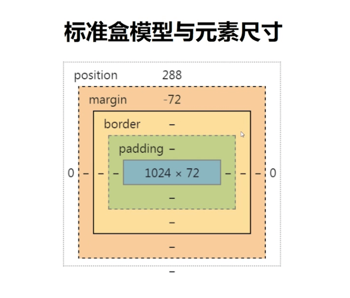

<!-- omit in toc -->

# javascript/typescript note

细节和技巧的交汇，本篇笔记主要用于速查。

- [javascript/typescript note](#javascripttypescript-note)
  - [练手组件](#练手组件)
  - [代码简洁性](#代码简洁性)
    - [科学计数法 E](#科学计数法-e)
    - [三元操作符](#三元操作符)
    - [逻辑运算符](#逻辑运算符)
  - [Common](#common)
    - [判断原始类型](#判断原始类型)
    - [计算星座](#计算星座)
    - [判断闰年函数](#判断闰年函数)
    - [其他](#其他)
  - [Array](#array)
    - [删除数组项](#删除数组项)
    - [数组去重](#数组去重)
    - [中文排序](#中文排序)
    - [数组扁平化](#数组扁平化)
    - [其他细节](#其他细节)
  - [Number](#number)
    - [parseInt](#parseint)
    - [金额分隔](#金额分隔)
    - [生成随机数](#生成随机数)
    - [字符串转数字](#字符串转数字)
  - [String](#string)
    - [计算字符串长度](#计算字符串长度)
  - [ES6+](#es6)
    - [Symbol](#symbol)
    - [class](#class)
  - [Store](#store)
  - [存取数据](#存取数据)
    - [cookie](#cookie)
  - [Date](#date)
  - [DOM](#dom)
    - [box model 对应的 DOM API](#box-model-对应的-dom-api)
    - [批量插入节点](#批量插入节点)
  - [Vue](#vue)
    - [mixin 的问题](#mixin-的问题)
    - [Object.definedProperty 缺点](#objectdefinedproperty-缺点)
    - [Vue 模板编译过程](#vue-模板编译过程)
    - [vuex](#vuex)
  - [React](#react)
    - [注意事项与技巧](#注意事项与技巧)
    - [展示型组件特点](#展示型组件特点)
  - [小程序](#小程序)
    - [小程序授权](#小程序授权)
    - [小程序跳转](#小程序跳转)
  - [第三方库](#第三方库)
    - [bizcharts](#bizcharts)
  - [error](#error)

## 练手组件

**Application**

- 日历: 考验对 `Date` 对象的使用。
- 简单的四则计算器: 考验对处理**浮点数溢出**的能力、`Math` 的使用等。

**简单算法**

- 设任意 N 行列的二维数组，要求螺旋打印出其值

## 代码简洁性

在实际工作中，可以在保证语义化的前提使用一些简写方法来提升代码的简洁性

### 科学计数法 E

似乎很多人都不爱用`js`的科学计数法，但实际上科学计数法用来表示大数字能使代码显得很简洁易读，如下：

```javascript
console.log(1000000000 === 1e9); // true
console.log(1e9 * 4); // 4000000000
```

两者对比就能看出差异，而且科学计数法也能做同等的运算。

### 三元操作符

用三元操作符代替简单`if...else`逻辑，除了简洁之外三元操作符还有一个好处就是可以用作条件预加载。

```javascript
const age = 16;

// bad
let hint = '';
if (age >= 18) {
  hint = '欢迎打开新世界(';
} else {
  hint = '嘿, 未成年不得入内!';
}

// good
const hint = age >= 18 ? '欢迎打开新世界 (' : '未成年不得入内!';
```

### 逻辑运算符

利用好 `&&` 和 `||` 特性的能力

```javascript
// 在某些场景下, 使用 && 操作符代替 if 能使使你的代码变得更加的整洁
let isMoving = false;
container.addEventListener('mousedown', () => (ismoving = true));
container.addEventListener('mouseup', () => (ismoving = false));

// if 语句
container.addEventListener('mousemove', () => {
  if (isMoving) handleMove();
});

// && 操作符. 前者为 true 的话, 就调用函数
container.addEventListener('mousemove', () => isMoving && handleMove());

// || 操作符则相反，只要前面的值为true，就不继续往后走了
```

<details>
<summary>不再建议使用的编程技巧</summary>

下面是一些简洁但可读性不太高的一些编程技巧，在 `eslint` 中已经不建议使用。但可以了解一下：

**按位非(按位取反):**

对任一数值`x`进行按位非操作的结果为`-(x + 1)`.

```javascript
console.log(~1); // -2
console.log(~0); // -1
console.log(~-1); // 0

// 当没有找到内容, 方法返回 -1 时, 进行按位非会加一取反, 则为 0
// 这个方法是利用隐式转换，在判断中会将 0 隐式转换为false

// 相当于下面的代码同等的效果
// names.some(name => linkName.indexOf(name) === -1)
names.some(name => ~linkName.indexOf(name));
```

**位操作符:**

利用按位或 `|` 向下取整:

```javascript
const num = 50.1234 | 0;

console.log(num); // 50
```

除此之外，还可以使用`~~`截除小数，但它只适用于`32`位数字。<br>
虽说前者会更简单，但有可能会遇到操作符优先级的问题。因此使用时一定要了解它的规则，同时确保代码的可读性。

```javascript
// 进行两次反转字位，然后出于10
console.log(~~50.1234 / 10); // 5

console.log(50.1234 | (0 / 10)); // 50
console.log((50.1234 | 0) / 10); // 5
```

</details>

## Common

通用方法

### 判断原始类型

```javascript
// 目标是否是对象
function isObject(obj) {
  return Object.prototype.toString.call(obj) === '[object Object]';
}

// 使用同样的方法进行测试, 结果如下:
Object.prototype.toString.call([]); // [object Array]
Object.prototype.toString.call(null); // [object Null]
Object.prototype.toString.call('12'); // [object String]
Object.prototype.toString.call(NaN); // [object Number]. 注意, NaN 是属于数字类型
Object.prototype.toString.call(345); // [object Number]
Object.prototype.toString.call(undefined); // [object Undefined]
Object.prototype.toString.call(Symbol()); // [object Symbol]
Object.prototype.toString.call(function() {}); // [object Function]

// 根据上述规则，可以对字符串进行操作
// 获取基础类型
function getBaseType(target) {
  const typeStr = Object.prototype.toString.call(target).toLocaleLowerCase();

  return typeStr.slice(8, -1);
}
```

### 计算星座

```javascript
/**
 * 根据生日的月份和日期，计算星座。
 * @param {String} month - 月份
 * @param {String} day - 日期
 * @desc 返回星座名
 */
function getAstro(month, day) {
  return '魔羯水瓶双鱼牡羊金牛双子巨蟹狮子处女天秤天蝎射手魔羯'.substr(
    month * 2 - (day < '102223444433'.charAt(month - 1) - -19) * 2,
    2
  );
}
```

### 判断闰年函数

判断闰年其实只要满足下面几个条件即可:

- 普通年**能被 4 整除**且**不能被 100 整除**的为闰年。如 2004 年就是闰年,1900 年不是闰年
- **世纪年**能被**400 整除**的是闰年。如 2000 年是闰年，1900 年不是闰年

```javascript
/**
 * 判断闰年函数
 * @param  {number} year 要判断的年份
 * @return {bool} 返回布尔值
 */
function leapYear(year) {
  return !(year % (year % 100 ? 4 : 400));
}
```

### 其他

> 你知道吗？

- 很多编译器在压缩代码的时候，会用`!0`和`!1`来代替布尔值`false`和`true`。因为可以有效减少文件体积, 但会破坏代码可读性 (虽然可读性是给人看得，机器只在乎运行效率)。

## Array

### 删除数组项

```javascript
// 删除数组元素, index 为数组索性, 只删除一个
arr.splice(index, 1);
```

### 数组去重

```javascript
let arr = [1, 2, 3, '1', 5, 2, 4, 5, 3, 4];

/* es6 */
// 利用 Set 没有重复值的特性去重, 再将其转为数组.
let newarr = Array.from(new Set(arr));

// 原理同上, 只不过是通过扩展运算符扩展出来
let newarr = [...new Set(arr)];
```

### 中文排序

**[IE11+]** [String.prototype.localeCompare](https://developer.mozilla.org/en-US/docs/Web/JavaScript/Reference/Global_Objects/String/localeCompare)，会返回一个数字，配合数组的`sort`方法进行排序。

```javascript
['张三', '李四', '王五'].sort((a, b) =>
  a.localeCompare(b, 'zh-Hans-CN', { sensitivity: 'accent' })
);
```

### 数组扁平化

二维数组扁平化

```javascript
const arr = [[1, 2, 3], [4, 5], [7, 8, 9], 10, null, undefined, {}];
const newArr = arr.reduce(
  (p, n) => (Array.isArray(n) ? p.concat(n) : (p.push(n), p)),
  []
);

console.log(newArr); // [1, 2, 3, 4, 5, 7, 8, 9, 10, null, undefined, {…}]
```

**[ES6+]** 多维数组扁平化

```javascript
function flatten(arr) {
  const newArr = arr.map((item) => (Array.isArray(item) ? flatten(item) : item));
  return [].concat(...newArr);
}

const arr = [[1, 2, 3], [4, 5], [7, [8, [9]]], 10, null, undefined, {}];
const newArr = flatten(arr);

console.log(newArr); // [1, 2, 3, 4, 5, 7, 8, 9, 10, null, undefined, {…}]
```

### 其他细节

`map`和`forEach`的区别:

| 方法      | 相同之处         | 不同之处                                                                                                                   |
| --------- | ---------------- | -------------------------------------------------------------------------------------------------------------------------- |
| `map`     | 同样用于遍历数组 | `map`对每项调用的函数后会取得函数的返回值，并推入新的数组中去(意味着可以链式调用)。<br>但是这个方法只有数组才能使用。      |
| `forEach` | 同样用于遍历数组 | `forEach`单纯对数组中每一项调用回调函数，不作其他操作。<br>该方法并不是只有数组能用，部分类数组(如 NodeList)也有这个方法。 |

> 你知道吗？

1. 数组实际上是一个类列表对象，这意味着我们可以在数组上添加属性，虽然一般不常这样做

## Number

### parseInt

在`ES5`之前，`parseInt`在没有传第二个参数的时候，会根据传入字符串的第一个字符来判断使用什么方式进行解析，这个历史遗留的问题可能会导致预期之外的效果。

```javascript
parseInt('08'); // 有些旧版本的浏览器可能会解析为 0， 因为浏览器会当做八进制进行解析。

// 因此我们用这个方法的时候，一定要显示加上第二个参数，而不要让浏览器去猜
parseInt('08', 10); // 8
```

还有一个常见的问题就是，不能直接将`parseInt`作为数组`map`的回调函数，因为两者所传(接受)的形参的用途不一:

```javascript
[1, 2, 3].map(parseInt); // [1, NaN, NaN]
```

[parseInt(string, radix)](https://developer.mozilla.org/zh-CN/docs/Web/JavaScript/Reference/Global_Objects/parseInt) 函数解析一个字符串参数，并返回一个指定基数的整数;

上面的例子就是因为`map`函数传入的第二个参数为数组的索引(`index`)。`parseInt`在处理到`2`时，传入了索引`2`作为基数，然而二进制并没有`2`这个数字，处理后自然会返回`NaN`。

### 金额分隔

```javascript
/**
 * 千位分隔符
 *
 * @param {Number} num - 金额
 * @returns 返回格式化后的数字
 */
function numberWithCommas(n) {
  // 正则解释: 匹配到 \B(非单词边界)后, 后面要匹配到 (\d{3})+(?!\d)
  // (\d{3})+ 至少匹配到一次或多次三个数字
  // (?!\d) 同时后面不是数字的话, 就匹配.
  // 注意, 后面的 (?=) 那一段代码只是判断的规则, 匹配到后只替换掉 \B
  // 而 \B 元字符匹配的是非单词边界

  let num = n.toString().split('.');
  num[0] = num[0].replace(/\B(?=(\d{3})+(?!\d))/g, ',');
  return num.join('.');
}

console.log(numberWithCommas(12345678912.123)); // "12,345,678,912.1234"
```

以上方法的缺陷是需要额外处理小数位，在 `ES2018` 中可以使用 [后行断言](https://es6.ruanyifeng.com/#docs/regex#%E5%90%8E%E8%A1%8C%E6%96%AD%E8%A8%80) 的语法(chrome 62+)，可以完全通过正则来处理，性能也比上一种方式会更高:

```js
function numberWithCommas(x) {
  return x.toString().replace(/\B(?<!\.\d*)(?=(\d{3})+(?!\d))/g, ',');
}
```

<details>
  <summary>测试用例</summary>

```js
function numberWithCommas(x) {
  return x.toString().replace(/\B(?<!\.\d*)(?=(\d{3})+(?!\d))/g, ',');
}

function test(x, expect) {
  const result = numberWithCommas(x);
  const pass = result === expect;
  console.log(`${pass ? '✓' : 'ERROR ====>'} ${x} => ${result}`);
  return pass;
}

let failures = 0;
failures += !test(0, '0');
failures += !test(0.123456, '0.123456');
failures += !test(100, '100');
failures += !test(100.123456, '100.123456');
failures += !test(1000, '1,000');
failures += !test(1000.123456, '1,000.123456');
failures += !test(10000, '10,000');
failures += !test(10000.123456, '10,000.123456');
failures += !test(100000, '100,000');
failures += !test(100000.123456, '100,000.123456');
failures += !test(1000000, '1,000,000');
failures += !test(1000000.123456, '1,000,000.123456');
failures += !test(10000000, '10,000,000');
failures += !test(10000000.123456, '10,000,000.123456');
if (failures) {
  console.log(`${failures} test(s) failed`);
} else {
  console.log('All tests passed');
}
```

</details>

除了正则还可以使用 [Number.prototype.toLocaleString](https://developer.mozilla.org/en-US/docs/Web/JavaScript/Reference/Global_Objects/Number/toLocaleString) 或 [Intl.NumberFormat](https://developer.mozilla.org/en-US/docs/Web/JavaScript/Reference/Global_Objects/Intl/NumberFormat) 来格式数字。该方法的缺点是低版本 IE 及移动端的兼容性支持不够好.

```javascript
var num = 1234567.123456;

// toLocaleString
num.toLocaleString(); // "1,234,567.123"

// result => "1,234,567.123"
new Intl.NumberFormat().format(num);

// 设置格式选项
var CNY_OPTIOONS = { style: 'currency', currency: 'CNY' };

// result => "¥1,234,567.12"
new Intl.NumberFormat('zh-CN', CNY_OPTIOONS).format(num);

// result => "¥1,234,567.123450"
// 设置小数位
new Intl.NumberFormat('zh-CN', { ...CNY_OPTIOONS, minimumFractionDigits: 6 }).format(num);
```

或者使用 [numeral.js](https://github.com/adamwdraper/Numeral-js/blob/master/numeral.js) 进行数字格式化。

参考资料: [How to print a number with commas as thousands separators in JavaScript](https://stackoverflow.com/questions/2901102/how-to-print-a-number-with-commas-as-thousands-separators-in-javascript)

### 生成随机数

```javascript
/**
 * 生成随机数
 * @param {number} min - 随机数的下限
 * @param {number} max - 随机数的上限
 * @returns 返回指定范围内的随机数
 */
function randomRangeNum(min, max) {
  return Math.round(Math.random() * (max - min) + min);
}
```

### 字符串转数字

```javascript
['1.1', '4566', '3e300'].map(Number); // [1.1, 4566, 3e+300]
['1.1', '456a', '3e300'].map(Number); // [1.1, NaN, 3e+300]
```

## String

### 计算字符串长度

`unicode` 编码 `0 ~ 128` 是单字节编码序列。因此可以利用这个特点来确定字符串的长度(单双字节实际占位)。

```javascript
/**
 * 检查字符串中第几个字符是否为汉字
 * @param { String } str 字符串
 * @param { Number } i 第几个字符串，最小为 1
 */
function checkCHS(str, i = 1) {
  const code = str.charCodeAt(Math.min(0, i - 1));
  return code > 255 || code < 0;
}

/**
 * 获取区分单双字节文本长度
 * @desc 仅用于中英文长度判断，中文占 2 位，英文占 1 位
 *       注意: emoji 的判断会不精准
 */
function getStrLength(str) {
  let len = 0;

  for (let i = 1; i <= str.length; i++) {
    len += checkCHS(str, i) ? 2 : 1;
  }

  return len;
}

console.log(
  '[getStrLength result]:',
  getStrLength('一二三四五六七八九十'),
  getStrLength('1234567890'),
  getStrLength('abcdefghij')
);
// [getStrLength result]: 20 10 10
```

## ES6+

### Symbol

1. 我们使用 Symbol 主要是因为它独一无二的特性(避免覆盖)。
2. 对于一些私有的方法，最好使用 Symbol 作为 key。但值得注意的是，用 Symbol 作为 key的话还有一个问题就是，不会被 `for` 循环、`Object.keys`等遍历返回。

### class

1. class 和传统的 `prototype` 在可枚举性是不一样的，class 不通过 `this.__protp__` 上获取原型方法
2. class 内部默认采用严格模式(意味着不能使用非严格性语法了)
3. class 必须使用 new 来调用, 但可以直接使用类的静态方法
4. ES6的 class 在重新赋值给一个变量的时候，this 指向会丢失。解决的方法是在 `constructor` 中硬绑定(bind) this。

## Store

## 存取数据

使用`localStorage`的时候需要对数据进行一些处理：

- 存入数据时对目标值转为合法的 JSON 值，`localStorage.setItem('name', JSON.stringify(name))`
- 读取数据后对 JSON 值进行解析取得目标值，`JSON.parse(localStorage.getItem('name'))`

### cookie

> 浏览器`Cookie`是服务器发送到用户浏览器并保存在本地的一小块数据，它会在浏览器下次向同一服务器再发起请求时被携带并发送到服务器上

`cookie`用途：

- 会话管理(用户状态信息等)
- 个性化设置(根据`cookie`信息为用户提供更进一步的功能)
- 浏览器行为跟踪(追踪用户行为、统计等)

创建一个新的`Cookie`的语法格式是:

```javascript
document.cookie = newCookie;
```

当对`document.cookie`进行赋值操作时，该属性会调用它底层所绑定的函数来设置`cookie`。其中`newCookie`是一个键值对的字符串，其格式如下:

```javascript
// 语法格式
document.cookie = key=value[
    ;path=path |
    ;domain=domain |
    ;max-age=max-age-in-second |
    ;expires=date-in-GMTString-format |
    ;secure |
    ;samesite
]

// 示例
document.cookie = 'nickname=anran758;path=/;max-age=31536000'
```

`key/value`表示`cookie`的键与值，其后为`cookie`的属性，简要概括一下：

| cookie 属性 | 作用                                                             | 兼容性    |
| :---------- | :--------------------------------------------------------------- | :-------- |
| path        | 指定哪些路径可以接受`cookie`, 不指定则为默认为当前文档的主机     |
| domain      | 指定哪些主机可以接受`Cookie`, 不指定则为当前页面的根目录`/`      |
| max-age     | 指定从现在开始`Cookie`可以存在的**秒数**, 超时该`cookie`就会过期 |
| expires     | 显式指定`cookie`具体的到期时间                                   |
| secure      | `Cookie`只能通过安全协议传输为`https`                            | Chrome52+ |
| samesite    | 阻止浏览器发送此`cookie`以及跨站点请求                           | Chrome52+ |

服务端可以通过`HTTP`头部`set-cookie`来给浏览器设置`cookie`, 格式如上所示。

如果同时指定了`Expires`和`Max-Age`，那么`Max-Age`的值将优先生效。

`Set-Cookie`没有指定`Expires`或`Max-Age`属性，则为会话信息(`Session Cookie`), 关闭浏览器后该`cookie`就会失效。

---

`Cookie`信息可以通过读取`document.cookie`来获取，但是读取出来的是由一个或多个`cookie`以`;`分隔的键值对字符串，如`key=value;key1=value1`。

了解了`cookies`的规则之后，我们需要对它进一步的封装以便在实际应用中使用：

```javascript
const tools = {
  /**
   * 读取 cookies
   * @param name - cookie 名，不传拿全部
   */
  cookieGet(name) {
    const cookies = document.cookie.split(';').map((item) => {
      const [key, value] = item.trim().split('=');
      return { key, value };
    });

    if (!name) return cookies;

    const cookie = cookies.find((item) => item.key === name);
    return cookie ? cookie.value : null;
  },

  /**
   * 设置cookie
   * @param name - cookie 名
   * @param value - cookie 值
   * @param days - 几天后过期
   * @param domain - 该 cookie 在哪些域名下可用
   * @param path - 指定 cookie 路径
   */
  cookieSet(name, value, days, domain, path = '/') {
    if (!name || !value) return false;

    let cookie = `${name}=${value}`;
    if (days === 0 || days) {
      const date = new Date();
      date.setTime(date.getTime() + days * 24 * 60 * 60 * 1000);
      cookie += `; expires=${date.toGMTString()}`;
    }

    if (domain) cookie += `; domain=${domain}`;
    if (path) cookie += `; path=${path}`;
    document.cookie = cookie;

    return true;
  },
};

// 查询 cookie
tools.cookieGet('nickName'); // null

// 设置 cookie
tools.cookieSet('nickName', 'anran758'); // true
tools.cookieGet('nickName'); // "anran758"

// 清除 cookie
tools.cookieSet('nickName', 'anran758', 0); // true
tools.cookieGet('nickName'); // null
```

具体更多有关`cookies`信息可以戳[MDN - Cookies](https://developer.mozilla.org/en-US/docs/Web/HTTP/Cookies)

## Date

- 设置某天的时间区间，区间在`00:00:00 - 23:59:59`。

```javascript
function setFullDate(rangeDay) {
  const start = new Date().setHours(0, 0, 0, 0);
  const end = new Date().setHours(23, 59, 59, 999);
  const oneDay = 24 * 60 * 60 * 1000;

  return [start - rangeDay * oneDay, end];
}
```

## DOM

### box model 对应的 DOM API



盒子模型上对应的 DOM API:

- border 上的实线为可视尺寸 -> `clientWidth` (标准 API)
- margin 上的虚线为占据尺寸 -> `outerWidth`  (非标准 API)

### 批量插入节点

DOM 操作实际上是一个挺耗费渲染性能的操作，我们应该尽可能的减少对 DOM 的操作。

比如批量插入节点时可以先在 js 中将新创建的节点插入到 `Fragment` 节点中，再将该节点插入到页面中，这样就仅触发一次渲染。

```javascript
const $fragment = document.createDocumentFragment();
const $list = document.querySelector('.list');

for (let i = 0; i < 10; i++) {
  const $ele = document.createElement('li');
  $ele.innerText = `item - ${i}`;
  $ele.setAttribute('class', 'item');

  $fragment.appendChild($ele);
}

$list.appendChild(fragment);
```

---

## Vue

开发常见问题：

1. 如果给子组件设置 `v-if` 的话，那么 vue 会在切换过程中将条件块内的事件监听器和子组件适当地被销毁和重建。也就是说就算里面用了 `watch` 也会失效。
2. 如果组件不是通过 `new Vue` 这种形式生成出来的话，那么`data`就必须要使用`function`的形式返回一个对象，而不是直接使用对象。不然的话`vue`会提示报错的。

   ```javascript
   // 这种会报错
   export default {
     template: '<div>{{text}}</div>',
     data: {
       text: 'hello',
     },
   };

   // 下面两者都不会
   new Vue({
     el: '#root',
     template: '<div>{{text}}</div>',
     data: {
       text: '123',
     },
   });

   export default {
     template: '<div>{{text}}</div>',
     data() {
       return {
         text: 'hello',
       };
     },
   };
   ```

3. 在父组件的 `created` 钩子上进行赋值操作的话，数值的变化是传不到子组件的`watch`里的。
4. 实际上，`props`的值是可以直接修改的。但是一般情况下我们并不推荐去修改`prop`里的内容，因为这会直接修改到父级的`data`。会引起组件之间的逻辑的混乱，未来 debug 也变得麻烦了起来。<br>通常我们会通过`this.$emit('postHandle', data)`这种形式去激活，通知父级更改。
5. 组件的通信上，`props`里可以使用驼峰性命名参数，但传入的时候需要转变为**连字号(-)**。
6. 在使用`vue-router`时，将`mode`设置为`history`模式的话，没有后端进行做相应的匹配会报 404。<br>但如果在开发模式下，使用`webpack-dev-server`作为本地服务器的话，可以让`webpack`设置`devServer`下的`historyApiFallback`做路径的映射，这样就可以用干净简洁的`history`模式啦~

### mixin 的问题

- 变量来源不明确，不利于代码阅读
- 多 mixin 可能会造成命名冲突
- mixin 和组件可能会出现多对多的关系，复杂度较高

### Object.definedProperty 缺点

- 深度监听，需要递归到底，一次性计算量大
- 无法监听新增属性/删除属性(Vue.set Vue.delete)
- 无法原生监听数组，需要特殊处理

### Vue 模板编译过程

vue 的模板(`template`)是通过 `loader` 或者是 `vue template complier` 编译为 `render` 函数的。`render` 函数执行后会生成 `vnode`, 最后在渲染和更新。

组件内可以直接使用 `render` 方法进行渲染，在流程上也少一步模板编译的过程。

### vuex

vuex 的 commit mutation 是一个同步的方法，而 Action 通过`store.dispatch`方法触发的是一个异步的方法。

Vue component 中使用 `distpatch` 触发一个 `action`，`action` commit 到 `mutations` 中。`mutations` 改变 `state` 数据后，数据更新到视图中。

---

## React

- [x] [React 知识回顾 (使用篇)](https://anran758.github.io/blog/2020/10/31/react-retrospection/) (生命周期、组件通信、Hooks 等)
- [x] [React 知识回顾 (优化篇)](https://anran758.github.io/blog/2020/11/04/react-retrospection-2/)
- [ ] redux、redux-sage 总结
- [ ] router 相关总结

### 注意事项与技巧

1. React 组件需要以大写字母开头的标签才能正常解析
2. React 是响应式框架，只需要关心数据
3. React 绑定事件名是驼峰式
4. React 不允许直接修改 state 的数据，因为会对性能有影响
5. React 是单向数据流，是视图层框架，只解决视图和数据渲染方面
6. jsx/tsx 一个组件内需要包裹一个元素，但如果这个组件内你不想再最外层额外包一个 `<div>` 的话，可以使用 `<Fragment></Fragment>` 占位符，或者它的简写形式 `<></>`。
7. 当组件的 state 或者 props 发生改变时，render 函数就会重新执行。

### 展示型组件特点

1. 关心数据的展示方式
2. 不依赖 APP 的其他文件
3. 不关心数据是如何加装和变化
4. 仅通过 props 接受数据和回调
5. 通常为函数式组件

## 小程序

小程序与`React`、`Vue` 之间有很多共通之处，将一些概念转换过来可以快速融入微信小程序思路：

1. 小程序也有生命周期，一般会在 `onLoad` 处理请求接口，因为它是最触发的生命周期钩子。
2. 在小程序中使用 `import` 语法时，要使用相对路径，不能使用绝对路径(如访问根目录 `/` ), 否则会抛错。
3. 在组件上，小程序的 `this.triggerEvent` 相当于 `vue` 的 `this.$emit`, 通过调用 API 来通知父组件有事件触发。
4. 只有跟 `wxml` 内有绑定的变量才需要放在 `this.data` 中，其余的放在 `this` 里。这样能减轻渲染的压力。

   ```javascript
   Page({
     /**
      * 页面的初始数据
      */
     data: {
       // 需要跟 wxml 模板绑定的数据
       gifts: {},
     },

     // timer 只是用于储存定时器，不需要在页面中渲染
     _timer: null,

     /**
      * 页面的方法列表
      */
     methods: {
       /* ... */
     },
   });
   ```

### 小程序授权

- 可以通过调用`wx.getSetting`，判断`data.authSetting['scope.userInfo']`来获取用户是否授权的信息
- 没有授权的话，我们可以标记一个状态变量(`hasLogin`)，当没有授权信息的时候，设置为`false`。
- 页面通过这个变量来控制显示真正的按钮，还是授权按钮(wx:if-else)
- 现在微信的授权，需要引导用户主动点击按钮才会弹出授权的窗口，需要使用原生的 button 组件，通过调用 `getuserinfo`的回调拿到`userInfo`信息，判断用户是否点击了授权

### 小程序跳转

如果想从一个小程序跳转到另一个小程序中，那么这两个小程序就**必须同时关联同一个公众号**（服务号或者订阅号）。与之相关联的关键词如下:

1. target="miniProgram"
2. app-id="appid"

## 第三方库

实际工作中总会遇到很多形形色色的业务需求，这篇针对特定业务需求所需推荐的库。

| name                                                   | 用途                                       |
| ------------------------------------------------------ | ------------------------------------------ |
| moment                                                 | 专门处理 date 的操作                       |
| lodash                                                 | 主要用于数据处理相关的 js 工具库           |
| node-qrcode                                            | 用以生成二维码                             |
| xlsx                                                   | excel 之类的表格处理，如导入导出           |
| classnames                                             | 类名管理工具                               |
| [decimal.js](https://www.npmjs.com/package/decimal.js) | JavaScript 的任意精度的十进制类型。        |
| [numeral](https://www.npmjs.com/package/numeral)       | 一个用于格式化和处理数字的 javascript 库。 |

### bizcharts

`Chart` 图表使用 `type: time`，数据量大了后刻度会不准，解决方法是将 `type` 替换为 `timecat`，将日期转换为有序的分类数据。

## error

1. 使用 JSONP 出现以下问题，查看 jsonp 是否将 format 设置为了 json：

   ``` error
   Uncaught SyntaxError: Unexpected token :
   ```

2. import 引入有问题。在 webpack中，提示不认识 `import` 这个语法，这时就需要安装 babel-plugin-syntax-dynamic-import，同时在 `.babelrc` 加入这个插件

   ```shell
   Module build failed: SyntaxError: Unexpected token (16:21)

   14 |   {
   15 |     path: '/app',
   > 16 |     component: () => import('../views/todo/todo.vue'),
   ```
