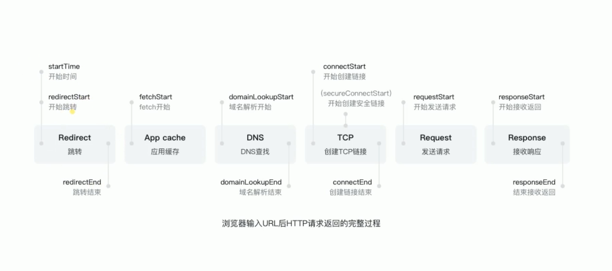

# 2020

> 2020 年常见的前端 topic

<details open block>
<summary>折叠/展开目录</summary>

[[toc]]

</details>

## html

### 把带 css 链接的 link 标签放在 head 标签内，而带 js 链接的 script 标签尽量靠近 body, 为什么会有这种提议？如果必须不这样做，该如何处理？

HTML 解析是自上向下解析的。若在 `<head>` 中解析到 `<link>` 标签的话，可以一边加载样式表渲染样式，一边继续向下解析。

若解析到 `<script>` 标签的话，由于 `<script>` 有可能会修改 DOM 的结构(比如 `document.write()`)，因此会停止渲染，先将 `<script>` 加载完毕并执行后，才继续向下解析。在这阻塞的过程中，用户所看到的页面将是一片空白，会影响用户体验。所以早期最佳实践就是将 `<script>` 放到 `</body>` 之前，这样就不会影响页面的渲染了。

HTML5 为 `<script>` 引入了 `async` 属性，添加该属性后可使脚本请求并行加载，让尽快解析和执行而不阻塞渲染。常见的应用场景就是没有 `DOM` 依赖关系或是没有跟其他脚本有依赖关系的脚本，如页面统计等。

## css

### 列举水平垂直居中的实现

[CSS 居中元素实现示例](../css/README.md##layout-%e5%b1%85%e4%b8%ad%e5%85%83%e7%b4%a0)

### 计算样式权重

已知设备 IPhone6, 写出 div 最后的 color、font-size 值:

``` html
<style>
  div { font-size: 1rem; color: blue; }
  .class1 { font-size: .32rem; color: red; }
  #id1 { color: #333; }
  #id1 div { color: #666; }
  .class1 div { color: #999; }
  .class1 .class2 div { color: #aaa; }
</style>

<div class="class1">
    <div id="id1" class="class2">
        <div>文字</div>
    </div>
</div>
```

**答:** 从 DOM 的结构来看共有三层，各层实际被应用的样式为:

- 第一层: `font-size: .32rem`, `color: red`
- 第二层: `font-size: 1rem`, `color: #333`
- 第三层(含文字那层): `font-size: 1rem`, `color: #666`

CSS 选择器优先级:

| 优先级 | 权重   | 类型                                                                                      |
| ------ | ------ | ----------------------------------------------------------------------------------------- |
| 0 级   | 0      | 通配符(`*`)、选择符(`+`、`>`、`~`、`||`、空格等)、逻辑组合伪类(`:not`、`:is()`、`:where`) |
| 1 级   | 1      | 标签选择器，如 `body {...}` 等                                                            |
| 2 级   | 10     | 类选择器(`.list {...}`)、属性选择器(`body] {...}`)、伪类(`:hover`)                        |
| 3 级   | 100    | ID选择器(`#title {...}`)                                                                  |
| 4 级   | 内联级 | `style` 属性内联: `<span style=" color: red;" />`                                         |
| 5 级   | 顶级   | 添加 `!important` 规则： `.title { color: red !important; }`                              |

样式覆盖规则:

- 相同权重的样式，应用最后声明的样式
- 多个选择器则叠加权重，如: `.list > .item {...}` 的权重为 `10 + 0 + 10 = 20`。
- `style` 内联样式默认覆盖外部样式表的样式。除非内联样式设置了普通样式，而外部样式表的样式使用了 `!important` 规则的情况就无法覆盖。但也可以在 `style` 设置的样式属性中加上 `!important` 规则，叠加后权重就更高了(一般不推荐使用 `!important`)

## 综合

### 什么是纯函数

纯函数由三大原则构成：

1. 给定相同输入，它总是返回相同的输出
2. 过程没有副作用(side effect)
3. 没有额外的状态依赖

### 谈谈对 MVVM 的理解 <Badge text="TODO" type="warning"/>

TODO: 待补充...

### 说说从浏览器地址栏输入 URL 到页面加载完的过程中都发生了什么事情?

1. 用户在浏览器输入 URL
2. 浏览器尝试读取 URL 的缓存
3. 无缓存则开始查 URL 域名的 ip，也就是 DNS 查找
4. 开始建立 TCP 链接，经过三次握手成功建立连接
5. 客户端开始发送数据
6. 服务端将用户所需的资源返回给客户端
7. 若返回的是 HTML 文档的话，浏览器开始解析 HTML 文档
8. 构建 DOM 树、构建 CSSOM 树
9. 将解析步骤中创建的 CSSOM 树和 DOM 树合成为 Render 树，然后用于计算每个可见元素的布局，最后将其绘制到屏幕上



完整解说请参照: [从浏览器地址栏输入 URL 到页面渲染之间都经历了什么](https://zhuanlan.zhihu.com/p/95904514)

## 优化类

### SPA（vue/react） 如何优化首页的加载速度？首屏空白是什么问题引起的？ <Badge text="TODO" type="warning"/>

首屏空白主要出现在单页面应用 (SPA) 上，SPA 本质上是将页面的逻辑都存入了 js 中。浏览器会先加载 HTML 文档，再通过 HTML 文档下载包含页面逻辑的 js 文件，下载后还得执行 js 代码，再将页面渲染出来。

最佳解决方案是使用服务端渲染来解决首屏空白的问题。

### 页面性能优化有哪些方案？

1. **尽可能减少 HTTP 请求**：CSS spirit 合并图片，小文件转为 Base64，合并 css/javascript 文件。
2. **使用 CDN**：CDN就是内容分发网络, 简单地说就是用户可以从最优的节点获取速度，从而达到快速访问，并减少源站负载压力的目的。
3. **减少 DNS 请求**
4. **文件/模块复用**
5. **按需加载**
6. **虚拟化长列表**: 过长的列表(成百上千条数据)会造成页面渲染压力大，因此可以使用 “虚拟滚动技术”。它可以在有限的事件内进渲染有限的内容，从而降低重新渲染组件所耗费的事件，以及创建 DOM 节点的数量。

## 解决方案

### 列举移动端适配方案

1. `rem` 方案
2. webpack + `vw`/`vh` 方案
3. 响应式布局

### 怎么处理跨域？

- 前端开发时可使用 webpack devserve 进行代理
- jsonp
- nginx

## HTTP

### 列举 HTTP 状态码以及它们的含义

下面列举 web 开发中常见的 HTTP code:

- 200 (ok): 请求成功
- 204 (No Content): 请求成功，不需要附带实体内容 (body)
- 301 (Moved Permanently): 永久重定向。被请求的资源已永久移动到新位置
- 302 (Found): 临时重定向。请求的资源临时从不同的 URI 响应请求。由于这样的重定向是临时的，客户端应当继续向原有地址发送以后的请求。
- 400 (Bad Request): 请求参数有误
- 401 (Unauthorized): 当前请求需要用户验证
- 403 (Forbidden): 没有权限的操作。服务器已经理解请求，但拒绝执行。
- 404 (Not Found): 资源没有找到
- 500 (Internal Server Error): 服务端出现了错误
- 502 (Bad Gateway): 网关错误。此错误响应表明服务器作为网关需要得到一个处理这个请求的响应，但是得到一个错误的响应
- 503 (Service Unavailable): 服务器停止服务。常见原因是服务器因维护或重载而停机
- 504 (Gateway Timeout): 网关超时。当服务器作为网关，不能及时得到响应时返回此错误代码。

### HTTP 的 GET 和 POST 请求有什么区别？

GET 和 POST 在浏览器上的表现会根据使用场景有各自的优缺点:

- GET 可以直接在浏览器上手动输入请求，在浏览器地址直接请求的 URL 在非匿名模式下会被浏览器记录下来的。这样用户可以通过历史记录来找回之前访问过的页面。反之，POST 不会在浏览器留下痕迹。
- GET 在浏览器地址上的长度是有限制的，POST 没有限制。
- GET 的请求一般可以被浏览器缓存
- 带云压缩的浏览器，比如 Opera mini/Turbo 2, 只有 GET 才能在服务器端被预取

但实际使用时 GET 和 POST 请求所进行的操作取决于服务端是如何解释的。比如一种极端情况就是：不管你是查询、删除、更新还是提交数据也好，所有请求一律使用 POST 来实现都没问题。但这种做法不符合主流的 `RESTful APIs` 设计规范，不建议这样做。

相关讨论参见: [post 相比get 有很多优点，为什么现在的HTTP通信中大多数请求还是使用get？](https://www.zhihu.com/question/31640769?rf=37401322)

### TCP 握手过程

1. 浏览器发送 TCP 分组，这个分组设置了一个特殊的 `SYN` 标记，用来表示这是一条连接请求。
2. 服务器接受到客户端的 `SYN` 连接后, 会选择服务器初始序号 `y`。同时向客户端发送含有连接确认 (`SYN + ACK`)、`Seq=0` (本例中的服务器初始序号)、`ACK=1` (客户端的序号 x + 1) 等信息的 TCP 分组。
3. 客户端收到了服务器的确定字段后，向服务器发送带有 `ACK=1`、`Seq=1`、`Ack=1` (服务器 Ack 信息的拷贝)等字段的 TCP 分组给服务器。
4. 服务器接收到客户端的确认字段后完成三次握手的连接，开始给客户端传输它想要资源

   

   <details block>
   <summary>点击显示真实案例</summary>

   以下序号 `40`、`44`、`45` 为 TCP 三次握手的具体数据信息。在右侧的 `info` 栏中显示了分组的标志位信息:

   

   </details>

### 有了解过 HTTP 缓存吗？ <Badge text="TODO" type="warning"/>

HTTP 缓存策略可分强缓存与协商缓存。

- 强缓存：服务器使用 `Cache-Control` 来设置缓存策略，常用 `max-age` 来表示资源的有效期。
- 协商缓存:
  - 验证资源是否失效就需要使用条件请求。常用的是 `If-Modified-Since` 和 `If-None-Match`，收到 304 状态码就可以复用缓存里的资源。
  - 验证资源是否被修改的条件有两个 `Last-modified` 和 `ETag` (ETag 比 Last-modified 的精确度更高)，需要预先在服务端的响应报文里设置，配合条件请求使用。

## 运维相关

1. **Q**: 了解过 docker 吗？
2. **Q**: 你们项目的 CI/CD 是怎么搭建的？
3. **Q**: 阿里云的 CDN 资源有缓存，如何强制更新缓存?  
   **A**: 阿里云 CDN 中有一个 Tab 叫**刷新预热**, 在该选项中可以强制刷新缓存。更新缓存的方式有 **URL 刷新**、**目录刷新**以及 **URL 预热**。
4. **Q**: git 除了 `pull`、`push` 外还了解哪些命令？  
   **A**: 可以参考 [Git 速查笔记](../git/README.md) 来回答

## 其他

1. 你哪些项目实现的比较满意？
2. 你碰到最难的一个问题是什么？
3. 是否写过测试用例
4. 是否了解敏捷开发
