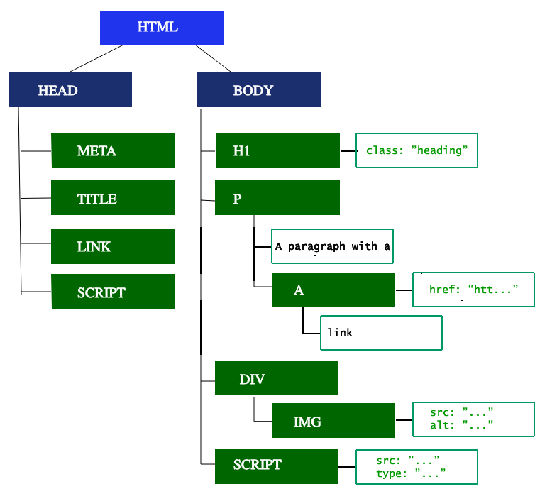
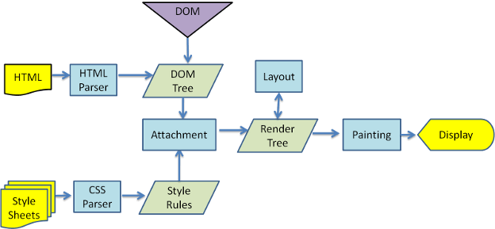

# 浏览器篇

### 常见的浏览器内核都有哪些？并介绍下你对内核的理解

- IE 浏览器: Trident (已废弃，微软使用新版本的 Edge 做代替)
- Edge: 基于 Chromium 开发，底层使用 Blink 引擎
- Opera 浏览器: 先使用 Presto 引擎后使用 Blink 引擎
- Safari 浏览器: Webkit
- Firefox 浏览器: Gecko
- Chrome 浏览器: 先使用 WebKit 引擎后使用 Blink 引擎

浏览器的内核是浏览器最核心的部分，负责对网页语法的解释并渲染（显示）网页。所以，通常所谓的浏览器内核也就是浏览器所采用的渲染引擎，渲染引擎决定了浏览器如何显示网页的内容以及页面的格式信息。

浏览器引擎内还包含一个 JavaScript 引擎，其中最为出名的就是 V8 引擎，JavaScript 引擎无需解析 DOM 之类的内容，因此 V8 引擎也被用于 Node.js 的运行时系统中。

参考资料：

- [初识网络原理: 从浏览器地址栏输入 URL 到页面渲染之间都经历了什么](https://anran758.github.io/blog/2018/04/06/URL-to-browser/)

---

### 从浏览器地址栏输入 URL 到页面渲染之间都经历了什么

1. 用户在浏览器输入 URL，浏览器尝试读取 URL 的缓存
2. 若无缓存则开始通过 DNS 查找查 URL 域名的 IP
3. 开始建立 TCP 链接，经过三次握手成功建立连接
4. 客户端开始发送数据
5. 服务端将用户所需的资源返回给客户端
6. 若返回的是 HTML 文档的话，浏览器开始解析 HTML 文档
7. 构建 DOM 树、构建 CSSOM 树
8. 将解析步骤中创建的 CSSOM 树和 DOM 树合成为 Render 树，然后用于计算每个可见元素的布局，最后将其绘制到屏幕上

---

### DOM 渲染流程

**构建 DOM 树**

浏览器开始解析 HTML 文件，将标记（标签）转换成浏览器能理解的结构，即 DOM 树。DOM 树是HTML页面的对象表示，表现为节点和对象的层次结构。

**构建 CSSOM 树**

浏览器需要将 CSS 代码 (内联、外链或嵌入)被解析成 CSSOM（CSS对象模型）。

**合并 DOM 和 CSSOM 构建渲染树**

渲染树（Render Tree）是DOM和CSSOM合并后的产物，它只包含渲染页面所需的节点，并带有相应的样式信息。

**渲染页面**

一旦渲染树被创建，浏览器会进行**布局**（或回流），这一步骤确定每个节点的确切位置和大小。这通常涉及到计算每个元素的视口内的确切位置和大小。

绘制是渲染过程的下一步，涉及填充像素的具体操作。它包括绘制文本、颜色、图像、边框、阴影等。

如果页面包含复杂的视觉效果，如层叠、滤镜、透明度等，浏览器会在多个层上进行渲染，然后将它们合成在一起，形成最终的屏幕图像。

参考资料：

- [MDN | 渲染页面：浏览器的工作原理](https://developer.mozilla.org/zh-CN/docs/Web/Performance/How_browsers_work)