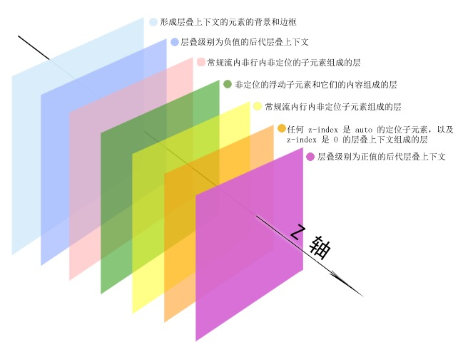

# CSS

## 列举水平垂直居中的实现

当然，这里是几种常见的CSS方法来实现水平和垂直居中：

**1. Flexbox**

```css
display: flex;
justify-content: center;
align-items: center;
```

**2. Grid**

```css
display: grid;
place-items: center;
```

**3. CSS定位 + transform**

```css
position: relative;
top: 50%;
left: 50%;
transform: translate(-50%, -50%);
```

这些方法分别利用了 Flexbox、Grid 布局以及定位和变换（Transform）技术，都可以有效实现内容的水平和垂直居中。

## 什么是 BFC？BFC 有什么用?

块格式化上下文（Block Formatting Context，BFC）是 Web 页面的可视 CSS 渲染的一部分，是块级盒子的布局过程发生的区域，也是浮动元素与其他元素交互的区域。

**BFC 的作用：**

- 包含内部浮动: 让浮动内容和周围的内容等高
- 排除外部浮动
- 阻止外边距重叠: 创建两个 BFC 阻止 margin 重叠

## z-index (层叠等级)

### 请描述一下网页的层叠等级 (z-index)？

当页面元素发生重叠时，会根据不同元素自身的特性决定元素的覆盖关系。而 z-index 可以控制元素展示的层级。

层级可分为 7 阶：

1. 层叠上下文 background/border
2. 负 z-index
3. block 块状水平盒子
4. float 浮动盒子
5. inline/inline-block 水平盒子
6. z-index: auto 或 z-index: 0 不依赖 z-index 的层叠上下文
7. 正 z-index



### z-index 可以是负数吗？

可以。z-index 负值可以让元素在其第一个含有定位属性(relative/absolute 等) 的父元素之上显示，该父元素其他子元素之下显示。

一般设置为负值是用于隐藏元素。

### z-index 有时不起作用的原因是什么？怎么解决？

1. 父标签 `position` 属性为 `relative`
   解决方法: `position:relative` 改为 `position:absolute`

2. 问题标签无 `position: relative/absolute/fixed` 等属性
   解决方法: 添加 `position: relative` 属性 (对样式侵入性小)

3. 问题标签含有浮动 (float) 属性。
   解决方法: 清除浮动

4. 问题标签的祖先标签的 `z-index` 值比较小
   解决方法: 提高父标签的 `z-index` 值

## 计算样式权重

已知设备 IPhone6, 写出 div 最后的 color、font-size 值:

```html
<style>
  div {
    font-size: 1rem;
    color: blue;
  }
  .class1 {
    font-size: 0.32rem;
    color: red;
  }
  #id1 {
    color: #333;
  }
  #id1 div {
    color: #666;
  }
  .class1 div {
    color: #999;
  }
  .class1 .class2 div {
    color: #aaa;
  }
</style>

<div class="class1">
  <div id="id1" class="class2">
    <div>文字</div>
  </div>
</div>
```

**答:** 从 DOM 的结构来看共有三层，各层实际被应用的样式为:

- 第一层: `font-size: .32rem`, `color: red`
- 第二层: `font-size: 1rem`, `color: #333`
- 第三层(含文字那层): `font-size: 1rem`, `color: #666`

CSS 选择器优先级:

| 优先级 | 权重   | 类型                                                                                |
| ------ | ------ | ----------------------------------------------------------------------------------- |
| 0 级   | 0      | 通配符(`*`)、选择符(`+`、`>`、`~`、空格等)、逻辑组合伪类(`:not`、`:is()`、`:where`) |
| 1 级   | 1      | 标签选择器，如 `body {...}` 等                                                      |
| 2 级   | 10     | 类选择器(`.list {...}`)、属性选择器(`body] {...}`)、伪类(`:hover`)                  |
| 3 级   | 100    | ID选择器(`#title {...}`)                                                            |
| 4 级   | 内联级 | `style` 属性内联: `<span style=" color: red;" />`                                   |
| 5 级   | 顶级   | 添加 `!important` 规则： `.title { color: red !important; }`                        |

样式覆盖规则:

- 相同权重的样式，应用最后声明的样式
- 多个选择器则叠加权重，如: `.list > .item {...}` 的权重为 `10 + 0 + 10 = 20`。
- `style` 内联样式默认覆盖外部样式表的样式。除非内联样式设置了普通样式，而外部样式表的样式使用了 `!important` 规则的情况就无法覆盖。但也可以在 `style` 设置的样式属性中加上 `!important` 规则，叠加后权重就更高了(一般不推荐使用 `!important`)

## 用纯 CSS 创建一个三角形的原理是什么？

采用的是均分原理,把矩形分为4等份,这4等份其实都是边框。核心就是给块级元素设置宽高为 0, 设置边框的宽度, 不需要显示的边框使用透明色; 例如：

```css
.square {
  width: 0;
  height: 0;
  margin: 0 auto;
  border: 6px solid transparent;
  border-top: 6px solid red;
}
```

## CSS3 有哪些新增的特性

> 简单描述一些常用的即可

- 圆角（border-radius）
- 阴影（box-shadow）
- 过渡效果（transition）
- 翻转（transform）
- 动画（animation）
- 媒体查询（@media）
- 弹性盒子（flex 布局）

## 如何开启硬件加速？

当我们的样式添加了以下属性后，将会开启硬件加速。

- transform
- opacity
- filter

可是在一些情况下，我们并不需要对元素应用 3D 变换的效果，可以设置 `transform: translateZ(0);` 来开启硬件加速。

**硬件加速的工作原理:**

浏览器接收到页面文档后，会将文档中的标记语言解析为 DOM 树。DOM 树和 CSS 结合后形成浏览器构建页面的渲染树。

渲染树中包含了大量的渲染元素，每一个渲染元素会被分到一个图层中，每个图层又会被加载到 GPU 形成渲染纹理，而图层在 GPU 中 transform 是不会触发 repaint 的，这一点非常类似 3D 绘图功能，最终这些使用 transform 的图层都会由独立的合成器进程进行处理。

## 硬件加速的副作用

硬件加速使用 GPU 可能会导致严重的性能问题。因为它增加了内存的使用，还会减少移动端设备的电池寿命。因此不能滥用。
