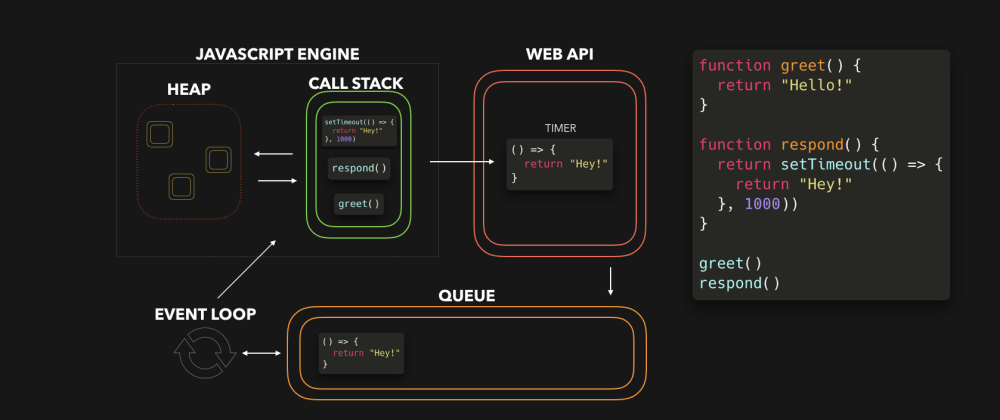
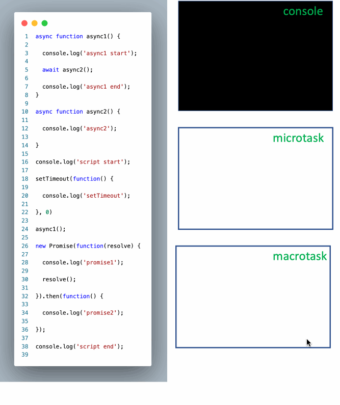

# JavaScript 篇

**目录**

[[toc]]

## 基础概念

### 什么是纯函数

纯函数由三大原则构成：

1. 给定相同输入，它总是返回相同的输出。
2. 过程没有副作用 (side effect)。
3. 没有额外的状态依赖。

### 谈谈对 MVVM 的理解

MVVM (Model–view–viewmodel) 是一种软件架构模式。它主要由以下四点组成。

- **模型 (Model)**: Modal 储存数据操作等逻辑。
- **视图 (View)**: View 用于展示给用户看的 UI、布局和结构。
- **视图模型 (View model)**: 暴露公共属性和命令的视图的抽象。在视图模型中，绑定器在 View 和数据绑定器之间进行通信。
- **绑定器 (Binder)**: 声明性数据和命令绑定隐含在 MVVM 模式中。绑定器使开发人员免于被迫编写样板式逻辑来同步视图模型和视图。

MVVM 架构的主要优点是实现了视图和模型之间的松耦合和数据双向绑定的功能。


### 什么是闭包？列举闭包的应用场景

闭包主要指**一个函数及其周围封闭词法环境中的引用构成闭包**，这也是一种语言特性。从实践的角度来看，满足以下两个条件的才能称为闭包:

1. 创建该函数的上下文被销毁了，但该函数仍然存在
2. 函数内有引用外部变量

常见的应用场景是，在一个函数的局部作用域中创建一个内部函数，再将这个内部函数返回出去。
内部函数总是可以访问创建它的上下文，也就是外部函数中声明的参数和变量，即使创建内部函数的上下文已经销毁。例如:

```js
function createName(name) {
  let prefix = "developer_";
  return function showName() {
    console.log(prefix + name);
  };
}

var showName = createName("anran758");
showName();
```

调用 `createName` 后返回了一个函数并赋值给了 `showName` 变量，同时 `createName` 的上下文被销毁。
此时再调用 `showName` 函数时，尽管 `createName` 的上下文已经被销毁了，但 `showName` 中还能获取 `createName` 的内部变量与形参，这就是闭包的一种应用。

### 什么是科里化？

柯里化是一种将**使用多个参数的函数**转换成一系列**使用一个参数的函数**的技术，本质上也是利用了闭包的特性。科里化可以做到**参数复用**和**延迟执行**的效果。

例如，若传入了给定函数的所定义的参数数量后执行函数:

```js
function add(a, b, c) {
  return a + b + c;
}

function curry(fn, ...rest) {
  return fn.length !== rest.length
    ? function wrap(...args) {
        return rest.length + args.length !== fn.length
          ? (...arg) => wrap(...args, ...arg)
          : fn(...rest, ...args);
      }
    : fn(...rest);
}

curry(add)(1)(2)(3);
// 6
```

### 节流与防抖

**节流与防抖**都是用于性能优化的技术，用于控制某些代码执行的频率。

**节流(Throttling)**

确保函数**在指定的时间段**内**最多只执行一次**。

这适用于需要频繁触发但又要求限制执行次数的场景。例如，调整窗口大小（resize）或滚动（scroll）时，可能只需要每 100 毫秒更新一次布局或执行检查，避免过多的计算和 DOM 操作。

``` js
function throttle(func, wait) {
  let timerId;
  let lastCallTime;

  return (...args) => {
    const now = Date.now();
    if (!lastCallTime) {
      // 初次调用，立即执行
      func(...args);
      lastCallTime = now;
    } else {
      // 清除上一个计划的调用
      clearTimeout(timerId);

      // 计算距离上次调用的时间
      const timeSinceLastCall = now - lastCallTime;

      // 设置一个新的定时器，延迟执行直到达到等待时间
      timerId = setTimeout(() => {
        func(...args);
        lastCallTime = now;
      }, wait - timeSinceLastCall);
    }
  }
}


window.addEventListener('resize', throttle(function() {
  console.log('Resizing...');
}, 1000));
```

**防抖(Debouncing)**

确保函数只在**最后一次事件触发后**的**一定延迟内**执行。

这适用于诸如搜索框输入这类事件：用户停止输入后才实际执行搜索，减少不必要的查询请求或处理。

``` js
function debounce(func, delay) {
  let debounceTimer;
  return function() {
    const context = this;
    const args = arguments;
    clearTimeout(debounceTimer);
    debounceTimer = setTimeout(() => func.apply(context, args), delay);
  }
}

// 使用例子
const input = document.querySelector('input');
input.addEventListener('keyup', debounce(function() {
  console.log('Input value:', this.value);
}, 500));
```

### 什么是事件循环?

JavaScript 中的事件循环是一个执行模型，它允许 JavaScript 引擎处理多个事件，尽管它是单线程的。这个模型的关键组成部分包括调用栈、任务队列、微任务队列和事件循环本身。

1. **调用栈**：这是一个用于存储代码执行期间所有函数调用的数据结构。JavaScript 引擎一次处理调用栈中的一个函数。
2. **任务队列**：异步事件（如用户交互、定时器、网络请求等）的回调函数会被添加到这个队列中。如果调用栈为空，事件循环会从任务队列中取出任务来执行。
3. **微任务队列**：专门用于处理微任务（如 Promise 回调）。每次执行宏任务后，JavaScript 引擎都会检查并执行微任务队列中的所有微任务，然后再继续下一个宏任务。

其中 JavaScript 的代码会被区分成**同步任务**和**异步任务**。

- **同步任务**在当前执行环境中立即执行，它们直接在调用栈中按顺序处理。执行栈按照后进先出（LIFO）的原则工作。
- **异步任务**不会立即执行，它们会被区分为**宏任务**与**微任务**，然后分入不同的队列中，等待事件循环的处理。

**宏任务**

宏任务通常是由宿主环境（如浏览器或Node.js）提供的 API 创建的。它们包括：

- `setTimeout`, `setInterval` 的回调。
- `setImmediate`（仅在 Node.js 中）。
- I/O 操作的回调（如文件读写、网络请求等）。
- 用户交互事件（如点击、滚动等）。
- `requestAnimationFrame`（主要用于浏览器的动画）。

**微任务**

微任务通常是由 JavaScript 语言特性创建的，它们在当前宏任务完成后立即执行，但在下一个宏任务开始前执行。微任务包括：

- `Promise.then`, `Promise.catch`, `Promise.finally` 的回调。
- Web Workers 中的 `queueMicrotask()` 方法创建的任务。
- `MutationObserver` 的回调。
- Node.js 环境的 `process.nextTick`。

**事件循环的执行步骤如下：**

1. **执行栈处理**：首先执行**当前宏任务**中的所有代码。宏任务可能是初始的全局脚本，或者是由事件、定时器等触发的回调函数。
2. **微任务处理**：当前宏任务在执行栈中的代码执行完毕后，即使还有其他宏任务在队列中等待，JavaScript 引擎也会优先处理所有微任务。
3. **宏任务队列检查**：微任务全部执行完毕后，如果执行栈为空，事件循环将会检查宏任务队列。如果宏任务队列中还有任务，事件循环将取出下一个宏任务推入执行栈进行处理，重复上述流程。



### 宏任务和微任务的区分是为了做什么? 它们的优先级?

**宏任务**和**微任务**之间的区分主要是为了管理异步事件的执行顺序和响应速度，确保关键操作快速且按顺序执行，从而提高应用性能并防止 UI 阻塞。也就是说，微任务用于处理紧急的更新，而宏任务则用于较大的、不那么紧迫的任务。

在每个宏任务执行完后，事件循环会处理所有的微任务，之后才会开始下一个宏任务。这意味着微任务总是在当前宏任务之后和下一个宏任务之前执行。

### `setTimeout` 是否有误差？若有，产生误差的原因是什么？

零延迟并不意味着回调会立即执行，其等待的时间取决于微任务队列里待处理的消息数量。

以下程序依次输出的信息是:

```js
(function () {
  console.log("这是开始");

  setTimeout(function cb() {
    console.log("这是来自第一个回调的消息");
  });

  console.log("这是一条消息");

  setTimeout(function cb1() {
    console.log("这是来自第二个回调的消息");
  }, 0);

  console.log("这是结束");
})();

// "这是开始"
// "这是一条消息"
// "这是结束"
// "这是来自第一个回调的消息"
// "这是来自第二个回调的消息"
```

### Fetch 与 XHR 的区别?

- `Fetch` 是基于 `Promise` 实现的, 相比 `XHR(XMLHttpRequest)` 的语法更加简洁。
- `Fetch` 发送请求时默认不带 `cookie` 的, 需要设置 `credentials` 的配置项
- 当接收到一个代表错误的 `HTTP` 状态码时, 从 `fetch()` 返回的 `Promise` 不会被标记为 `reject`, 即使响应的 `HTTP` 状态码是 `404` 或 `500`。仅当网络故障时或请求被阻止时, 才会标记为 `reject`。
- `Fetch` 不支持超时控制与检测请求进度

### bind、call、apply 的区别?

调用 bind 方法后返回一个新函数，新函数的 this 将被指向调用 bind 方法时的第一个参数。而其余参数将作为新函数的参数，供调用时使用

call 与 apply 第一个参数也是指定的 this 值，其余的不同是接受参数的不同。call 接受**参数列表**，apply 接收的是**参数数组**。两者相比，call 的性能会更好。

### 如何检测变量的类型(尽可能多，描述可能出现的问题)?

主要使用 `typeof`、`instanceof`、`Object.prototype.toString.call`。还可以使用 `Array.isArray` 方法判断是否是数组，`Number.isNaN` 是否是 `NaN` 等。

`typeof` 可以用于 `String`、`Number`、`Symbol`、`Boolean`、`undefined` 等类型，但用于 `null`、`Array` 类型的话会展示为 `object` 类型。

`instanceof` 则是通过原型链的方式来判断对象类型。但它的局限性在于只要被操作的变量原型有上有该类型的值。它主要缺点是不能检测 `number`, `boolean`, `string` 字面量的类型。

`Object.prototype.toString.call` 可以精准的判断类型的值，主要的问题是写法繁琐，可以基于此函数做一层封装:

```js
function getBaseType(target) {
  const typeStr = Object.prototype.toString.call(target).toLocaleLowerCase();

  return typeStr.slice(8, -1);
}
```

---

## 数组

### 数组去重

1. 利用 `Set` 结构不可重复的特性

   ```js
   var info = { name: "anran758" };
   var arr = [0, 1, 2, 2, info, 3, info];

   // 通过扩展运算符将 Set 转为 Array
   var newArr = [...new Set(arr)];

   // 或者使用 Array.from 转为 Array
   var newArr = Array.from(new Set(arr));
   ```

   > 优点: 语法简洁
   > 缺点: Set 添加新值时是通过 [SameValueZero](http://ecma-international.org/ecma-262/6.0/#sec-samevaluezero) 算法进行比对的, 因此不能做深比较去重

2. 使用 `indexOf` 判断是否具有相同的项

   ```js
   var info = { name: "anran758" };
   var arr = [0, 1, 2, 2, info, 3, info];

   function uniq(arr) {
     if (!arr || !arr.length) return [];

     var newArr = [];
     for (let i = 0; i < arr.length - 1; i++) {
       var item = arr[i];

       if (newArr.indexOf(item) === -1) {
         newArr.push(item);
       }
     }

     return newArr;
   }

   var newArr = uniq(arr);
   ```

   > 优点: 兼容低版本 IE
   > 缺点: 没有实现深比较去重

3. 引入 [lodash](https://www.lodashjs.com/docs/lodash.uniq) 工具库来处理:

   ```js
   var arr = [0, 2, 4, 3, 3, 2, 6];

   _.uniq(arr);
   ```

   还可以使用 [uniqWith](https://www.lodashjs.com/docs/lodash.uniqWith) 搭配 [isEqual](https://www.lodashjs.com/docs/lodash.isEqual) 实现深比较去重的效果。

   ```js
   var objects = [
     { x: 1, y: 2 },
     { x: 2, y: 1 },
     { x: 1, y: 2 },
   ];

   _.uniqWith(objects, _.isEqual);
   // => [{ 'x': 1, 'y': 2 }, { 'x': 2, 'y': 1 }]
   ```

   > 优点: 语法简洁，使用方便，能满足所有去重需求
   > 缺点: 需要额外引入第三方库

### 数组多层扁平化

1. `Array.flat`: 数组的 `flat` 方法接受一个数值参数，该参数是指定需要扁平化的层数。若想将数组子项中所有数组进行扁平化，可以传入 `Infinity`。

   只扁平化第 1 层:

   ```js
   var arr = [0, [1, [2], [[3]]], [[], 4]];
   arr.flat(1);
   // [0, 1, [2], [[3]], [], 4]
   ```

   全部扁平化:

   ```js
   arr.flat(Infinity);
   // [0, 1, 2, 3, 4]
   ```

2. 通过递归的方式处理:

   ```js
   var arr = [0, [1, [2], [[3]]], [[], 4]];

   function flatDeep(arr, depth) {
     var d = depth != null ? depth : 1;
     return d > 0
       ? arr.reduce(
           (acc, val) =>
             acc.concat(Array.isArray(val) ? flatDeep(val, d - 1) : val),
           [],
         )
       : arr.slice();
   }

   flatDeep(arr, 1);
   // [0, 1, [2], [[3]], [], 4]

   flatDeep(arr, Infinity);
   // [0, 1, 2, 3, 4]
   ```

   递归实现有很多思路，`reduce` 循环合并是一种，`for` 循环也是一种。它们只是实现细节不同，但递归思想是相通的。

### 深拷贝数组和对象

1. 可以先通过 `JSON.stringify` 将数据转为 JSON 字符串，再通过 `JSON.parse` 对 JSON 字符串进行解析，可以得到全新的数组/对象。

   使用该方法进行深拷贝并不算完美，`JSON.stringify` 只能序列化对象的可枚举属性，如果对象是通过构造函数生成的，那么会丢失 `constructor`。也不能对有循环引用的对象进行深拷贝。
   除此之外，`Date` 对象会被序列化为字符串。正则表达式、`Error` 对象会被序列化为空对象。若属性中存在 `undefined` 则该属性会被丢弃。`NaN`、`Infinity` 等信息会被转为 `null`。
   由此可见，如果被拷贝的参数中没有 `Date`、正则、函数或对象循环引用的问题，可以考虑使用该方法。

2. 可以自己定义递归函数，参数是传入数组或对象。再遍历形参的属性或下标，如果遍历到的类型也是引用类型那就进行浅拷贝，再进行递归，直至全部属性都遍历完毕。
3. 通过第三方类库实现，如 `lodash` 的 `deepClone` 就可以实现深拷贝。

### 数组里面有 10 万个数据，取第 1 个数据与第 10 万个数据的时间相差多少？

**A:** 取元素的复杂度为 `O(1)`, 消耗时间几乎一致，差异可以忽略不计。

### 数组的 map 和 forEach 有什么区别？

`map` 将每一个元素传入函数调用后，会将函数的返回值存入新数组中，因此可以对数组做链式处理。而 `forEach` 只是将元素传入给函数调用，不会讲返回值存入新数组中。

可以参考这个回答: [js es6 中如何比较深刻的理解 map、for、for of？](https://www.zhihu.com/question/278332594/answer/886056097)

---

## 原型链

### 简述一下原型链

原型链是实例对象与原型之间的连接，每个对象都有一个特殊的 `[[Prototype]]` 属性，它指向原型对象引用。当访问对象的某个属性时，首先会在对象自身查找这个属性。

若这个属性在自身没有找到，就会通过 `[[Prototype]]` 属性指向的原型对象上查找。如果该原型对象里也没有找到的话该属性的话，就会从这个**原型对象中**的 `[[Prototype]]` 属性继续往下找，直到找到属性或者 `[[Prototype]]` 的值为 `null` 时停止查找。

这一个通过 `[[Prototype]]` 链相连的机制被为原型链。

### prototype、 **proto** 和 constructor 的关系

**简单版**:

构造函数的 `prototype` 和通过该构造函数实例化出来的对象的 `__proto__` 属性是指向同一个原型对象。由于它们共享同一个原型对象，因此构造函数上的 `prototype.constructor` 等价于实例化对象的 `__proto__.constructor`

---

**详细版**:

在 js 中，每个函数都有一个 `prototype` 属性, 该属性指向的是调用该构造函数而创建的**实例的原型**:

```js
function Person() {}

console.log("1. Person prototype:", Person.prototype);
```

每个 js 对象中都有个 `__proto__` 属性，这个属性会指向**该对象的原型**。比如将 `Person` 进行实例化赋值给 `person1`, `person1.__proto__` 将指向构造函数的 `prototype`。

```js
// 此处 Person 是构造函数
const person1 = new Person();

console.log(
  "2. person1.__proto__ equal to Person.prototype:",
  person1.__proto__ === Person.prototype,
);
```

<details block>
  <summary>扩展: 如果是像 `"This is a string"`、`18`、`true` 这种基本类型也会有 `__proto__` 属性吗？</summary>

这里就需要引入**封装对象包装**的概念。当我们定义完基本类型字面量后，js 引擎自动会为这些基本类型值包装成一个对象，包装后的对象就拥有了 `__proto__` 属性:

```js
console.log(0.__proto__);
// Uncaught SyntaxError: Invalid or unexpected token
// 上行代码会抛错，因为字面量没有来得及封装为对象。直接访问是访问失败的

// 将字面量存入变量中或使用括号提升优先级后就可以正常访问了
var n = 0;
console.log(n.__proto__);
console.log((0).__proto__);
```

具体细节请参考: **《你不知道的 JavaScript 中卷》 3.2 封装对象包装**

</details>

根据以上例子可以推出结论: `原型对象 === Person.prototype === person1.__proto__`。`person1` 没有 `prototype` 属性是因为该属性只有函数对象才有，但他们指向的引用是同一个。

除此之外，每个原型都有一个 `constructor` 属性默认指向关联的构造函数:

```js
console.log(
  "3. Person === Person.prototype.constructor:",
  Person === Person.prototype.constructor,
);
console.log(
  "4. person1.__proto__.constructor === Person.prototype.constructor:",
  person1.__proto__.constructor === Person.prototype.constructor,
);
```

::: warning

`__proto__` 可能随时被废弃，若想获取原型对象，请优先使用 [Object.getPrototypeOf(object)](https://developer.mozilla.org/zh-CN/docs/Web/JavaScript/Reference/Global_Objects/Object/GetPrototypeOf) API

:::

---

### 你觉得 js 里 this 的设计怎么样? 有没有什么缺点啥的

JavaScript 中的 `this` 早期设计存在一些缺陷，主要体现在行为不直观和使用复杂的额问题。

1. `this` 的值**取决于函数的调用方式**，而非定义方式。这在多种调用场景（如事件处理器、setTimeout等）中容易导致混淆和错误。
2. 代码维护困难：在旧的 JavaScript 函数中，尤其是那些作为回调函数使用时，this 可能不指向预期对象，经常需要借助变量（如 `that` 或 `self`）或者 `.bind()` 方法来解决。
3. 性能问题：频繁使用 `.bind()` 可以确保 `this` 指向正确，但可能会引入性能问题，因为每次 `.bind()` 都会创建一个新的函数实例。

为了解决这些问题，ES6 引入了箭头函数，它提供了对 `this` 行为的改进：

箭头函数不自己绑定 `this`，它们会捕获其所在上下文的 `this` 值作为自己的 `this` 值。这使得箭头函数特别适合用来编写那些需要自身上下文与外围代码相同的函数，例如回调函数和事件处理器。

``` js
class Logger {
    constructor() {
        this.logLevel = "info";
    }

    display() {
        setTimeout(() => {
            console.log(this.logLevel); // 正确引用了构造函数中的 this
        }, 1000);
    }
}

new Logger().display();

```

### 导致 js 里 this 指向混乱的原因是什么?

`this` 在 JavaScript 中的行为是由其调用方式决定的，这是指向混乱的根本原因。

### function 和箭头函数的定义有什么区别? 导致了在 this 指向这块表现不同

传统的 `function` 在 JavaScript 中为 `this` 提供动态绑定，而箭头函数则从其定义时的上下文继承 `this`，提供更一致和可预测的行为。

---

## ES6

### 使用过 ES6 吗？你常用的有哪一些？

- let/const 自身特性与块级作用域
- 模板字符串
- 解构赋值
- 函数默认参数
- 箭头函数
- Promise
- async/await

### 简述一下 Promise 的特点

- 主要用于异步计算.
- Promise 对象有三种状态，分别是 pending（进行中）、fulfilled（已成功）和 rejected（已失败），状态一旦改变就不会再变了。
- 可以将异步操作队列化，按照期望的顺序执行，返回符合预期的结果。
- 可以在对象之间传递和操作 Promise，帮助我们处理队列。
- 链式写法更简洁，可以避免回调地狱

### Promise 怎么做异常处理?

1. Promise 最末尾添加 catch() 是统一 catch 错误
2. Promise.then 的第二个参数捕获错误

衍生问题:

**Q: `try...catch` 可以捕获 Promise.reject 错误吗，具体说说原因？**

A: `try...catch` 是同步代码，而 `Promise`、`setTimeout` 等语句是异步代码，因此当异步代码发生错误时，`try...catch` 代码块已经执行完毕了，因此被抛出错误。

### Promise 如何串联加载?

1. 通过 async await ，等异步函数执行完毕取出 Promise 中的值
2. 通过 then 链式传递串联

### Promise 如何并行加载?

可以使用 `Promise.all`。

`Promise.all` 接受一个数组，数组内可以是对象、数组或者字符串等基本类型，也可以是 `Promise` 类型。

若数组中有 `Promise` 类型，当所有 `Promise` 的状态都变为成功后，就会进入 `Promise.all` 的 then 方法中，若有一项 `Promise` 状态变为 `reject`，则 `Promise.all` 的状态变为 `reject`。

### Promise 如何限制并发？⭐️

实现一个批量请求函数, 能够限制并发量：

```js
function parallelLimit(tasks, { concurrency = 10 }) {
  const results = [];
  const executing = new Set();

  let currentlyRunning = 0;
  let currentIndex = 0;

  return new Promise((resolve) => {
    const next = () => {
      if (currentIndex < tasks.length) {
        // 取出记录数，准备执行
        const index = currentIndex;
        const task = tasks[index];

        currentIndex += 1;
        currentlyRunning += 1;

        const resultPromise = task().then((result) => {
          // 任务执行完毕，更新运行数、保存结果
          currentlyRunning -= 1;
          results[index] = result;
          executing.delete(resultPromise);

          // 开启下一个任务
          next();
        });

        executing.add(resultPromise);

        // 当前运行的任务数小于限制并且还有任务未开始时，继续添加任务
        if (currentlyRunning < concurrency && currentIndex < tasks.length) {
          next();
        }
      } else if (currentlyRunning === 0) {
        // 所有任务都已完成
        resolve(results);
      }
    };

    // 初始化
    for (let i = 0; i < Math.min(concurrency, tasks.length); i += 1) {
      next();
    }
  });
}
```

### async/await 是什么

- async/await 是最直接的同步写法，在也没有回调函数
- async/await 使用了 Promise，并没有和 Promise 产生冲突
- 但还是改变不了 js 单线程、异步的本质

---

### 装饰器是什么

在JavaScript中，装饰器（Decorators）是一种特殊类型的声明，它们**可以被附加到类声明、方法、访问器、属性或参数上**。装饰器使用 `@expression` 这种形式，其中 `expression` 必须求值为一个函数，这个函数会在运行时被调用，被装饰的声明的信息作为参数传入。

装饰器目前仍是一个提案，并不是正式的ECMAScript标准的一部分。如果要在项目中使用装饰器，通常需要通过Babel这样的转译器来实现。

装饰器的用途包括：

- 拦截和修改类的构造函数。
- 添加、修改或替换方法和访问器的定义。
- 修改或替换属性。
- 参数验证。
- 增加类、方法、属性的元数据。

Angular 开发中广泛使用了装饰器，可以通过装饰器定义组件、模块、服务与指令等。

### generator 是如何做到中断和恢复的

`generator` 函数的中断和恢复功能主要是通过**状态机**来实现的，即函数封装了多个内部状态。它根据yield表达式来改变函数的执行流程。

当一个 `generator` 函数执行到 `yield` 表达式时，它会暂停执行并返回一个值（`yield` 后表达式的值）。此时，函数的状态（包括变量的值和执行位置）被保留下来。当外部代码再次调用 `generator` 的 `next()` 方法时，函数会从上次暂停的地方恢复执行，直到遇到下一个 `yield`，或者函数结束。

这种机制允许 generator 函数在执行过程中进行“中断”，并在适当的时候“恢复”，非常适合用于需要异步处理或协程的场景。

``` js
function* numberGenerator() {
    console.log('开始执行'); // 这里会输出 "开始执行"
    yield 1;
    console.log('恢复执行'); // 继续执行时会输出 "恢复执行"
    yield 2;
    console.log('完成执行'); // 最终会输出 "完成执行"
}

// 创建generator对象
const generator = numberGenerator();

// 直接打印每次调用 next() 的返回值
console.log('输出: ', generator.next());
console.log('输出: ', generator.next());
console.log('输出: ', generator.next());

// 开始执行
// 输出: { value: 1, done: false }
// 恢复执行
// 输出: { value: 2, done: false }
// 完成执行
// 输出: { value: undefined, done: true }
```

Generators 主要用途集中在：

1. **惰性求值**：适合按需处理大数据集或无限序列，避免一次性加载全部数据。
2. **复杂控制流**：优于管理需要精确暂停和恢复的复杂状态或算法。
3. **自定义迭代器**：允许精细调整迭代过程，适合特殊迭代需求。

## 实践

### sleep 函数如何实现？

通过 `Promise` 和 `setTimeout` 实现延迟执行。

``` js
function sleep(ms) {
  return new Promise(resolve => setTimeout(resolve, ms));
}
```

### js 超过 Number 最大值的数怎么处理?

在 JavaScript 中处理超过 `Number.MAX_VALUE` 的数值时，传统的 `Number` 类型在达到这一限制（约为`1.7976931348623157e+308`）后无法准确表示更大的数值。这种情况下，可以考虑以下方法：

1. **使用`BigInt`类型**：
   `BigInt`是一个比较新的JavaScript类型，可以用来安全地处理任意大小的整数。`BigInt`可以通过在整数末尾添加`n`来创建，或者使用`BigInt()`构造函数。例如：

   ```javascript
   let bigIntNumber = BigInt("1234567890123456789012345678901234567890");
   ```

   缺点是 `BigInt` 只能用来表示整数，不支持小数。

2. 将 `Number` 类型转为 `String` 类型存储并通过自定义函数控制计算是一种更通用的方案，通常需要结合第三方库一起处理。

---

## 综合

### 为什么要引入 TypeScript，引入的好处是什么？

TypeScript 是 JavaScript 的超集，在 JavaScript 的基础上引入了类型约束。

- 提供类型系统：增强了代码的可读性和可维护性，在编译阶段就能发现大部分错误
- 支持 ES6
- 强大的 IDE 支持: 类型检测、语法提示

### TypeScript is 这个关键字是做什么的?

`is` 关键字用于类型谓词，主要用于用户自定义的类型保护函数中，帮助 TypeScript 编译器在编译时确认变量的具体类型。

例如，通过一个函数检查对象是否为某一类型，然后在这个确认的基础上安全地使用该对象的特定属性或方法。

``` ts
interface Bird {
  fly: () => void;
}

interface Fish {
  swim: () => void;
}

function isBird(animal: Bird | Fish): animal is Bird {
  return (animal as Bird).fly !== undefined;
}

function move(animal: Bird | Fish): void {
  if (isBird(animal)) {
    // TypeScript 现在知道 animal 是 Bird 类型
    animal.fly();
  } else {
    // TypeScript 现在知道 animal 是 Fish 类型
    animal.swim();
  }
}

```

#### WebComponent 是什么

Web Components 是一种能够创建自定义 HTML 元素的技术。这些元素和你平时用的 HTML 标签一样，但是可以包含你自己定义的行为和样式。
这样做的好处是可以创建一些可重用的组件，比如一个特别的按钮或者一个导航栏，然后在不同的网页或项目中使用它们，而不用每次都重写相同的代码。

使用步骤大致如下：

1. 定义一个类：这个类继承自 HTMLElement，你可以在这里定义组件的功能和行为。
2. 注册自定义元素：使用 `customElements.define` 方法来注册新元素，此时需要给它定义一个标签名（比如 `<my-button>`）。
3. 使用组件

``` js
class WelcomeMessage extends HTMLElement {
  connectedCallback() {
    this.innerHTML = `<p>欢迎访问我们的网站!</p>`;
  }
}

customElements.define('welcome-message', WelcomeMessage);
```

## 计算题

**【题 1】按顺序写出程序的输出结果:**

> 考察 this 问题

```js
var length = 10;

function fn() {
 alert(this.length);
}
var obj = {
 length: 5,
 callApi: function (fn) {
   fn();
   arguments[0]();
 },
};

obj.callApi(fn, 3);
```

该段代码依次输出 `10`、`2`。**函数的调用方式决定了 `this` 的值**。第二个函数调用是通过 `arguments` 调用，那么 `this` 自然指向 `arguments`，那 `arguments` 的实参有 `fn` 跟 `3` 两个参数，因此输出 `2`。

---

**【题 2】列出下面代码的不足及优化方案**

::: tip
考察事件代理与 nodeList
:::

```js
var node = document.querySelectorAll("ul");

for (var i = 0; i < node.length; i++) {
  node[i].addEventListener("click", function () {
    alert("click" + i);
  });
}
```

解：

1. 闭包中的变量引用错误。

   在循环中使用 `var i` 会导致每个事件处理器中的 `i` 都引用同一个变量，该变量在循环结束时的值是 `node.length`。因此，无论点击哪个 `<ul>` 元素，`alert` 显示的都是最后的 `i` 值，而不是在添加监听器时的 `i` 值。

   优化方案：使用 `let` 声明变量以获取块级作用域。这样每次循环 `i` 都是一个新的变量。

2. 当 `ul` 元素较多时，为每个元素添加 `click` 可能会有性能问题。

   优化方案：可以在父元素上添加一个事件监听器来捕获所有 `<ul>` 的点击事件，这样可以减少 DOM 操作和内存消耗。

   ```js
   // 假设所有的 ul 元素都是某个父容器的子元素
   document.getElementById('parent-container').addEventListener('click', function(e) {
     if (e.target.tagName === 'ul') {
       let index = Array.prototype.indexOf.call(this.children, e.target);
       alert("click" + index);
     }
   });
   ```

---

**【题 3】改造下面的代码，使之输出 0 ~ 9，写出你能想到的所有解法。**

```js
for (var i = 0; i < 10; i++) {
 setTimeout(() => {
   console.log(i);
 }, 1000);
}
```

**解法 1：** `var` 改为 `let`。

**解法 2：** 循环体内的代码改为立即执行函数，利用闭包来修复。

   ```js
   for (var i = 0; i < 10; i++) {
    ((j) => {
      setTimeout(() => {
        console.log(j);
      }, j * 1000);
    })(i);
   }
   ```

**解法 3：** 将循环体内的代码封装到新函数中，在循环体中调用该函数并传入 `i`。

**解法 4：** 将 `i` 作为 `setTimeout` 内部函数的额外参数传入。

   ```js
   for (var i = 0; i < 10; i++) {
    setTimeout(
      (j) => {
        console.log(j);
      },
      1000,
      i,
    );
   }
   ```

---

**【题 4】请写出下面代码的运行结果**

   ```js
   async function async1() {
    console.log("async1 start");
    await async2();
    console.log("async1 end");
   }

   async function async2() {
    console.log("async2");
   }

   console.log("script start");

   setTimeout(() => {
    console.log("setTimeout");
   }, 0);

   async1();

   new Promise((reslove) => {
    console.log("promise1");
    reslove();
   }).then(() => {
    console.log("promise2");
   });

   console.log("script end");
   ```

依次输出的是:

``` md
script start
async1 start
async2
promise1
script end
async1 end
promise2
setTimeout
```

[](https://bytefish.medium.com/the-execution-order-of-asynchronous-functions-in-the-event-loop-ff641dae4f09)

---

**【题 5】下面的代码会进入 `.catch` 吗？解释一下你的答案。**

   ```js
   new Promise(() => {
     setTimeout(() => {
       throw new Error("Whoops!");
     }, 1000);
   }).catch(() => console.log("catched!"));
   ```

解：

不会进入 `.catch`, 因为 `try...catch` 无法捕获异步代码的错误。
