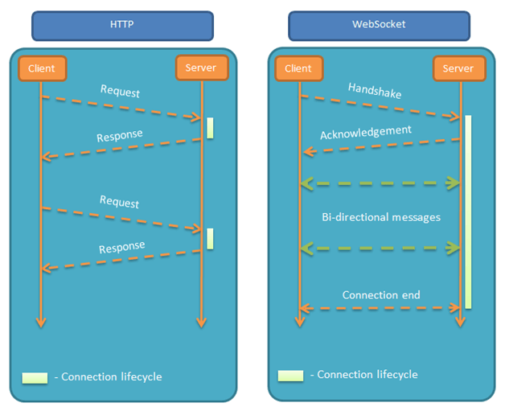

# 网络原理

### 列举 HTTP 状态码以及它们的含义

下面列举 web 开发中常见的 HTTP code:

- 200 (ok): 请求成功
- 204 (No Content): 请求成功，不需要附带实体内容 (body)
- 301 (Moved Permanently): 永久重定向。被请求的资源已永久移动到新位置
- 302 (Found): 临时重定向。请求的资源临时从不同的 URI 响应请求。由于这样的重定向是临时的，客户端应当继续向原有地址发送以后的请求。
- 400 (Bad Request): 请求参数有误
- 401 (Unauthorized): 当前请求需要用户验证
- 403 (Forbidden): 没有权限的操作。服务器已经理解请求，但拒绝执行。
- 404 (Not Found): 资源没有找到
- 500 (Internal Server Error): 服务端出现了错误
- 502 (Bad Gateway): 网关错误。此错误响应表明服务器作为网关需要得到一个处理这个请求的响应，但是得到一个错误的响应
- 503 (Service Unavailable): 服务器停止服务。常见原因是服务器因维护或重载而停机
- 504 (Gateway Timeout): 网关超时。当服务器作为网关，不能及时得到响应时返回此错误代码。

### HTTP 的 GET 和 POST 请求有什么区别？

GET 和 POST 在浏览器上的表现会根据使用场景有各自的优缺点:

- GET 可以直接在浏览器上手动输入请求，在浏览器地址直接请求的 URL 在非匿名模式下会被浏览器记录下来的。这样用户可以通过历史记录来找回之前访问过的页面。反之，POST 不会在浏览器留下痕迹。
- GET 在浏览器地址上的长度是有限制的，POST 没有限制。
- GET 的请求一般可以被浏览器缓存
- 带云压缩的浏览器，比如 Opera mini/Turbo 2, 只有 GET 才能在服务器端被预取

但实际使用时 GET 和 POST 请求所进行的操作取决于服务端是如何解释的。比如一种极端情况就是：不管你是查询、删除、更新还是提交数据也好，所有请求一律使用 POST 来实现都没问题。但这种做法不符合主流的 `RESTful APIs` 设计规范，不建议这样做。

相关讨论参见: [post 相比get 有很多优点，为什么现在的HTTP通信中大多数请求还是使用get？](https://www.zhihu.com/question/31640769?rf=37401322)

### 有了解过 HTTP 缓存吗？

HTTP 缓存策略可分强缓存与协商缓存。这些机制通过 HTTP 头部字段来控制，可以有效减少网络延迟，提高网页加载速度，并减轻服务器的负载。

**强缓存（Strong Caching）**

强缓存不会向服务器发送请求，直接从缓存中读取资源。强缓存可以通过两个 HTTP 响应头实现：

1. **`Expires`**
   - `Expires` 是一个日期/时间，指示资源什么时候过期。如果请求的时间小于 `Expires` 指定的时间，浏览器就直接使用缓存的资源。
   - 例如: `Expires: Wed, 21 Oct 2020 07:28:00 GMT`
   - `Expires` 是 HTTP/1.0 的产物，依赖于客户端和服务器时间的一致性，因此不太可靠。

2. **`Cache-Control`**
   - `Cache-Control` 是一个更灵活的 HTTP/1.1 字段，用于定义资源的缓存策略。常见的值包括：
     - `max-age=<seconds>`：资源在被认为过期之前可以保留的最大时间（秒）。
     - `public`：指示响应可被任何缓存存储。
     - `private`：响应是为单个用户定制的，不能由共享缓存存储。
     - `no-cache`：强制每次请求直接发送到服务器，服务器会验证资源的有效性。
     - `no-store`：绝对禁止缓存。
   - 例如: `Cache-Control: max-age=3600`

如果这两个字段同时存在，`Cache-Control` 会优先于 `Expires`。

**协商缓存（Negotiated Caching）**

当强缓存过期后，如果资源仍可使用，协商缓存将允许客户端与服务器之间进行「协商」，看是否可以继续使用缓存的资源。这主要通过以下两对 HTTP 头实现：

1. **`Last-Modified` 和 `If-Modified-Since`**
   - `Last-Modified` 标记资源的最后修改时间。
   - 当资源过期并再次发起请求时，浏览器会发送 `If-Modified-Since`，该值为之前 `Last-Modified` 的值。
   - 服务器比较时间，如果服务器资源未改变，则返回 HTTP 304（Not Modified），浏览器继续使用缓存。

2. **`ETag` 和 `If-None-Match`**
   - `ETag` 是资源的特定版本的唯一标识符。如果资源过期，浏览器会在请求中包含 `If-None-Match`，其值为之前的 `ETag`。
   - 如果 `ETag` 仍然匹配，服务器返回 HTTP 304，浏览器使用缓存的资源。

---

### 协商缓存的 ETag 是怎么生成的

`ETag` 是对资源的一种标识，通常由服务器根据资源的内容或属性生成。生成方法可以有很多种，具体取决于服务器的实现。

1. **内容哈希**：
   最常见的方法是对文件内容应用哈希函数（如MD5、SHA-1等），生成一个哈希值。这种方法的优点是只要内容发生改变，生成的`Etag`值就会变，从而确保内容的更新能够被客户端识别。

2. **文件属性**：
   有些实现可能会结合文件的大小、最后修改时间等属性来生成`Etag`。这种方法比内容哈希计算开销小，但可能不如内容哈希精确。

3. **自定义规则**：
   服务器也可以根据自定义规则生成`Etag`，例如结合文件版本号、更新周期等因素。

---

### TCP 握手过程

1. 浏览器发送 TCP 分组，这个分组设置了一个特殊的 `SYN` 标记，用来表示这是一条连接请求。
2. 服务器接受到客户端的 `SYN` 连接后, 会选择服务器初始序号 `y`。同时向客户端发送含有连接确认 (`SYN + ACK`)、`Seq=0` (本例中的服务器初始序号)、`ACK=1` (客户端的序号 x + 1) 等信息的 TCP 分组。
3. 客户端收到了服务器的确定字段后，向服务器发送带有 `ACK=1`、`Seq=1`、`Ack=1` (服务器 Ack 信息的拷贝)等字段的 TCP 分组给服务器。
4. 服务器接收到客户端的确认字段后完成三次握手的连接，开始给客户端传输它想要资源

   

   

   
点击显示真实案例

   以下序号 `40`、`44`、`45` 为 TCP 三次握手的具体数据信息。在右侧的 `info` 栏中显示了分组的标志位信息:

   

   

---

### WebSocket 的连接原理

WebSocket 协议允许在客户端和服务器之间建立一个持久的、全双工的通信通道。这个过程开始于一个标准的 HTTP 请求，通过这个请求，客户端告诉服务器它希望将连接升级到 WebSocket。连接过程如下：

1. **客户端请求（握手）**：
   - 客户端发起一个 HTTP 请求到服务器，这个请求包含特定的头部信息，表示希望进行协议升级。这些头部包括：
     - `Upgrade: websocket`：表明请求升级到 WebSocket。
     - `Connection: Upgrade`：指示当前连接需要切换协议。
     - `Sec-WebSocket-Key`：一个 Base64 编码的随机字符串，服务器将使用这个字符串生成响应头中的 `Sec-WebSocket-Accept`。
     - `Sec-WebSocket-Version`：表明客户端支持的 WebSocket 版本。

2. **服务器响应**：
   - 如果服务器支持 WebSocket 连接和请求中指定的 WebSocket 版本，它会响应一个 HTTP 101 状态码（Switching Protocols），表示协议切换正在进行。
   - 响应中还包括：
     - `Upgrade: websocket` 和 `Connection: Upgrade`：确认将协议升级到 WebSocket。
     - `Sec-WebSocket-Accept`：这是一个由服务器生成的特定值，用于确认握手的有效性。这个值是将客户端的 `Sec-WebSocket-Key` 与一个特定的 GUID 连接后，通过 SHA-1 哈希算法计算并编码得到。

3. **建立连接**：
   - 一旦握手完成，HTTP 连接就被升级到 WebSocket 连接。这时，连接保持开放，允许客户端和服务器进行双向数据传输。
   - 数据在 WebSocket 连接中以帧（frame）的形式传输，这些帧可以包含文本或二进制数据。

4. **数据传输**：
   - 在 WebSocket 连接中，服务器和客户端都可以随时发送数据，而无需等待对方先发起请求，这样显著减少了通信延迟。

WebSocket 提供了一种相比传统 HTTP 更高效、更适合实时通信的解决方案。这对于需要快速响应的应用程序（如在线游戏、聊天应用和实时数据传输）尤其有用。

---

### HTTPS 是如何保证安全的? 是如何保证不被中间人攻击的?

HTTPS 通过结合 SSL/TLS（安全套接层/传输层安全）协议，为网站与用户之间的通信提供了加密和身份验证，从而增强了安全性。

1. **加密**
   - **对称加密**：一旦客户端和服务器之间建立了 TLS 连接，它们会协商生成一个共享的对称密钥。此密钥用于加密传输数据，确保传输内容的隐私性和安全性。v
   - **非对称加密**：在握手过程中使用，主要用于安全地交换对称密钥和验证服务器身份。

2. **身份验证**
   - **证书和公钥基础设施（PKI）**：服务器将向客户端提供一个由可信第三方（证书颁发机构，CA）签名的公开证书。这个证书包含服务器的公钥和一些身份信息。
   - **证书验证**：客户端将验证服务器证书的有效性，包括证书是否由受信任的 CA 签发，证书是否过期，以及证书中的域名是否与正在访问的网站匹配。这确保了客户端是与预期的服务器建立连接，而不是一个冒充者。

3. **完整性检查**
   - **消息摘要和数字签名**：TLS 还使用消息摘要技术来保护数据的完整性，确保数据在传输过程中没有被篡改。数字签名进一步确保数据的来源，防止被篡改。

HTTPS 防范中间人攻击主要通过**建立加密的连接**和**验证服务器的身份**来确保数据传输的安全性和可信度。
