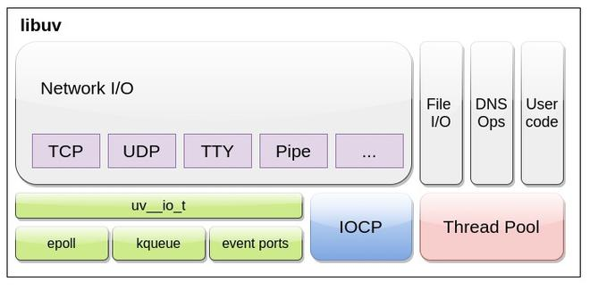
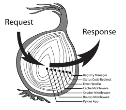

# Node.js 与服务端

### 简述一下 Nodejs 的异步 IO 模型

1. **事件驱动：** 基于事件循环的模型，通过监听和响应事件实现异步编程。
2. **非阻塞 I/O：** 采用非阻塞的 I/O 操作方式，使得可以在进行 I/O 操作的同时执行其他代码。
3. **回调函数：** 大部分异步操作通过回调函数来处理结果，实现了异步编程的主要机制。
4. **事件触发器：** 提供事件触发器类来处理事件的监听和触发，用于模块之间的解耦和通信。
5. **单线程：** 尽管是单线程的，但通过事件循环和异步 I/O 模型，能够充分利用多核 CPU，实现高并发和高吞吐量的处理能力。

---

### 什么是 libuv?

libuv 是一个用于抽象非阻塞 I/O 操作的 C 库。他有以下几个特点：

- 集成了事件驱动的异步I/O模型。
- 它允许同时使用CPU和其他资源，同时仍然执行I/O操作，从而实现资源和网络的高效利用。
- 它促进了事件驱动的方法，其中使用基于回调的通知来执行 I/O 和其他活动。

**示例：** 假设我们有一个程序正在执行查询数据库的操作，而数据库查询可能需要一些时间来完成。如果程序在等待查询结果的同时被阻塞，那么 CPU 就会处于空闲状态，无法处理其他任务，从而造成系统资源的浪费。



---

### 并发量大怎么解决?

**1.从代码层面进行优化**

- **异步编程**：利用Node.js的非阻塞I/O模型，确保应用使用异步API调用，避免阻塞主事件循环。
- **避免重计算**：使用缓存策略，如内存缓存或分布式缓存系统（如Redis），来存储重复计算的结果或常用数据。

**2.在应用架构层面调整**

- **微服务架构**：将大型应用拆分为小的、独立的服务，可以分别扩展，降低整体系统的复杂性。
- **无状态设计**：确保服务间的通信无状态，这样每个服务都可以独立扩展。

其中一个典型的例子就是云函数架构 (FaaS)，每个云函数都独立执行。如果一个云函数发生崩溃或遇到阻塞，它不会影响应用程序的其他部分正常运行。

**3.负载均衡**

- **使用反向代理**：通过 Nginx 或 HAProxy 等工具可以帮助分发入站请求到多个 Node.js 实例或服务器。
- **DNS轮询**：配置DNS以轮询方式分发请求到多个服务器，从而平衡负载。

**4.水平扩展**，即日常工作中常说 "扩容"。

- **增加实例**：通过增加更多的 Node.js 实例来分散负载。这可以在单台机器上实现，也可以跨多台机器实现。
- **容器化与编排**：使用 Docker 和 Kubernetes 等技术可以帮助自动管理和扩展应用程序的多个实例。

**5.优化数据库访问**

- **数据库索引**：根据业务需求，在合适的地方添加索引，以提高数据库查询的速度和效率。确保关键查询字段都建立了索引。
- **读写分离**：对于访问量大的数据库应用，通过实现主从复制及读写分离策略，可以有效分散读操作和写操作的压力，从而提升整体性能。

**6.设置缓存**

- **前端缓存**：使用 CDN 来缓存静态资源，减轻服务器压力。
- **后端缓存**：应用程序级别的缓存（例如Redis）可以存储常用数据或会话信息，减少数据库访问次数。

**7.限流和服务降级**

- **限流**：限制访问速率，防止系统过载。
- **服务降级**：在系统负载极高时，暂时关闭或降低某些非核心功能的服务质量。

比方说，在电商平台的大促销期间，为防止系统崩溃，可以限制每秒处理的用户请求数量，确保所有用户都能获得一致的服务体验。

---

### 如果你的 node 半夜服务挂了如何启动?

通过守护进程管理 Node.js 应用，在 Node.js 中最常用的守护进程是 `pm2`:

使用 pm2 启动应用:

``` bash
pm2 start app.js
```

设置开机自启，确保服务器重启后能自动启动：

``` bash
pm2 startup
```

---

### koa 的洋葱模型是怎么实现的

在 Koa 中，中间件就像洋葱的层层皮一样。当一个请求到达时，它首先经过最外层的中间件，然后通过 `next` 函数逐层向里传递，直到达到最内层。

每一层中间件都是独立的功能、可以做一些工作，然后再把请求传递给下一层。当请求处理完成后，Koa 会逆向执行这些中间件，从内层到外层，以便完成一些清理工作。

``` js
const Koa = require('koa');
const app = new Koa();

// 第一个中间件
app.use(async (ctx, next) => {
    console.log('Middleware 1 - Start');
    await next(); // 调用下一个中间件
    console.log('Middleware 1 - End');
});

// 第二个中间件
app.use(async (ctx, next) => {
    console.log('Middleware 2 - Start');
    await next(); // 调用下一个中间件
    console.log('Middleware 2 - End');
});

// 路由处理函数
app.use(async ctx => {
    console.log('Route Handler');
    ctx.body = 'Hello Koa!';
});

// 启动应用程序
app.listen(3000, () => {
    console.log('Server is running on port 3000');
});
```



---

### 在没有async await 的时候, koa是怎么实现的洋葱模型?

Koa 可以基于回调的方式来实现中间件的执行和控制流程：

``` js
const Koa = require('koa');
const app = new Koa();

// 第一个中间件
app.use((ctx, next) => {
    console.log('Middleware 1 - Start');
    // 调用下一个中间件函数
    return next(() => {
        console.log('Middleware 1 - End');
    });
});

// 第二个中间件
app.use((ctx, next) => {
    console.log('Middleware 2 - Start');
    // 调用下一个中间件函数
    return next(() => {
        console.log('Middleware 2 - End');
    });
});

// 路由处理函数
app.use(ctx => {
    console.log('Route Handler');
    ctx.body = 'Hello Koa!';
});

// 启动应用程序
app.listen(3000, () => {
    console.log('Server is running on port 3000');
});
```

---

### 中间件的异常处理是怎么做的？

中间件的异常处理通常通过 try...catch 块来实现。当一个中间件函数抛出异常时，Koa 会捕获这个异常，并将控制传递给一个专门用于处理错误的中间件函数。这个错误处理中间件函数通常会被放置在其他中间件函数的后面，以确保它能够捕获所有其他中间件函数抛出的异常。

``` js
const Koa = require('koa');
const app = new Koa();

// 中间件1
app.use(async (ctx, next) => {
    console.log('Middleware 1');
    throw new Error('Something went wrong'); // 抛出一个异常
});

// 中间件2
app.use(async (ctx, next) => {
    console.log('Middleware 2');
    // 正常情况
    await next(); // 调用下一个中间件函数
});

// 错误处理中间件
app.use(async (ctx, next) => {
    try {
        await next(); // 调用下一个中间件函数
    } catch (err) {
        console.error('Error caught by error handling middleware:', err);
        ctx.status = err.status || 500;
        ctx.body = {
            error: {
                message: err.message || 'Internal Server Error'
            }
        };
    }
});

// 路由处理函数
app.use(ctx => {
    console.log('Route Handler');
    ctx.body = 'Hello Koa!';
});

// 启动应用程序
app.listen(3000, () => {
    console.log('Server is running on port 3000');
});
```

---

### body-parser 中间件了解过吗

`body-parser` 是 Node.js 的一个中间件，用于解析请求体中的数据，例如 JSON、URL 编码和表单数据等。

`body-parser` 的主要作用是将请求体中的数据解析为 JavaScript 对象，并将解析后的数据附加到请求对象的 body 属性中，以便后续中间件或路由处理函数使用。

`body-parser` 常搭配 `express` 框架一起使用：

``` js
const express = require('express');
const bodyParser = require('body-parser');

const app = express();

// 使用 body-parser 中间件解析 application/json 格式的请求体
app.use(bodyParser.json());

// 使用 body-parser 中间件解析 application/x-www-form-urlencoded 格式的请求体
app.use(bodyParser.urlencoded({ extended: true }));

// 使用 body-parser 中间件解析 text/plain 格式的请求体
app.use(bodyParser.text());

// 路由处理函数
app.post('/api/data', (req, res) => {
    console.log(req.body); // 输出解析后的请求体数据
    res.send('Data received');
});

app.listen(3000, () => {
    console.log('Server is running on port 3000');
});
```

---

### 如果浏览器端用 post 接口上传图片和一些其他字段, header 里会有什么? koa 里如果不用 body-parser，应该怎么解析?

若接口需要授权，则可以通过 Authorization 传递授权信息。

上传文件时的 Content-Type 一般被设置为 `multipart/form-data` 类型，其中 `boundary` 是分隔符，由浏览器随机生成的唯一字符串：

``` http
Content-Type: multipart/form-data; boundary=something
```

以下例 curl 为例，`----WebKitFormBoundaryEU440tTuKtxsINLf` 就是作为分隔 `data` 的作用：

``` sh
curl 'https://api.upyun.com/cloud-example' \
  -H 'accept: application/json, text/plain, */*' \
  -H 'accept-language: en,zh-CN;q=0.9,zh;q=0.8,zh-TW;q=0.7,zh-HK;q=0.6' \
  -H 'cache-control: no-cache' \
  -H 'content-type: multipart/form-data; boundary=----WebKitFormBoundaryEU440tTuKtxsINLf' \
  -H 'origin: https://v5204.eng.szx.ifanrx.com' \
  -H 'pragma: no-cache' \
  -H 'priority: u=1, i' \
  -H 'referer: https://v5204.eng.szx.ifanrx.com/' \
  -H 'sec-ch-ua: "Chromium";v="124", "Google Chrome";v="124", "Not-A.Brand";v="99"' \
  -H 'sec-ch-ua-mobile: ?0' \
  -H 'sec-ch-ua-platform: "macOS"' \
  -H 'sec-fetch-dest: empty' \
  -H 'sec-fetch-mode: cors' \
  -H 'sec-fetch-site: cross-site' \
  -H 'user-agent: Mozilla/5.0 (Macintosh; Intel Mac OS X 10_15_7) AppleWebKit/537.36 (KHTML, like Gecko) Chrome/124.0.0.0 Safari/537.36' \
  --data-raw $'------WebKitFormBoundaryEU440tTuKtxsINLf\r\nContent-Disposition: form-data; name="policy"\r\n\r\neyJidWNrZXQiOiAiY2xvdWQtbWluYXBwLTQ3MTUxIiwgInNhdmUta2V5IjogIjFzNU4xTmVHdHdOQ3FPWHYucG5nIiwgImRhdGUiOiAiRnJpLCAxMCBNYXkgMjAyNCAwOTo1ODozMyBHTVQiLCAiZXhwaXJhdGlvbiI6IDE3MTUzMzU0MTMsICJub3RpZnktdXJsIjogImh0dHBzOi8vdjUyMDQuZW5nLnN6eC5pZmFucnguY29tL2V4dGFwaS9oeWRyb2dlbi91cHl1bi9jYWxsYmFjay85MzAvNjYzZGVmYzljYjc0N2RiYzlkNWRiMmJlLyJ9\r\n------WebKitFormBoundaryEU440tTuKtxsINLf\r\nContent-Disposition: form-data; name="authorization"\r\n\r\nmyauth=\r\n------WebKitFormBoundaryEU440tTuKtxsINLf\r\nContent-Disposition: form-data; name="file"; filename="img_product.png"\r\nContent-Type: image/png\r\n\r\n\r\n------WebKitFormBoundaryEU440tTuKtxsINLf--\r\n'
```

**koa 里如果不用 body-parser，应该怎么解析?**

`multipart/form-data` 请求中，每个表单字段或上传的文件都被封装在一个由边界字符串（boundary）分隔的部分里。每个部分的开头通常包含一个 `Content-Disposition` 头，该头描述了字段的名称（以及文件的名称，如果该部分是一个文件）。

不通过中间件来解析 `multipart/form-data` 类型的数据，则原生的实现方式为：

``` js
const Koa = require('koa');
const app = new Koa();

app.use(async (ctx, next) => {
    if (ctx.method === 'POST' && ctx.is('multipart/form-data')) {
        let data = '';
        let boundary = ctx.get('content-type').split('=')[1];
        let parts = [];

        await new Promise((resolve, reject) => {
            ctx.req.on('data', chunk => {
                data += chunk.toString();
            });

            ctx.req.on('end', () => {
                // 分割字符串，使用boundary
                data.split(boundary).forEach(part => {
                    if (part.includes('Content-Disposition: form-data;')) {
                        parts.push(part); // 将每个部分存储到数组中
                    }
                });

                resolve();
            });
        });

        // 处理每个部分，解析出字段名和值
        parts.forEach(part => {
            let matchResult = part.match(/name="([^"]+)"\r\n\r\n([\s\S]+)\r\n$/);
            if (matchResult) {
                let key = matchResult[1];
                let value = matchResult[2].trim();
                ctx.request.body = ctx.request.body || {};
                ctx.request.body[key] = value;
            }
        });

        await next();
    }
});

app.use(async ctx => {
    ctx.body = ctx.request.body; // 输出解析的结果
});

app.listen(3000, () => console.log('Server running on http://localhost:3000'));

```

---

### Node 的日志怎么做？

**日志系统**

常使用如 Winston 或 Morgan 等库进行日志管理。Winston 支持多种存储选项和日志级别，而 Morgan 特别适用于 HTTP 请求日志。

---

### Node 的负载均衡怎么做？

**1.Node.js Cluster模块**

Node.js 的 Cluster 模块允许应用程序利用多核系统的多个核心。通过创建多个子进程（workers），每个子进程都有自己的事件循环和内存空间，可以有效地分散请求负载。

``` js
const cluster = require('cluster');
const http = require('http');
const numCPUs = require('os').cpus().length; // 获取CPU核心数

if (cluster.isMaster) {
  console.log(`主进程 ${process.pid} 正在运行`);

  // 衍生工作进程。
  for (let i = 0; i < numCPUs; i++) {
    cluster.fork();
  }

  cluster.on('exit', (worker, code, signal) => {
    console.log(`工作进程 ${worker.process.pid} 已退出`);
  });
} else {
  // 工作进程可以共享任何TCP连接。
  // 在本例中，它是一个HTTP服务器
  http.createServer((req, res) => {
    res.writeHead(200);
    res.end('你好世界\n');
  }).listen(8000);

  console.log(`工作进程 ${process.pid} 已启动`);
}
```

**2.反向代理**

使用反向代理服务器是 Node.js 应用最常见的负载均衡方法之一，它的实现原理是：

当用户访问例如 `example.com` 这样的网站时，用户的请求首先到达部署了反向代理的服务器。这个反向代理服务器不会直接处理请求内容，而是根据一定的规则（如负载均衡策略、服务器健康状态等）将请求转发到一组后端服务器之一。

这个过程中，反向代理可以采取多种策略来决定如何分发请求：

- **轮询（Round Robin）**：按顺序将每个新请求发送到下一个服务器，循环进行。
- **最少连接（Least Connections）**：将请求发送到当前连接数最少的服务器。
- **IP哈希（IP Hashing）**：根据用户的 IP 地址决定将请求发送到哪个服务器，这样来自同一IP地址的请求总是被发送到同一台服务器，可以维持用户的会话状态。

以下常为常见的反向代理服务器：

- **Nginx**: 作为反向代理使用，可以将进入的请求分发到后端的多个 Node.js实例。
- **Apache HTTP Server**: 虽然不如 Nginx 流行，但也可以配置为Node.js的负载均衡器。

**3.DNS负载均衡**

云解析 DNS 权重配置，即在 DNS 服务器中为同一个主机记录配置多个 IP 地址，在应答 DNS 查询时，所有 IP 地址按照预先设置的权重进行返回不同的解析结果，将解析流量分配到不同的服务器上，从而达到负载均衡的目的。

以阿里云的 DNS 云解析为例：假设您我们有 3 台服务器 (IP 地址分别为 `1.1.XX.XX`、`2.2.XX.XX`、`3.3.XX.XX`) 提供同一服务（1 个域名）。

当权重配置开启后，进行权重设置，在 DNS 请求应答中，IP 地址按照预先设置的权重进行返回，可以实现将解析流量按照权重进行分配。例如，将上述 3 条解析记录的权重比设置为 **2:1:1** 时，则 DNS 解析结果如下所示：

``` log
Region1 访问，返回 1.1.XX.XX
Region2 访问，返回 2.2.XX.XX
Region3 访问，返回 3.3.XX.XX
Region4 访问，返回 1.1.XX.XX
Region5 访问，返回 1.1.XX.XX
Region6 访问，返回 2.2.XX.XX
```

**4.容器服务与编排工具**

容器化技术允许将应用和其依赖环境封装在一个轻量级的、可移植的容器中。每个容器都是独立运行的，并且与其他容器隔离。这种隔离和封装确保了应用的一致性和安全性，使得容器非常适合在不同环境中部署和扩展。常见的容器服务有 docker。

容器编排工具，如 Kubernetes，能够监控容器的状态和性能指标。根据预定义的规则，如 CPU 使用率或内存消耗，编排工具可以自动增加或减少容器实例的数量。这种自动扩展功能是实现负载均衡的关键，它确保应用可以根据需求动态调整资源，避免过载。

例如，在 Kubernetes 中，一个 Service 对象定义了一个逻辑应用服务，它背后可以有多个 Pod 实例。当服务接收到请求时，Kubernetes 的内部负载均衡机制（如 iptables 或 IPVS）将请求均匀地分配到后端的 Pod 上。
