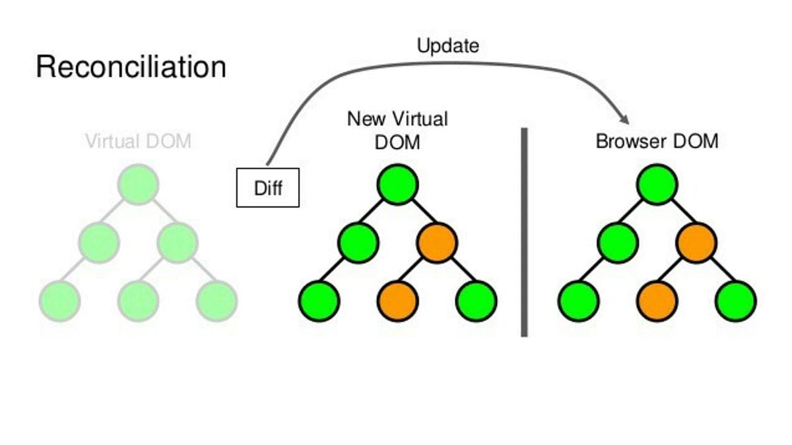

# React 篇

**目录**

[[toc]]

## React 基础概念

### React 是单向数据流还是双向数据流？它还有其他特点吗？

- React 是单向数据流，数据是从上向下流
- 声明式编写 UI
- 组件化开发

---

### React 通过什么方式来更新数据

React 是通过 `setState` 来更新数据的。调用多个 `setState` 不会立即更新数据，而是批量延迟更新后再将数据合并。

除了 `setState` 外还可以使用 `forceUpdate` 跳过当前组件的 `shouldComponentUpdate` 对比，强制触发组件渲染(避免使用该方式)。

---

### React 不能直接修改 State 吗？

1. 直接修改 state 不会触发组件的渲染。
2. 若直接修改 state 引用的值，在实际使用时会导致错误的值出现
3. 修改后的 state 可能会被后续调用的 `setState` 覆盖

---

### setState 是同步还是异步的？

出于性能的考虑，可能会把多个 `setState` 合并成一个调用。

在 React 控制的生命周期、React 封装的事件处理器中直接使用是异步的(命中 `batchUpdate` 机制，`isBatchingUpdate` 的标志位为 `true`)。比如 React中注册的 `onClick` 事件或是 `componentDidMount` 中直接使用都是异步的。

可以给 `setState` 第二个参数传递一个函数，该函数是**数据更新后会触发的回调函数**。在该函数中可以拿到更新后最新的值。

在 React 控制外中使用 `setState` 是同步的，比如在 `setTimeout`, 或者是原生的事件监听器中使用都是同步的。

---

### 函数组件是什么？与类组件有什么区别？

函数组件本质上是一个纯函数，它接受 props 属性，最后返回 JSX。

与类组件的差别在于: 它没有实例、不能通过 `extends` 继承于其他方法、也没有生命周期和 `state`(但可以引入 `Hooks` 来处理没有生命周期和 `state` 的问题)。

---

### 受控组件与非受控组件的区别

受控组件主要是指表单的值受到 `state` 的控制，它需要自行监听 `onChange` 事件来更新 `state`。

由于受控组件每次都要编写事件处理器才能更新 `state` 数据、可能会有点麻烦，React 提供另一种代替方案是**非受控组件**。

非受控组件将**真实数据储存在 DOM 节点**中,它可以为表单项设置默认值，不需要手动更新数据。当需要用到表单数据时再通过 `ref` 从 DOM 节点中取出数据即可。

**注意: 多数情况下React 推荐编写受控组件。**

扩展资料: [受控和非受控制使用场景的选择](https://goshakkk.name/controlled-vs-uncontrolled-inputs-react/)

---

### React中的合成事件是什么？

合成事件是围绕浏览器原生事件充当跨浏览器包装器的对象。它们将不同浏览器的行为合并为一个 API。这样做是为了确保事件在不同浏览器中显示一致的属性。

---

### 为什么浏览器无法读取JSX？

浏览器只能处理 JavaScript 对象，而不能读取常规 JavaScript 对象中的 JSX。所以为了使浏览器能够读取 JSX，首先，需要用像 Babel 这样的 JSX 转换器将 JSX 文件转换为 JavaScript 对象，然后再将其传给浏览器。

---

### JSX 是如何编译为 js 代码的？

在 React v17 之前，JSX 会被编译为 `React.createElement(component, props, ...children)` 函数，执行会返回 `vnode`，`vnode` 通过 `patch` 之类的方法渲染到页面。

React v17 之后更新了 JSX 转换规则。新的 JSX 转换不会将 JSX 转换为 `React.createElement`，而是自动从 React 的 `package` 中引入新的入口函数(`react/jsx-runtime`)并调用。这意味着我们不用在每个组件文件中显式引入 `React`。

---

### React 生命周期

针对 React 生命周期中函数的调用顺序，笔者写了一个简易的 Demo 用于演示: [React 父子组件生命周期示例](https://codesandbox.io/s/react-lifecycle-forked-2dvdg?file=/src/Parent.jsx)

**React 组件挂载阶段**先后会触发 `constuctor`、`static getDerivedStateFromProps`、`render`、`componentDidMount` 函数。若 `render` 函数内还有子组件存在的话，则会进一步递归:

```log
[Parent]: constuctor
[Parent]: static getDerivedStateFromProps
[Parent]: render
[Children]: constuctor
[Children]: static getDerivedStateFromProps
[Children]: render
[Children]: componentDidMount
[Children]: 挂载阶段结束!
[Parent]: componentDidMount
[Parent]: 挂载阶段结束!
```

**React 组件更新阶段**：主要是组件的 props 或 state 发生变化时触发。若组件内还有子组件，则子组件会判断是否也需要触发更新。默认情况下 `component` 组件是只要父组件发生了变化，子组件也会跟着变化。以下是更新父组件 `state` 数据时所触发的生命周期函数:

```log
[Parent]: static getDerivedStateFromProps
[Parent]: shouldComponentUpdate
[Parent]: render
[Children]: static getDerivedStateFromProps
[Children]: shouldComponentUpdate
[Children]: render
[Children]: getSnapshotBeforeUpdate
[Parent]: getSnapshotBeforeUpdate
[Children]: componentDidUpdate
[Children]: 更新阶段结束!
[Parent]: componentDidUpdate
[Parent]: 更新阶段结束!
```

**React 组件销毁阶段**：父组件先触发销毁前的函数，再逐层向下触发:

```log
[Parent]: componentWillUnmount
[Parent]: 卸载阶段结束!
[Children]: componentWillUnmount
[Children]: 卸载阶段结束!
```

---

### React 组件通信

- 父组件通过 props 给子组件传参，子组件通过触发父组件提供的回调函数来给父组件传递数据
- React.Context
- 自定义事件
- redux/mobx 之类的状态管理器

---

### React.Context 怎么使用

`Context` 可以共享对于组件树而言是全局的数据，比如全局主题、首选语言等。使用方式如下：

1. `React.createContext` 函数用于生成 `Context` 对象。可以在创建时给 `Context` 设置默认值：

   ```js
   const ThemeContext = React.createContext("light");
   ```

2. `Context` 对象中有一个 `Provider(提供者)` 组件，`Provider` 组件接受一个 `value` 属性用以将数据传递给消费组件。

   ```jsx
   <ThemeContext.Provider value="dark">
     <page />
   </ThemeContext.Provider>
   ```

3. 获取 `Context` 提供的值可以通过 `contextType` 或者 `Consumer(消费者)` 组件中获取。`contextType` 只能用于类组件，并且只能挂载一个 `Context`：

   ```js
   class MyClass extends React.Component {
     componentDidMount() {
       let value = this.context;
       /* 在组件挂载完成后，使用 MyContext 的值执行一些有副作用的操作 */
     }
     render() {
       let value = this.context;
       /* 基于 MyContext 的值进行渲染 */
     }
   }
   MyClass.contextType = MyContext;
   ```

   若想给组件挂载多个 `Context`, 或者在函数组件内使用 `Context` 可以使用 `Consumer` 组件:

   ```jsx
   <ThemeContext.Consumer>
     {(theme) => (
       <UserContext.Consumer>
         {(user) => <ProfilePage user={user} theme={theme} />}
       </UserContext.Consumer>
     )}
   </ThemeContext.Consumer>
   ```

`Context` 通常适用于传递较为简单的数据信息，若数据太过复杂，还是需要引入状态管理(redux/mbox)。

---

### React 怎么做代码复用

- [Render Props](https://react.html.cn/docs/render-props.html)
- 高阶组件 (HOC)
- 自定义 Hooks
- Mixins (已被 React 废弃的方案)

`Render props` 是一种在 React 组件之间共享代码的简单技术。具体的行为是:

1. 子组件接收一个用于渲染指定视图的 `prop` 属性，该属性的类型是函数。
2. 父组件在组件内部定义该函数后，将函数的引入传给子组件
3. 子组件将组件内部 `state` 作为实参传给从外面传来的函数，并将函数的返回结果渲染在指定的视图区域。

```jsx
// 组件使用
<Mouse
  render={(x, y) => (
    <span>
      x: {x}, y: {y}
    </span>
  )}
/>;

// 组件内部大致实现
class Mouse extends React.Component {
  state = { x: 0, y: 0 };

  render() {
    return (
      <section>
        <header>头部信息</header>
        <main>{this.props.render(this.state)}</main>
        <footer>底部信息</footer>
      </section>
    );
  }
}
```

准确来说 `Render props` 是一个用于告知组件需要渲染什么内容的函数属性。`props` 的命名可以由自己定义，比如用于在内容区域渲染的 prop 名可以叫 `render`，同时还可以再接收一个 `renderHead` 的 prop 用于渲染头部的信息。

---

### 高阶函数、高阶组件是什么？

**高阶函数**就是**接收其它函数作为参数**的函数就称之为高阶函数，像数组的 `map` 、`sort`、`filter` 都是高阶函数。

**高阶组件(Higher-order component, HOC)** 是 React 用于复用组件逻辑的一种高级技巧。它具体的行为是：

函数**接收一个组件作为参数**，在函数体内**定义一个新组件**，新组件内**编写可复用的逻辑**并应用到参数组件中。最后再将**新组件作为函数的返回值** return 出去。
`redux` 中的 `connect` 函数就是一个高阶组件。

---

### 怎么对组件的参数做类型约束呢?

要对组件的参数做类型约束的话，可以引入 `prop-types` 来配置对应的 `propTypes` 属性。
`Flow` 和 `TypesScript` 则可以对整个应用做类型检查。

---

### 组件设计原则

- 从功能上拆分组件
- 组件功能原子化
- 容器组件只管数据，UI 组件只管视图
- 可复用、易用、直观
- 组件库可以遵循 [ARIA](https://developer.mozilla.org/en-US/docs/Web/Accessibility/ARIA/Roles) 规范

## 渲染与优化

### 渲染列表为啥要用 key？

在渲染列表时，为列表子项指定唯一的 `key` 是非常重要的。如果不为列表子项提供 `key`，React 将默认使用 `index` 作为 `key`，同时会在控制台发出警告。

`key` 在兄弟节点之间必须唯一，应避免使用数组下标 `index` 作为 `key`。因为使用数组下标作为 `key` 可能会导致一些问题：

- 当列表的顺序发生改变时，React 可能会错误地重新排序或重渲染列表中的元素，从而影响页面的稳定性和性能。
- 对于列表中的组件，组件实例是基于 `key` 来决定是否更新与复用的。当顺序发生变化时，`key` 也会相应变化，可能导致子组件间的数据错乱或状态丢失。

React 的 Diffing 算法是通过 `tag` 和 `key` 判断是否是同一个元素(`sameNode`)，因此使用唯一的 `key` 有助于 React 识别哪些元素发生了改变，如节点添加或删除，从而减少不必要的 DOM 操作，优化性能。

如果列表项中的数据没有唯一的标识符，可以使用第三方库比如 [shortid](https://www.npmjs.com/package/shortid) 来生成唯一的 `id`：

```js
const shortid = require("shortid");

function addId(data) {
  return {
    ...data,
    id: shortid.generate(),
  };
}

const newList = list.map(addId);
```

若确定没有列表的顺序不会发生变化同时没有其他唯一的 `key` 来标识列表项时才能使用数组的下标。

---

### 虚拟 dom 是如何提升性能的

当组件触发更新时，虚拟 DOM 通过比对新旧 `state` 和 `props` 的变化以决定是否渲染 DOM 节点，从而减少渲染提升性能。因为修改真实 DOM 所耗费的性能远比操作 JavaScript 多几倍，因此使用虚拟 DOM 在渲染性能上会高效的多。

---

### react 在虚拟 dom 的 diff 上，做了哪些改进使得速度很快?

1. **Fiber 架构**：
   - React 16 引入了 Fiber 架构，重写了 React 的内部机制。Fiber 允许 React 进行增量渲染——即将渲染任务分解为多个小任务，并且可以中断和恢复这些任务。这种方式让 React 在处理大型更新时更为高效，可以更好地利用浏览器的帧率。

2. **优先级调度**：
   - Fiber 架构引入了任务优先级的概念，允许 React 根据更新的紧急性分配不同的优先级。这意味着 React 可以优先完成更重要的更新，例如与用户交互相关的更新。

3. **Reconciliation 算法优化**：
   - React 在进行组件树比较时，会优化对子组件的比较。如果组件类型相同，React 会假设结构没有发生大的变化，只进行属性的比较和更新。使用 `key` 可以帮助 React 确定哪些元素需要更新、移动或删除，减少不必要的组件重渲染。

4. **跳过不必要的比较**：
   - 使用 `React.memo` 和 `shouldComponentUpdate` 等 API，开发者可以指定在何种情况下组件不需要进行重新渲染，减少了不必要的 diff 和重渲染过程。

---

### 可以描述一下 React Diffing 算法吗？

### React 的 Diffing 算法

React 使用 `Reconciliation` 算法，该算法首先比较两个根元素的变化:

1. **节点类型变化**：当节点类型变化时，React 将卸载旧树并构建新树。例如，如果父节点从 `<div>` 变为 `<section>`，则它及其子节点都会被重新渲染。
2. **DOM 节点类型相同**：如果 DOM 节点类型未改变，React 会保留该节点并仅更新发生变化的属性。
3. **组件类型相同**：当组件更新且类型相同时，React 会保持组件实例不变，更新其 props 并调用 `static getDerivedStateFromProps()` 和 `componentDidUpdate()`。然后调用 `render` 方法，如果 `render` 方法中包含子组件，将递归触发 Diff。
4. **列表节点变化，检查列表项是否有 key**：
   1. **未设置 key**：Diff 算法会逐个对比节点。
      - 如果在列表尾部添加元素，仅会添加新元素。
      - 如果新元素位于列表中间，Diff 到该位置时会判断节点已变化，从此处开始将丢弃所有后续节点并重新渲染。
   2. **设置了 key**：React 可以通过 key 匹配新旧节点间的关系，快速完成 Diff 过程，避免不必要的节点重渲染。



---

### React 如何做性能优化

1. `props/state` 新旧值的变化来决定是否渲染组件。

   React 可以通过 `shouldComponentUpdate`, `PureComponent`, `React.memo` 来对组件渲染进行性能优化。

   `shouldComponentUpdate` 是 class 组件生命周期中的一个钩子，常用于 `component` 中。

   该钩子的返回值可以决定组件是否进行渲染，如果没有在组件内定义该钩子的逻辑，则默认返回 `true`, 这也就意味着 React 默认情况下是无条件渲染的。通常 `component` 组件可以通过该钩子对比数据，以决定组件是否该渲染，从而避免重复渲染的问题。

   > 值得注意的是，即便在 `shouldComponentUpdate` 对新旧 props 使用深对比也不能破坏 React **不可变值\*\***不可变值\*\*原值。
   > 因为直接改变 state 的数据再通过 setState 来更新数据，因为新旧数据的值是一致的(旧数据被修改)，也就不能触发渲染。

2. 列表渲染时每项添加唯一的 `key`。
3. 定时器、DOM 事件等在组件销毁时一同销毁，从而避免内存泄露。
4. 代码分割，使用异步组件。
5. Hooks 使用 `useMemo` 缓存上一次计算的结果，避免重复计算值。

---

### 父组件在执行 render 时会不会触发子组件的 render 事件？如果会该怎么避免？

如果父组件渲染后，子组件接收的 props 也跟着发生了改变，那么默认情况下会触发子组件的渲染。

若子组件接收的 props 没有发生改变，那就得判断子组件的状况。

如果子组件是继承于 `component` 声明的组件，并且没有使用 `shouldComponentUpdate` 做避免重复渲染的处理，那么子组件会触发 render 事件。

为了避免重复渲染，类组件可以使用 `shouldComponentUpdate` 来决定是否进行渲染。也可以将继承于 `component` 组件改为继承 `PureComponment`，该组件会浅对比 `Props` 是否进行改变，从而决定是否渲染组件。

如果是函数组件，可以通过 `React.memo` 来对函数组件进行缓存。

> 问题本质上想问 React 性能优化的问题，可以参考上题答案。

---

### 什么是 Portals?

`Portals` 就像个传送门，它可以将子节点渲染到存在于父组件以外的 DOM 节点的方案。

比如 `Dialog` 是一个全局组件，按照传统渲染组件的方式，`Dialog` 可能会受到其容器 css 的影响。因此可以使用 `Portals` 让组件在视觉上渲染到 `<body>` 中，使其样式不受 `overflow: hidden` 或 `z-index` 的影响。

---

### 什么是 React Fiber?

Fiber 是 React 16 中新的**协调引擎或重新实现核心算法**。它的主要目标是**支持虚拟 DOM 的增量渲染**。React Fiber 的目标是提高其在动画、布局、手势、暂停、中止或重用等方面的适用性，并为不同类型的更新分配优先级，以及新的并发原语。

它的主要特性是增量渲染: 能够将渲染工作分割成块，并将其分散到多个帧中。

---

### 说说 Fiber 架构是怎么实现的

React Fiber 通过引入新的内部架构和调度机制，使 React 能够更有效地处理 UI 更新。Fiber 架构的核心在于：

1. **Fiber 数据结构**：每个组件有一个对应的 Fiber 对象，代表一个工作单元，包含组件的状态、props 和 DOM 节点引用。
2. **双缓冲技术**：React 维护两棵树，一棵当前显示的树和一棵正在构建的树，使得 UI 更新可以异步并且无干扰地进行。
3. **增量渲染**：React 可以将更新任务拆分为多个小任务，并根据优先级异步执行，从而不会阻塞主线程。
4. **任务中断与恢复**：React 可以根据需要中断和恢复更新任务，优先处理更重要的任务，如用户交互。

---

### Fiber 和 Stack 的区别

React Fiber 和 React Stack 是 React 的两个不同的渲染引擎版本。Stack 是在 Fiber 引入之前使用的旧版同步渲染引擎。它们的主要区别：

1. **渲染方法**：
   - **Stack**：使用递归的渲染方法，无法中断，可能导致长时间的UI阻塞。
   - **Fiber**：使用可以中断的任务分割方法，提高应用响应性和渲染效率。

2. **任务调度与优先级**：
   - **Stack**：没有任务优先级，更新按发生顺序同步执行。
   - **Fiber**：支持优先级调度，能够优先处理更重要的任务，提升交互体验。

3. **错误处理**：
   - **Stack**：错误可能导致整个应用崩溃。
   - **Fiber**：引入错误边界，允许局部捕获和处理错误。

4. **并发模式**：
   - **Stack**：不支持并发模式。
   - **Fiber**：为真正的并发模式和更好的任务管理奠定基础。

---

### 异步组件怎么使用？

1. 通过动态 `import()` 语法对组件代码进行分割。
2. 使用 `React.lazy` 函数，结合 `import()` 语法引入动态组件。在组件首次渲染时，会自动导入包含 `MyComponent` 的包。

   ```jsx
   const MyComponent = React.lazy(() => import("./MyComponent"));
   ```

3. 在 `React.Suspense` 组件中渲染 `lazy` 组件，同时可以使用 `fallback` 做优雅降级(添加 `loading` 效果):

   ```jsx
   <React.Suspense fallback={<div>Loading...</div>}>
     <MyComponent />
   </React.Suspense>
   ```

4. 封装一个错误捕获组件(比如组件命名为 `MyErrorBoundary`)，组件内通过生命周期 `getDerivedStateFromError` 捕获错误信息。当异步组件加载失败时，将捕获到错误信息处理后给用户做错误提示功能。

   ```jsx
   <MyErrorBoundary>
     <React.Suspense fallback={<div>Loading...</div>}>
       <MyComponent />
     </React.Suspense>
   </MyErrorBoundary>
   ```

---

## Hooks

### Hooks 相比 class 的优点

类组件的不足:

- 状态逻辑复用难，缺少复用机制。渲染属性和高阶组件导致层级冗余
- 复杂组件变得难以理解
- this 指向困扰

Hooks 的优点:

- 自定义 Hook 方便复用状态逻辑
- 副作用的关注点分离
- 函数组件没有 this 问题

Hooks 现有的不足:

- 不能完全代替 class 组件的生命周期，部分不常用的生命周期暂时没有实现
- useEffect 等 Hook 的运作方式带来了一定的学习成本，需要转换现有的编程思维

---

### Hooks 的使用

> 描述 Hooks 有哪些方法和大致用途

1. `useState`: 使函数组件支持设置 `state` 数据，可用于代替类组件的 `constructor` 函数。
2. `useEffect`: 使函数组件支持操作副作用的能力，可以模拟类组件 `componentDidMount` 的功能。同时还能监听数据变化，进而操作一系列诸如数据获取等副作用操作。 可以在 `useEffect` 的函数中返回一个函数做清除操作。这个清除操作时可选的:

   ```js
   // 第一个参数是函数
   // 第二个参数是函数内所依赖的外部变量数组。若没有外部依赖，则可以忽略第二个参数。
   useEffect(() => {
     document.addEventListener("click", handleClick);

     // useEffect 回调函数的返回值是函数的话，当组件卸载时会执行该函数
     // 若没有需要清除的东西，则可以忽略这一步骤
     return () => {
       document.removeEventListener("click", handleClick);
     };
   }, [handleClick]);
   ```

3. `useContext`: 接收一个 `Context` 对象，并返回 `Context` 的当前值。相当于类组件的 `static contextType = MyContext`。
4. `useReducer` 是 `useState` 的代替方案，有点类似于 `redux` 的工作方式。它通过函数来操作 state，适合 state 逻辑较为复杂且包含多个子值，或是下一个 state 依赖于旧的 state 的场景。
5. `useMemo` 可以缓存变量的值，避免每次组件更新后都需要重复计算值。
6. `useCallbck` 用于缓存函数，避免函数被重复创建。它是 `useMemo` 的语法糖，`useCallback(fn, deps)` 相当于是 `useMemo(() => fn, deps)`。

---

### 自定义 Hook 怎么使用

自定义 Hook 的命名规则是以 `use` 开头的函数，比如 `useLocalStorage` 就符合自定义 Hook 的命名规范。
使用自定义 Hook 的场景有很多，如表单处理、动画、订阅声明、定时器等等可复用的逻辑都能通过自定义 Hook 来抽象实现。

在自定义 Hook 中，可以使用 Hooks 函数将可复用的逻辑和功能提取出来，并将内部的 `state` 或操作的方法从自定义 Hook 函数中返回出来。函数组件使用时就可以像调用普通函数一祥调用自定义 Hook 函数, 并将自定义 Hook 返回的 `state` 和操作方法通过解构保存到变量中。

下面是 [useLocalStorage](https://usehooks.com/useLocalStorage/) 的实现，它将 state 同步到本地存储，以使其在页面刷新后保持不变。 用法与 useState 相似，不同之处在于我们传入了本地存储键，以便我们可以在页面加载时默认为该值，而不是指定的初始值。

```jsx
import { useState } from "react";

// Usage
function App() {
  // Similar to useState but first arg is key to the value in local storage.
  const [name, setName] = useLocalStorage("name", "Bob");

  return (
    <div>
      <input
        type="text"
        placeholder="Enter your name"
        value={name}
        onChange={(e) => setName(e.target.value)}
      />
    </div>
  );
}

// Hook
function useLocalStorage(key, initialValue) {
  // State to store our value
  // Pass initial state function to useState so logic is only executed once
  const [storedValue, setStoredValue] = useState(() => {
    try {
      // Get from local storage by key
      const item = window.localStorage.getItem(key);
      // Parse stored json or if none return initialValue
      return item ? JSON.parse(item) : initialValue;
    } catch (error) {
      // If error also return initialValue
      console.log(error);
      return initialValue;
    }
  });

  // Return a wrapped version of useState's setter function that ...
  // ... persists the new value to localStorage.
  const setValue = (value) => {
    try {
      // Allow value to be a function so we have same API as useState
      const valueToStore =
        value instanceof Function ? value(storedValue) : value;
      // Save state
      setStoredValue(valueToStore);
      // Save to local storage
      window.localStorage.setItem(key, JSON.stringify(valueToStore));
    } catch (error) {
      // A more advanced implementation would handle the error case
      console.log(error);
    }
  };

  return [storedValue, setValue];
}
```

**注意: 自定义 Hook 函数在定义时，也可以使用另一个自定义 Hook 函数。**

---

### Hook 使用约束

1. 只能在**函数组件最顶层**调用 Hook，不能在循环、条件判断或子函数中调用。
2. 只能在**函数组件**或者是**自定义 Hook 函数**中调用，普通的 js 函数不能使用。

---

### Hooks 怎么实现 class 组件的功能

Hooks 没有生命周期，但可以通过 Hook 来模拟生命周期的功能。

#### constructor

class 组件的构造函数一般是用于设置 state 或者给事件绑定 this 的。Hooks 中没有 this 指向的问题，而 state 可以通过 `useState`/`useReducer` 来实现。

#### getDerivedStateFromProps

`getDerivedStateFromProps` 用于在组件 props 变化时派生 `state`。可以通过 Hook 这样实现:

```jsx
function ScrollView({ row }) {
  const [isScrollingDown, setIsScrollingDown] = useState(false);
  const [prevRow, setPrevRow] = useState(null);

  if (row !== prevRow) {
    // Row 自上次渲染以来发生过改变。更新 isScrollingDown。
    setIsScrollingDown(prevRow !== null && row > prevRow);
    setPrevRow(row);
  }

  return `Scrolling down: ${isScrollingDown}`;
}
```

#### shouldComponentUpdate

`shouldComponentUpdate` 可以根据 `props`/`state` 的新旧值变化决定是否更新组件，在函数组件中可以使用 `React.memo` 达到同样的效果。

`React.memo` 默认只是浅比较 `props` 的变化，它的第一个参数是函数组件，第二个参数是可选的自定义比较函数，用于来比较新旧 `props`。

#### Hooks 没有实现的生命周期钩子

- getSnapshotBeforeUpdate
- getDerivedStateFromError
- componentDidCatch

---

### 如何强制更新 Hook 组件?

可以设置一个**没有实际作用**的 `state`，然后强制更新 `state` 的值触发渲染。

---

### 类实例成员变量如何映射到 Hooks?

使用 `useRef` 设置可变数据。

---

### Hook 中如何获取旧的 props 和 state

可以通过 `useRef` 来保存数据，因为渲染时不会覆盖掉 `ref`。

## Redux

### 什么场景会考虑使用状态管理器

从使用的角度:

1. 用户的使用方式复杂
2. 不同身份的用户有不同的使用方式 (区分普通用户和 admin)
3. 多个用户之间可以协作
4. 与服务器大量交互，或使用了 websocket
5. view 要从多个来源获取数据

从组件的角度来看:

1. 某个组件的状态需要共享
2. 某个状态需要在任何地方都可以拿到
3. 一个组件需要改变全局状态
4. 一个组件需要改变另一个组件的状态

---

### redux 是什么? 它遵循什么原则吗?

Redux 是状态容器与数据流管理。它的三大原则是:

- 单一数据源
- 状态不可变
- 纯函数 (无副作用函数) 修改状态

---

### 描述 redux 单向数据流

1. Redux 内部维护一个 `state` 数据。这个 `state` 数据只能通过 `dispatch` 派生 `action` 事件才能修改。
2. 若 Redux 使用了中间件，先经过全部中间件处理
3. `dispatch` 触发事件后将 `action` 事件和当前的 `state` 数据传入给 `reducer`，由 `reducer` 对事件进行处理并返回更新后 `state` 数据。
4. `reducer` 的返回值将用于更新 `state` 数据
5. 如果需要获取 `state` 更新后的数据，可以调用 `subscribe` 方法，传递一个监听函数来订阅数据的变化。当数据更新后将会调用每个监听函数。
6. 将获取到的 `state` 数据渲染到视图中。
